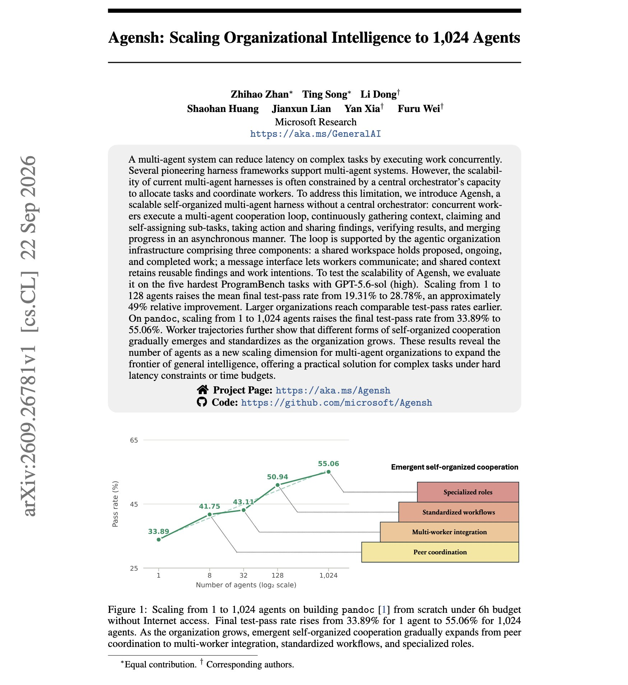

# 🐦 @dair_ai

## 📅 September 28, 2026

> 2 post(s) archived.

---

### 🕐 14:31 UTC · @dair_ai

> I just ran a paper-research agent on an open stack and had this week&apos;s top 5 papers on agent memory in my terminal in about 10 seconds. How does it work? I used Tavily to pull the last 7 days of arXiv. NVIDIA Nemotron 3 Ultra, served on Nebius Token Factory, reads and ranks them. It&apos;s 24 lines of Python on an OpenAI-compatible API. It cost me nothing to try. You can build this too! Here is how: The new Nebius AI Builder Program gives you $400+ in credits and discounts on day one, across Token Factory, Tavily, and launch partners, plus runnable blueprints and free courses built with NVIDIA. What I like most is that every layer is swappable. Change the model or the search layer, and the rest keeps working. Walkthrough in the video. Join for free here: http://devtoolsacademy.link/elv Thanks to Nebius for collaborating on this post. Media

🔗 [View original post](https://x.com/omarsar0/status/2104579712760598844)

---

### 🕐 01:06 UTC · @dair_ai

> Banger paper from Microsoft Research. (bookmark it) They run 1K+ coding agents at once to test a scalable self-organized multi-agent harness. This is an interesting test because most multi-agent systems today have some hierarchy or structure. Agensh has no central orchestrator. It coordinates parallel coding agents through a shared state instead of a central orchestrator. Each agent gathers context, claims a sub-task, does the work, shares what it found, verifies the result, and merges it, all asynchronously through a shared workspace and a message channel. On the five hardest ProgramBench tasks with GPT-5.6-sol, increasing agents from 1 to 128 raises the mean final test-pass rate from 19.31% to 28.78%. Larger teams also reach a given pass rate sooner. On pandoc, 1,024 agents take the test-pass rate from 33.89% to 55.06%. The authors also report forms of cooperation that the agents start on their own and that become standard practice as the team grows. Paper: https://arxiv.org/abs/2609.26781 Chat with Paper: https://academy.dair.ai/papers/agensh-scaling-organizational-intelligence-to-1-024-agents-2609.26781

🔗 [View original post](https://x.com/omarsar0/status/2104377054829613473)

---
