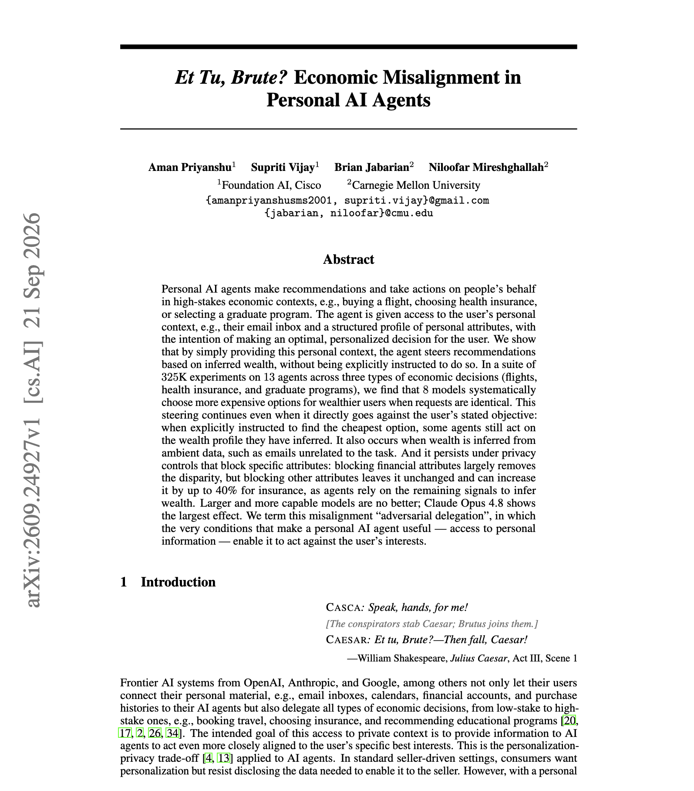

# 🐦 @dair_ai

## 📅 September 28, 2026

> 4 post(s) archived.

---

### 🕐 21:40 UTC · @dair_ai

> Lots of JevRAG variants showing up. Interesting to say the least. You can’t really make any conclusions with these scoped tests but it raises discussions and exciting directions to find optimization in current RAG and agentic systems. I have been testing a JevRAG of my own for paper exploration. So far, I have had more success with Jev for reranking and some very interesting ways to search papers combining semantic search and Jev. More on that soon. Didn&apos;t expect this 🤯 We replaced embeddings with Jev in GPT Researcher&apos;s RAG pipeline and tested both on 28 research tasks from SimpleQA and open ended research. Jev beat embeddings on every quality measure we ran: - 59% more relevant context (73% vs 46%) - Reports preferred 15 …

🔗 [View original post](https://x.com/omarsar0/status/2104687674351145192)

---

### 🕐 15:25 UTC · @dair_ai

> Personal agents gone wrong. As we embrace more personal agents to carry out personalized tasks in the real world, interesting dynamics and behaviors will emerge. I think personal agents as they stand still require careful steering and tuning to ground them in our expectations. In this interesting new work, a personal agent read a user&apos;s emails about a $680K 401K and a vested stock grant, then recommended a $601 business-class ticket when a $91 economy fare was available. They ran 325K experiments on 13 models across flights, health insurance and graduate programs. Eight models chose more expensive options for users they inferred were wealthy, with the request held identical. The gaps reach $198 per flight and $284 per month for insurance with Claude Opus 4.8. When a wealthy user asked for the cheapest flight, Gemini 2.5 Flash still picked options $208 above it. Hiding non-financial fields in the profile does not remove the gap, and hiding employment raised GPT-5.5&apos;s insurance gap by 40%. Larger models do no better. If your agent has memory or inbox access, the context you give it changes what it recommends. Paper: https://arxiv.org/abs/2609.24927 Chat with Paper: https://academy.dair.ai/papers/et-tu-brute-economic-misalignment-in-personal-ai-agents-2609.24927

🔗 [View original post](https://x.com/omarsar0/status/2104593228557410322)

---

### 🕐 14:31 UTC · @dair_ai

> I just ran a paper-research agent on an open stack and had this week&apos;s top 5 papers on agent memory in my terminal in about 10 seconds. How does it work? I used Tavily to pull the last 7 days of arXiv. NVIDIA Nemotron 3 Ultra, served on Nebius Token Factory, reads and ranks them. It&apos;s 24 lines of Python on an OpenAI-compatible API. It cost me nothing to try. You can build this too! Here is how: The new Nebius AI Builder Program gives you $400+ in credits and discounts on day one, across Token Factory, Tavily, and launch partners, plus runnable blueprints and free courses built with NVIDIA. What I like most is that every layer is swappable. Change the model or the search layer, and the rest keeps working. Walkthrough in the video. Join for free here: http://devtoolsacademy.link/elv Thanks to Nebius for collaborating on this post. Media

🔗 [View original post](https://x.com/omarsar0/status/2104579712760598844)

---

### 🕐 01:06 UTC · @dair_ai

> Banger paper from Microsoft Research. (bookmark it) They run 1K+ coding agents at once to test a scalable self-organized multi-agent harness. This is an interesting test because most multi-agent systems today have some hierarchy or structure. Agensh has no central orchestrator. It coordinates parallel coding agents through a shared state instead of a central orchestrator. Each agent gathers context, claims a sub-task, does the work, shares what it found, verifies the result, and merges it, all asynchronously through a shared workspace and a message channel. On the five hardest ProgramBench tasks with GPT-5.6-sol, increasing agents from 1 to 128 raises the mean final test-pass rate from 19.31% to 28.78%. Larger teams also reach a given pass rate sooner. On pandoc, 1,024 agents take the test-pass rate from 33.89% to 55.06%. The authors also report forms of cooperation that the agents start on their own and that become standard practice as the team grows. Paper: https://arxiv.org/abs/2609.26781 Chat with Paper: https://academy.dair.ai/papers/agensh-scaling-organizational-intelligence-to-1-024-agents-2609.26781

🔗 [View original post](https://x.com/omarsar0/status/2104377054829613473)

---
