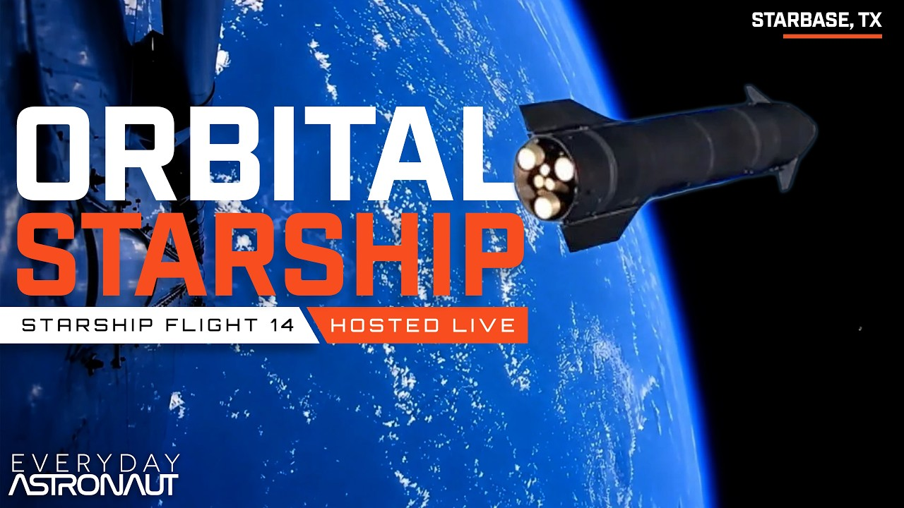
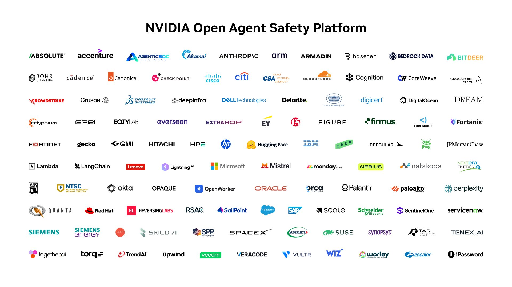

# 🐦 @elonmusk

## 📅 September 28, 2026

> 13 post(s) archived.

---

### 🕐 12:14 UTC · @elonmusk

> Starship Flight 14 launches in ~30 mins https://x.com/i/broadcasts/1qxvvenMPMQxB

🔗 [View original post](https://x.com/elonmusk/status/2104545337478406579)

---

### 🕐 12:13 UTC · @elonmusk

> Watch Starship Flight 14 https://x.com/i/broadcasts/1qxvvenMPMQxB

🔗 [View original post](https://x.com/SpaceX/status/2104544946665804216)

---

### 🕐 12:09 UTC · @elonmusk

> WE&apos;RE LIVE to watch the FIRST ORBITAL STARSHIP!!! LET&apos;S GO!!! https://youtube.com/live/LeKY53pwArw?feature=share

🔗 [View original post](https://x.com/Erdayastronaut/status/2104544004473856339)

---

### 🕐 09:12 UTC · @elonmusk

> Today, with over 100 industry partners, we introduced the NVIDIA Open Agent Safety Platform, bringing together OpenShell and Sentry. Artificial intelligence is extraordinary technology that will advance discovery, productivity, security, health, and prosperity for generations to come. But its full promise can only be realized when people have confidence that AI is being built to be safe and deployed with wisdom and responsibility. This is bigger than a single product. It&apos;s the beginning of an open ecosystem to build the trust layer for safe agent systems. Together, we are building the foundation of the AI economy. Trust and innovation are not in conflict. Safety is how trust is earned. We must build not only the most capable AI, but the most trusted AI, so that this extraordinary technology can realize its enormous promise for the world. https://nvda.ws/4hcoq7m

🔗 [View original post](https://x.com/JensenHuang/status/2104499465055023424)

---

### 🕐 02:22 UTC · @elonmusk

> Upgrades WAIT A SECOND. Why is Grok bot so fast today?? 😳

🔗 [View original post](https://x.com/elonmusk/status/2104396243434651759)

---

### 🕐 01:46 UTC · @elonmusk

> with elon, people focus too much on trying to find individual bad decisions there are extremely few decisions that matter and that are irreversible, and he continues to get those right, the others he can try again whatever bitter lesson is for ai, he discovered for free markets

🔗 [View original post](https://x.com/gabriel1/status/2104387199726923986)

---

### 🕐 01:38 UTC · @elonmusk

> Bravo @JMilei! Argentina’s monthly inflation went from 25.5% in Milei’s first month to 1.7% in August 2026. As expected when government stops printing pesos to cover the deficit. Fiscal surplus first, then prices stop sprinting. The “experts” who called this “austerity theater” now have 33 mont…

🔗 [View original post](https://x.com/elonmusk/status/2104385138545365067)

---

### 🕐 01:24 UTC · @elonmusk

> True True

🔗 [View original post](https://x.com/elonmusk/status/2104381674796495229)

---

### 🕐 00:59 UTC · @elonmusk

> Accurate Feeling the AGI/ASI, few observations 1. Opus 5.5 really gives strong vibes of AGI (maybe not fully there, but we&apos;re very close, like 80%-90%). For example, few breakthoughs in training humanoids are needed. We need to move this intelligence into physical world. 2. I don&apos;t think …

🔗 [View original post](https://x.com/elonmusk/status/2104375332048613752)

---

### 🕐 00:24 UTC · @elonmusk

> Accurate (for now) There’s a rank specifically for Google now? 😭😭

🔗 [View original post](https://x.com/elonmusk/status/2104366530938994817)

---

### 🕐 00:05 UTC · @elonmusk

> Worth considering This actually improved my sleep so much &quot;Inclined Bed Therapy&quot; Fixed my acid reflux issues and solved the headaches I was getting when waking

🔗 [View original post](https://x.com/elonmusk/status/2104361756412019115)

---

### 🕐 00:03 UTC · @elonmusk

> Starship Flight 14 aiming to launch tomorrow morning Starship’s 14th flight is set to launch on Monday, Sept 28. The 75-minute launch window opens at 7:15 a.m. CT. Live coverage of the mission starts ~35 minutes before launch → https://x.com/i/broadcasts/1qxvvenMPMQxB

🔗 [View original post](https://x.com/elonmusk/status/2104361390123430335)

---

### 🕐 00:01 UTC · @elonmusk

> I really felt the AGI profoundly this time Media

🔗 [View original post](https://x.com/elonmusk/status/2104360927474921529)

---
