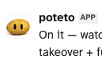
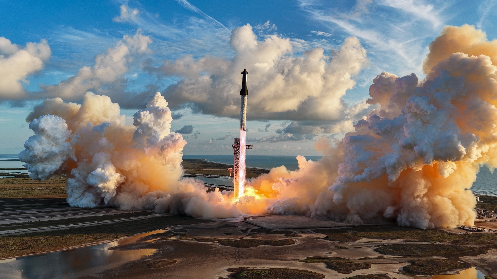
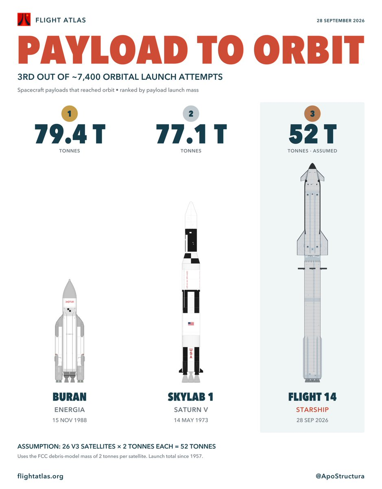
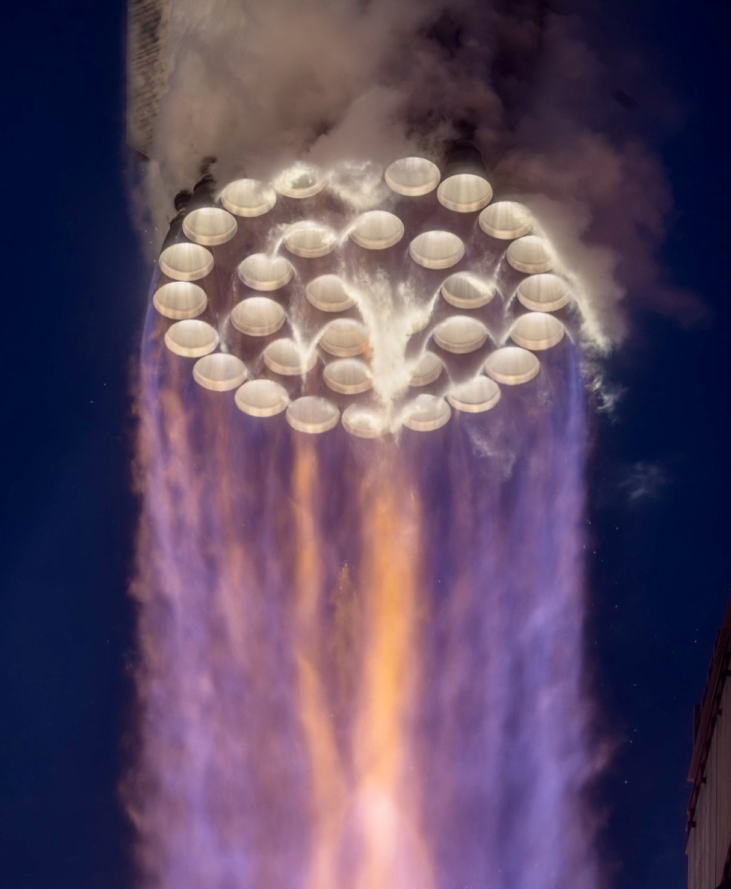
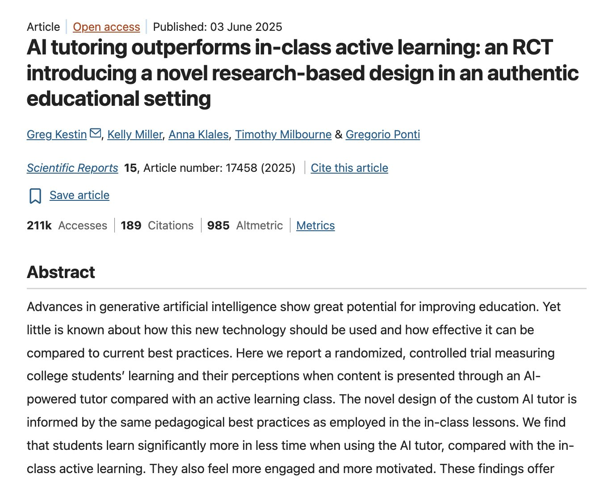

# 🐦 @elonmusk

## 📅 September 28, 2026

> 37 post(s) archived.

---

### 🕐 23:32 UTC · @elonmusk

> Not bad Grok 4.7 xHigh ranks #1 in Artificial Analysis Cyber Index It&apos;s a powerful frontier model performing at the highest level in enterprise cyber defense Outperforming Fable 5.1 Max, Opus 5.5, Astra 6, GPT-6 and other leading AI systems

🔗 [View original post](https://x.com/elonmusk/status/2104715842319786148)

---

### 🕐 23:10 UTC · @elonmusk

> Grok 4.7 is now on Amazon Bedrock Media

🔗 [View original post](https://x.com/SpaceXAI/status/2104710467512058027)

---

### 🕐 23:08 UTC · @elonmusk

> Now @Bot works as a team! Introducing Team Bots, shared AI teammates that learn as your team works with them. Give your Team Bot the skills, plugins, and credentials it needs for its role, then work with it in Slack or Grok Bot.

🔗 [View original post](https://x.com/elonmusk/status/2104709783999729911)

---

### 🕐 22:04 UTC · @elonmusk

> Starship transiting the Sun this morning during Flight 14 — prior to this morning&apos;s mission, this has never been captured before with the world&apos;s largest and most powerful rocket. I’ve ached over this shot for years, mainly for two reasons: what does methane exhaust look like silhouetted against the Sun, and how violent are the acoustic energy waves from 33 Raptor engines on the Super Heavy booster? Well...now we have an answer. 📸 - @NASASpaceflight Media

🔗 [View original post](https://x.com/_MaxQ_/status/2104693750425440487)

---

### 🕐 20:07 UTC · @elonmusk

> very excited to share one of my favorite new features! grok @bot is now multiplayer. make a team bot which has access to your plugins, skills, credentials, and then add it to slack with one click. it&apos;s super easy! guess what i named my bot 🤪 i love chatting with it and firing off cloud agents much more to come Introducing Team Bots, shared AI teammates that learn as your team works with them. Give your Team Bot the skills, plugins, and credentials it needs for its role, then work with it in Slack or Grok Bot.

🔗 [View original post](https://x.com/poteto/status/2104664283808428165)

---

### 🕐 20:02 UTC · @elonmusk

> renaissance painting Liftoff of Starship&apos;s first orbital flight

🔗 [View original post](https://x.com/IterIntellectus/status/2104662991534969190)

---

### 🕐 19:30 UTC · @elonmusk

> Liftoff of Starship&apos;s first orbital flight

🔗 [View original post](https://x.com/SpaceX/status/2104654998034690329)

---

### 🕐 19:24 UTC · @elonmusk

> Starship achieved orbit on its first attempt and successfully delivered Starlink V3 satellites to space for the first time → https://spacex.com/launches/starship-flight-14 Media

🔗 [View original post](https://x.com/SpaceX/status/2104653511883628569)

---

### 🕐 18:55 UTC · @elonmusk

> in case you missed it over the weekend, grok @bot can help with your finances! combined with the other connectors available in grok bot you can build custom dashboards for your business, budgeting tools for you and your family, and even find more ways to save you money try looking through all the subs you pay for and forgot about and save and make money today with grok bot! Grok Bot now connects to your finances. Link your bank, card, and investment accounts with the new Finance integration, then ask Bot to help manage your spending, investments, and more.

🔗 [View original post](https://x.com/poteto/status/2104646114427457941)

---

### 🕐 18:40 UTC · @elonmusk

> SpaceX is building massive infrastructure for the future We are building the infrastructure of the future, from supercomputers to Terafab to Gigasat to a new Starbase in Louisiana

🔗 [View original post](https://x.com/elonmusk/status/2104642361645003002)

---

### 🕐 18:33 UTC · @elonmusk

> Starship landing Splashdown confirmed. Congratulations to the entire SpaceX team on the first orbital flight of Starship!

🔗 [View original post](https://x.com/elonmusk/status/2104640740399976477)

---

### 🕐 16:45 UTC · @elonmusk

> There are only two launches in history that put more payload mass in orbit than Starship Flight 14. And that’s with only 26 Starlink satellites. Future launches will carry up to 60.

🔗 [View original post](https://x.com/ApoStructura/status/2104613497426301233)

---

### 🕐 15:39 UTC · @elonmusk

> I set a camera really close to the launch pad to get this shot. It was a sound activated trigger since it wasn’t safe for me to stand here. That’s all 33 Raptor engines performing nominally as Starship heads to orbit for the first time.

🔗 [View original post](https://x.com/AJamesMcCarthy/status/2104596891300253831)

---

### 🕐 14:09 UTC · @elonmusk

> Congrats @SpaceX! Gorgeous launch, getting Ship to orbit and managing every step in a safe, responsible, and especially inspirational way. @NASA, along with the rest of the interested public, is excited to help where we can and for Starship missions to become routine! Starship performs its orbital insertion burn and enters orbit of Earth for the first time

🔗 [View original post](https://x.com/NASAAdmin/status/2104574149800726532)

---

### 🕐 14:02 UTC · @elonmusk

> All 26 Starlink V3 operational satellites deployed and operating nominally The @Starlink team has made contact with all 26 satellites

🔗 [View original post](https://x.com/elonmusk/status/2104572572067099102)

---

### 🕐 14:01 UTC · @elonmusk

> First orbital flight of Starship successful! Starship performs its orbital insertion burn and enters orbit of Earth for the first time

🔗 [View original post](https://x.com/elonmusk/status/2104572192247984493)

---

### 🕐 13:28 UTC · @elonmusk

> SpaceX&apos;s Starship rocket has successfully reached orbit and deployed its V3 Starlink satellites into orbit for the first time, officially making this Starship&apos;s first revenue-generating flight, a major milestone for the company! Congrats @SpaceX team! Incredible achievement 🚀 Media

🔗 [View original post](https://x.com/SawyerMerritt/status/2104563930752319513)

---

### 🕐 13:25 UTC · @elonmusk

> Today’s Starlink payload will add up to 26 Terabits of capacity to the constellation. Starship has begun deploying its payload of 26 @Starlink V3 satellites. This deployment sequence will take ~30 minutes

🔗 [View original post](https://x.com/Starlink/status/2104563241334747537)

---

### 🕐 13:15 UTC · @elonmusk

> Starship performs its orbital insertion burn and enters orbit of Earth for the first time Media

🔗 [View original post](https://x.com/SpaceX/status/2104560708969259344)

---

### 🕐 12:56 UTC · @elonmusk

> Super Heavy has splashed down in the Gulf of America! Media

🔗 [View original post](https://x.com/SpaceX/status/2104555957569077633)

---

### 🕐 12:53 UTC · @elonmusk

> Starship’s Raptor engines ignite during hot-staging separation. Super Heavy boosted back towards its splashdown site in the Gulf of America Media

🔗 [View original post](https://x.com/SpaceX/status/2104555009127956836)

---

### 🕐 12:50 UTC · @elonmusk

> Liftoff of Starship! Media

🔗 [View original post](https://x.com/SpaceX/status/2104554235924815900)

---

### 🕐 12:32 UTC · @elonmusk

> Our approach to Starship’s first orbital mission Media

🔗 [View original post](https://x.com/SpaceX/status/2104549692914950442)

---

### 🕐 12:14 UTC · @elonmusk

> Starship Flight 14 launches in ~30 mins https://x.com/i/broadcasts/1qxvvenMPMQxB

🔗 [View original post](https://x.com/elonmusk/status/2104545337478406579)

---

### 🕐 12:13 UTC · @elonmusk

> Watch Starship Flight 14 https://x.com/i/broadcasts/1qxvvenMPMQxB

🔗 [View original post](https://x.com/SpaceX/status/2104544946665804216)

---

### 🕐 12:09 UTC · @elonmusk

> WE&apos;RE LIVE to watch the FIRST ORBITAL STARSHIP!!! LET&apos;S GO!!! https://youtube.com/live/LeKY53pwArw?feature=share

🔗 [View original post](https://x.com/Erdayastronaut/status/2104544004473856339)

---

### 🕐 10:34 UTC · @elonmusk

> Researchers proved AI has deleted every reason universities exist. Harvard University ran a controlled experiment pitting a custom AI against their own top-tier classrooms. And the results are going to collapse the higher education bubble. They took 194 undergraduates and split them up. One group learned physics in one of Harvard’s best hands-on, active-learning physical classrooms. Group work. Instructor support. The premium university experience. The other group went home and learned the exact same material with an AI tutor. The AI didn&apos;t just win. It embarrassed the institution. Students using the AI learned more than twice as much as the students in the elite Harvard classroom. They scored 30% higher on the final assessment. And they did it in less time. Let that sink in. A piece of software sitting on a laptop outperformed a world-class faculty in one of the most elite learning environments on Earth. Universities have always justified their exorbitant tuition with two things: access to elite knowledge and the physical classroom experience. This study just proved both of those moats are gone. When software can teach you complex physics twice as well as a $60,000-a-year institution, the math of higher education breaks permanently. The AI didn&apos;t just give the students answers. It used strict pedagogical guardrails. It guided. It questioned. It forced the students to do the cognitive work. It offered perfect, one-to-one tutoring, personalized to the exact moment a student misunderstood a concept. That level of attention is mathematically impossible to scale in a physical lecture hall. For a thousand years, the university was the only place to get a premium education. Now, it’s the bottleneck. If AI can double your learning speed for a fraction of the cost, what exactly are students taking on decades of debt to pay for?

🔗 [View original post](https://x.com/thesupermannx/status/2104519992532496810)

---

### 🕐 09:12 UTC · @elonmusk

> Today, with over 100 industry partners, we introduced the NVIDIA Open Agent Safety Platform, bringing together OpenShell and Sentry. Artificial intelligence is extraordinary technology that will advance discovery, productivity, security, health, and prosperity for generations to come. But its full promise can only be realized when people have confidence that AI is being built to be safe and deployed with wisdom and responsibility. This is bigger than a single product. It&apos;s the beginning of an open ecosystem to build the trust layer for safe agent systems. Together, we are building the foundation of the AI economy. Trust and innovation are not in conflict. Safety is how trust is earned. We must build not only the most capable AI, but the most trusted AI, so that this extraordinary technology can realize its enormous promise for the world. https://nvda.ws/4hcoq7m

🔗 [View original post](https://x.com/JensenHuang/status/2104499465055023424)

---

### 🕐 02:22 UTC · @elonmusk

> Upgrades WAIT A SECOND. Why is Grok bot so fast today?? 😳

🔗 [View original post](https://x.com/elonmusk/status/2104396243434651759)

---

### 🕐 01:46 UTC · @elonmusk

> with elon, people focus too much on trying to find individual bad decisions there are extremely few decisions that matter and that are irreversible, and he continues to get those right, the others he can try again whatever bitter lesson is for ai, he discovered for free markets

🔗 [View original post](https://x.com/gabriel1/status/2104387199726923986)

---

### 🕐 01:38 UTC · @elonmusk

> Bravo @JMilei! Argentina’s monthly inflation went from 25.5% in Milei’s first month to 1.7% in August 2026. As expected when government stops printing pesos to cover the deficit. Fiscal surplus first, then prices stop sprinting. The “experts” who called this “austerity theater” now have 33 mont…

🔗 [View original post](https://x.com/elonmusk/status/2104385138545365067)

---

### 🕐 01:24 UTC · @elonmusk

> True True

🔗 [View original post](https://x.com/elonmusk/status/2104381674796495229)

---

### 🕐 00:59 UTC · @elonmusk

> Accurate Feeling the AGI/ASI, few observations 1. Opus 5.5 really gives strong vibes of AGI (maybe not fully there, but we&apos;re very close, like 80%-90%). For example, few breakthoughs in training humanoids are needed. We need to move this intelligence into physical world. 2. I don&apos;t think …

🔗 [View original post](https://x.com/elonmusk/status/2104375332048613752)

---

### 🕐 00:24 UTC · @elonmusk

> Accurate (for now) There’s a rank specifically for Google now? 😭😭

🔗 [View original post](https://x.com/elonmusk/status/2104366530938994817)

---

### 🕐 00:05 UTC · @elonmusk

> Worth considering This actually improved my sleep so much &quot;Inclined Bed Therapy&quot; Fixed my acid reflux issues and solved the headaches I was getting when waking

🔗 [View original post](https://x.com/elonmusk/status/2104361756412019115)

---

### 🕐 00:03 UTC · @elonmusk

> Starship Flight 14 aiming to launch tomorrow morning Starship’s 14th flight is set to launch on Monday, Sept 28. The 75-minute launch window opens at 7:15 a.m. CT. Live coverage of the mission starts ~35 minutes before launch → https://x.com/i/broadcasts/1qxvvenMPMQxB

🔗 [View original post](https://x.com/elonmusk/status/2104361390123430335)

---

### 🕐 00:01 UTC · @elonmusk

> I really felt the AGI profoundly this time Media

🔗 [View original post](https://x.com/elonmusk/status/2104360927474921529)

---
