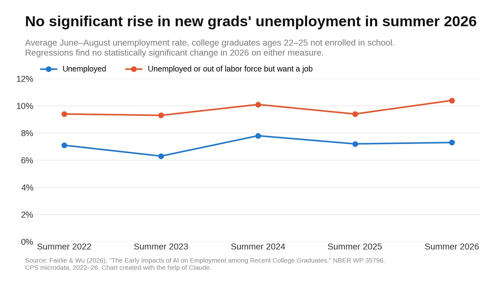
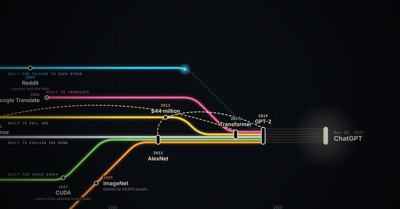
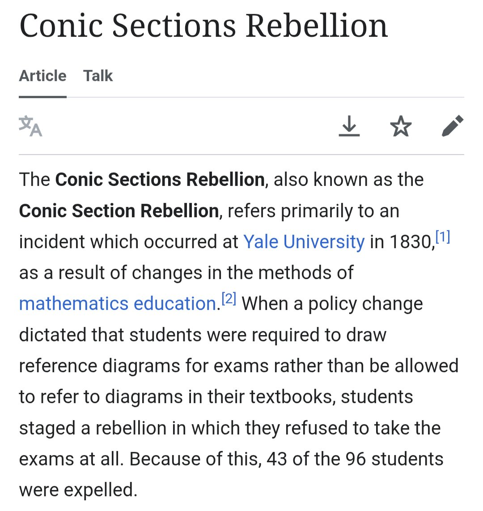

# 🐦 @emollick

## 📅 September 28, 2026

> 8 post(s) archived.

---

### 🕐 18:02 UTC · @emollick

> It is also why non-coders can often accomplish unexpected things with AI: people have different limits than software, and old mental models can get in the way. Still one of the best ways to think about AI that I&apos;ve read from @emollick

🔗 [View original post](https://x.com/emollick/status/2104632980635259336)

---

### 🕐 15:48 UTC · @emollick

> Since people liked this, and the weak point was the text to speech, I asked Opus to update with an ElevenLabs voice. This is the same video, but with much better narration. Media

🔗 [View original post](https://x.com/emollick/status/2104599209995645069)

---

### 🕐 11:39 UTC · @emollick

> Still no evidence of AI-driven unemployment among recent college grads, new @nberpubs paper says. &quot;Taking an agnostic approach to defining treatment timing, we find that unemployment rates did not spike in summer 2026 relative to summer months in previous years and did not rise in a significant way relative to older college graduates or young workers without a college degree. We also provide the first analysis of an expanded definition of unemployment that includes those who report &apos;wanting a job&apos; which adds nearly two percentage points to the unemployment rate of recent college graduates but we find no evidence of a statistically significant increase in summer 2026 even after adding these &apos;sidelined unemployed.&apos;&quot; https://www.nber.org/papers/w35796

🔗 [View original post](https://x.com/CharlesFLehman/status/2104536553519206718)

---

### 🕐 05:44 UTC · @emollick

> The thing I didn&apos;t fully realize was that it means that every smart commentator in their own field (politics, culture, etc) will need to do the same catch-up on the same AI topics while posting about it. Eternal September for discussions of AI safety &amp; consciousness &amp; jobs &amp;... No matter how much you are hearing about AI, today is the least you will ever hear about AI.

🔗 [View original post](https://x.com/emollick/status/2104447068731555883)

---

### 🕐 03:39 UTC · @emollick

> Sources and footnotes here: https://built-for-something-else.netlify.app/

🔗 [View original post](https://x.com/emollick/status/2104415669123174553)

---

### 🕐 03:34 UTC · @emollick

> TIL in 1830 half the students at Yale were expelled because they didn&apos;t want to use new tech -- the blackboard -- for math exams

🔗 [View original post](https://x.com/MishaTeplitskiy/status/2104414434860916929)

---

### 🕐 02:45 UTC · @emollick

> I was reflecting on how many random contingencies went into creating the current accelerating AI moment and had Opus 5.5 put together a video, inspired by old science show Connections, to try and point out how a series of initially unrelated ideas led to the moment we are in now. Media

🔗 [View original post](https://x.com/emollick/status/2104402002868592659)

---

### 🕐 02:03 UTC · @emollick

> Oh two of the commentators reminded me of the infamous ham sandwich hardlock in Impossible Text Adventure, where if you eat it in chapter 1, you can&apos;t win the game. The forums went crazy.

🔗 [View original post](https://x.com/emollick/status/2104391470669242610)

---
