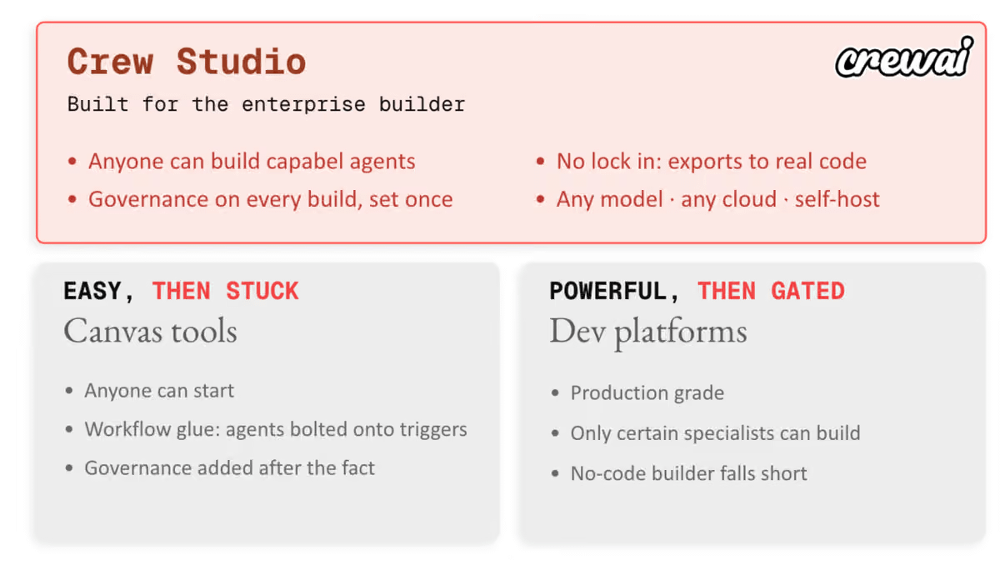

# 🐦 @joaomdmoura

## 📅 September 28, 2026

> 1 post(s) archived.

---

### 🕐 16:00 UTC · @joaomdmoura

> One of our customers went from 4,000 agent runs in a month to over 125,000. What changed was who was allowed to build them. In most large companies the person who understands the work cannot build the system that runs it. They explain it to someone who can, and that person turns it into code, permissions, integrations and tests. That translation costs time, and worse than that, it loses fidelity. This customer, one of the largest travel companies in the world, let people closer to the work build instead. A small group of champions first. Month one: 4,000 agentic executions. Month three: around 30,000. Now: over 125,000 a month, most business units trained. The rules stayed put. Platform teams still decide the approved models, the tools, the data and the audits. So ask who is allowed to build agents where you work. If it is one team, that is your ceiling.

🔗 [View original post](https://x.com/joaomdmoura/status/2104602080367554718)

---
