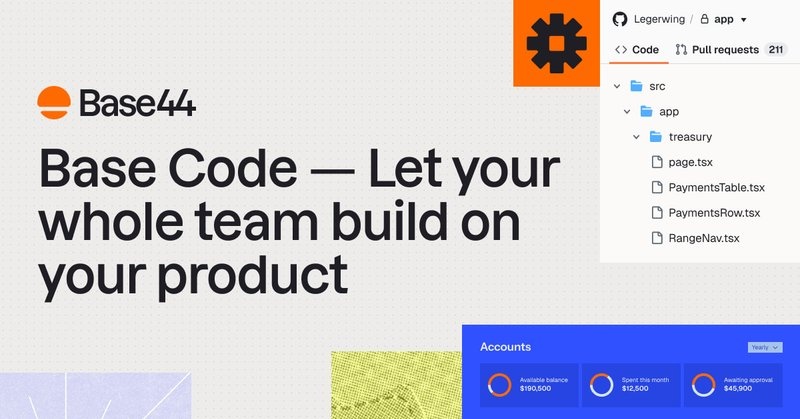
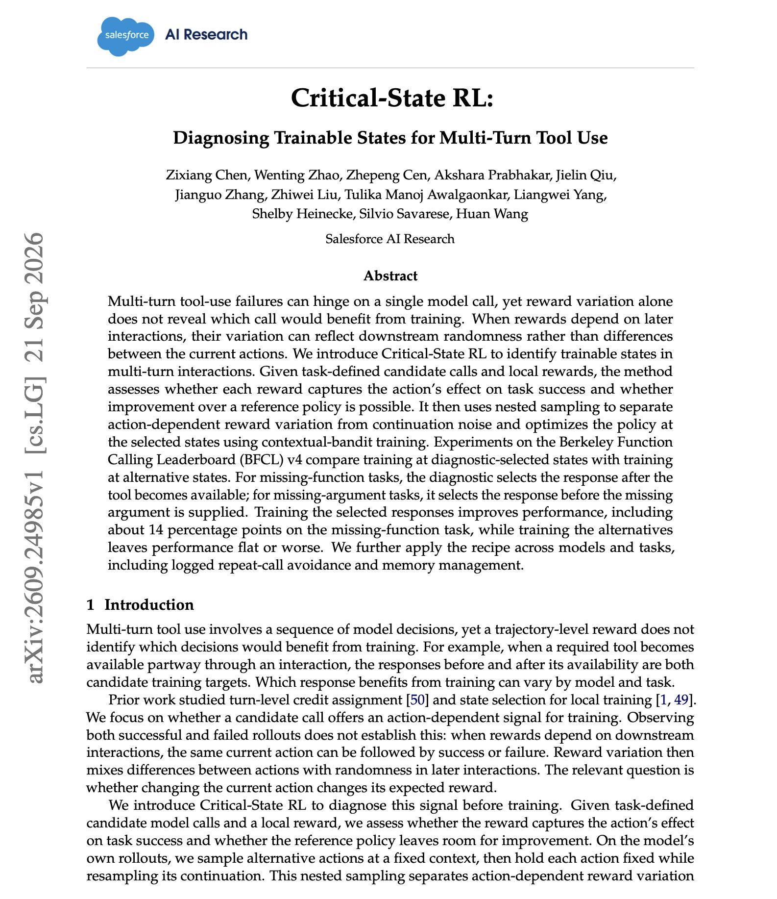

# 🐦 @omarsar0

## 📅 September 28, 2026

> 9 post(s) archived.

---

### 🕐 22:54 UTC · @omarsar0

> Recommended read if you are building AI products. Title doesn’t say much. There is a lot of great insights on what drives AI distribution and how to build defensibility in a super competitive AI landscape. https://x.com/i/article/2104574050257563648

🔗 [View original post](https://x.com/omarsar0/status/2104706308163420452)

---

### 🕐 21:43 UTC · @omarsar0

> On my way to DevDay right now and on a flight but I will be sharing more notes and thoughts on this direction hopefully during the week.

🔗 [View original post](https://x.com/omarsar0/status/2104688425009926473)

---

### 🕐 19:12 UTC · @omarsar0

> Calling Higgsfield “just a wrapper” tells you surprisingly little about the economics of our business. In over 40% of cases, we get to decide which model does the work for our customers. As models become more interchangeable, the ability to move demand between them becomes a moat. If you’re mapping where value accumulates in AI, follow who owns the customer relationship. I went deeper on this with @HarryStebbings on 20VC. Higgsfield is the most untold story in tech. $1BN in ARR in 18 months. Faster than everyone other than OpenAI and Anthropic. They spend $4M a month on models. They expect this to be $100K per person per month. They have 150 people working in a content machine. They will breed mor…

🔗 [View original post](https://x.com/alexmashrabov/status/2104650467833680068)

---

### 🕐 17:23 UTC · @omarsar0

> This is what the future of coding looks like. Multiple AI models working in the same Codex session, with Jev routing them to tackle different parts of the task. Here, I had it build a full-stack demo app: &gt; Opus 5.5 planned it. &gt; GPT-6 Astra built the backend. &gt; Kimi K3 built the frontend. &gt; DeepSeek handled testing. &gt; GLM 5.3 Flash wrote the docs. Jev handles the switching. I never touched the model picker. 40% cheaper, 15% faster for the same build. Media This is JevRouter. 99% of Opus 5.5 and GPT-6 Astra&apos;s intelligence, for 40% of the cost. Hundreds of Jevs read your ENTIRE request and analyze every single benchmark across all models to match you with the perfect model. Enjoy 30% off all frontier models

🔗 [View original post](https://x.com/omarsar0/status/2104623036133417456)

---

### 🕐 16:19 UTC · @omarsar0

> Try Base Code here: https://base44.com/base-code

🔗 [View original post](https://x.com/omarsar0/status/2104606987275370775)

---

### 🕐 16:00 UTC · @omarsar0

> Build for the agentic era. The future of how we build is being redefined, and it&apos;s exciting. I haven&apos;t seen much innovation in this space, but Base Code (from @Base44), with its focus on cloud and collaborative tooling, makes a lot of sense. And it&apos;s model-agnostic too. Recommend reading if you are a software engineer. Today we’re introducing Base Code. It’s an early preview of how we think software will be built in the future. It’s a product that encapsulates everything we’ve learnt from: - How our users are building software. - How we’re building internally, scaling to hundreds of millions of…

🔗 [View original post](https://x.com/omarsar0/status/2104602122159612078)

---

### 🕐 15:42 UTC · @omarsar0

> Great paper from Salesforce AI Research on RL for multi-turn tool use. The finding is that you want to train the one call where the action changes the outcome, instead of spreading reward across the whole trajectory. (bookmark it) When reward depends on later turns, much of its variation comes from what happens downstream. Critical-State RL uses nested sampling to separate the reward variation caused by the current action from that noise, then trains only the selected call with contextual-bandit updates. On BFCL v4 missing-function tasks, training the selected turn adds about 14 points. Training the other candidate turn leaves accuracy flat or lower. Paper: https://academy.dair.ai/papers/critical-state-rl-diagnosing-trainable-states-for-multi-turn-tool-use-2609.24985

🔗 [View original post](https://x.com/dair_ai/status/2104597506835530112)

---

### 🕐 14:53 UTC · @omarsar0

> It&apos;s an engineering problem! This topic has gotten too political. Let&apos;s get back to the fundamentals. &quot;Trust and innovation are not in conflict. Safety is how trust is earned.&quot; Today, with over 100 industry partners, we introduced the NVIDIA Open Agent Safety Platform, bringing together OpenShell and Sentry. Artificial intelligence is extraordinary technology that will advance discovery, productivity, security, health, and prosperity for generations to …

🔗 [View original post](https://x.com/omarsar0/status/2104585316363358559)

---

### 🕐 14:40 UTC · @omarsar0

> I think it&apos;s a great opportunity to learn to build AI tools and agents. If you try it out, here is the gist of the script I used: https://gist.github.com/omarsar/1c21cd01a23222f561a7b3725a95e685

🔗 [View original post](https://x.com/omarsar0/status/2104582131141972226)

---
