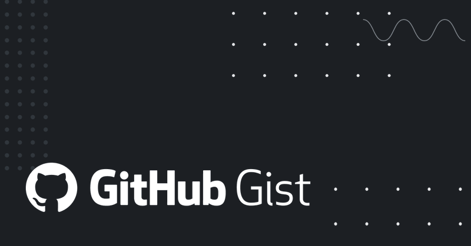

# 🐦 @omarsar0

## 📅 September 28, 2026

> 2 post(s) archived.

---

### 🕐 14:53 UTC · @omarsar0

> It&apos;s an engineering problem! This topic has gotten too political. Let&apos;s get back to the fundamentals. &quot;Trust and innovation are not in conflict. Safety is how trust is earned.&quot; Today, with over 100 industry partners, we introduced the NVIDIA Open Agent Safety Platform, bringing together OpenShell and Sentry. Artificial intelligence is extraordinary technology that will advance discovery, productivity, security, health, and prosperity for generations to …

🔗 [View original post](https://x.com/omarsar0/status/2104585316363358559)

---

### 🕐 14:40 UTC · @omarsar0

> I think it&apos;s a great opportunity to learn to build AI tools and agents. If you try it out, here is the gist of the script I used: https://gist.github.com/omarsar/1c21cd01a23222f561a7b3725a95e685

🔗 [View original post](https://x.com/omarsar0/status/2104582131141972226)

---
