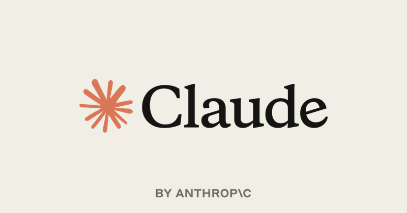
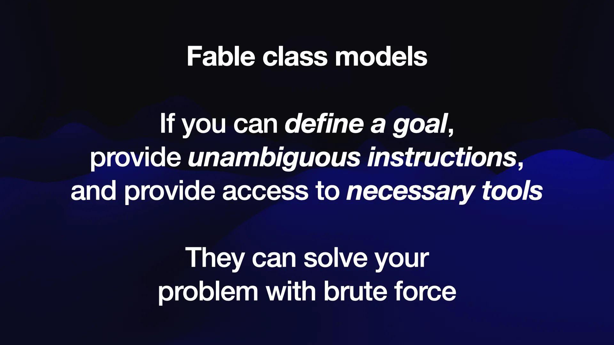
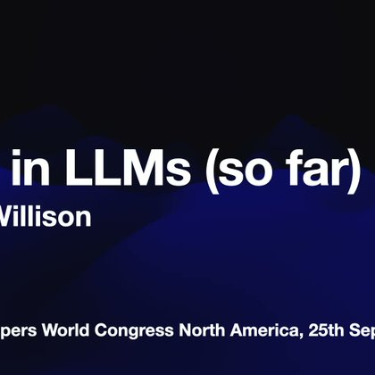

# 🐦 @simonw

## 📅 September 28, 2026

> 5 post(s) archived.

---

### 🕐 21:18 UTC · @simonw

> The most important thing about Sonnet 5.5 is that it&apos;s now the model that powers the free tier on https://claude.ai - so all of this stuff can be done by free users ChatGPT&apos;s free tier is still GPT-5.6 Luna, which is a lot less capable A thread of early experiments with Claude Sonnet 5.5. A fall foliage simulator by @_re_pete, made with Sonnet 5 vs Sonnet 5.5.

🔗 [View original post](https://x.com/simonw/status/2104682232522944909)

---

### 🕐 17:56 UTC · @simonw

> @WeAreDevs (The full talk also covers New Zealand’s Kākāpō parrot breeding season, probably the best news of 2026)

🔗 [View original post](https://x.com/simonw/status/2104631417712103706)

---

### 🕐 17:55 UTC · @simonw

> @WeAreDevs And my closing thought on how this stuff impacts our lives as software engineers, with a quote from cycling champion Greg LeMond

🔗 [View original post](https://x.com/simonw/status/2104631210412810466)

---

### 🕐 17:53 UTC · @simonw

> @WeAreDevs Here&apos;s how I define &quot;Fable class models&quot; - first Claude Fable 5, now Claude Opus 5.5 and GPT-Astra 6 and maybe GPT-5.6 Sol as well

🔗 [View original post](https://x.com/simonw/status/2104630666755441131)

---

### 🕐 17:51 UTC · @simonw

> I&apos;ve published detailed notes and an annotated transcript to accompany the video of the keynote I gave at @WeAreDevs World Congress North America in San Jose on Friday - here&apos;s my rundown of everything that&apos;s happened with LLMs and agents in 2026 so far https://simonwillison.net/2026/Sep/27/2026-in-llms-so-far/

🔗 [View original post](https://x.com/simonw/status/2104630129528037415)

---
