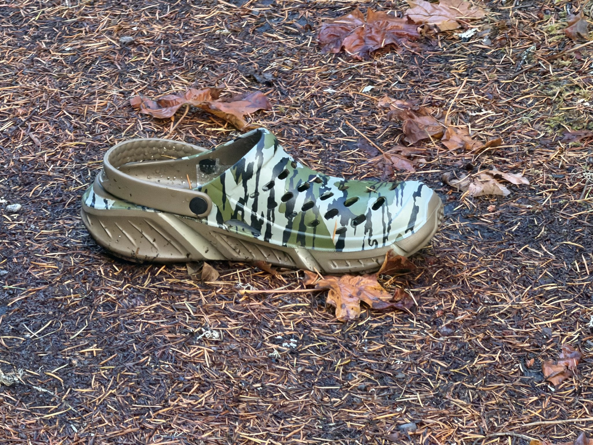

# 🐦 @tunguz

## 📅 September 28, 2026

> 8 post(s) archived.

---

### 🕐 23:18 UTC · @tunguz

> Oh it’s still a sigmoid, but we may not reach the flattening stage until we are past Kardashev I. i was wrong about this

🔗 [View original post](https://x.com/tunguz/status/2104712456983769121)

---

### 🕐 20:19 UTC · @tunguz

> LOL JK

🔗 [View original post](https://x.com/tunguz/status/2104667431855947790)

---

### 🕐 20:19 UTC · @tunguz

> Gemini

🔗 [View original post](https://x.com/tunguz/status/2104667389547921809)

---

### 🕐 19:32 UTC · @tunguz

> All right, here we go - *finally* a math/physics breakthrough using AI that might have some serious real-world implications/applications. A 59-year-old conjecture in fusion physics just fell. Harold Grad (1967): smooth 3D plasma equilibria can&apos;t exist unless pressure is constant or there&apos;s symmetry. This week: 3 families of counterexamples. 2 independent papers, posted a day apart. Two found with GPT-6 Astra. Huge …

🔗 [View original post](https://x.com/tunguz/status/2104655555126300780)

---

### 🕐 17:11 UTC · @tunguz

> Be careful when you are hiking in the woods - I just came across a croc in the wild!

🔗 [View original post](https://x.com/tunguz/status/2104620101303718082)

---

### 🕐 16:39 UTC · @tunguz

> I agree with Dean on this one. I am more optimistic than this. I think it’s primarily a science problem, and that it’s possible to make progress in that science. But no, while there is engineering we can do today to improve AI safety, it is not fundamentally an engineering problem.

🔗 [View original post](https://x.com/tunguz/status/2104611970284748965)

---

### 🕐 03:50 UTC · @tunguz

> yes The fact of our current moment is: remarkable AI capabilities, along with modest job &amp; economic impact Graeber vindicated?

🔗 [View original post](https://x.com/tunguz/status/2104418393134956991)

---

### 🕐 02:27 UTC · @tunguz

> Make Physics Physics Again

🔗 [View original post](https://x.com/tunguz/status/2104397547158872236)

---
