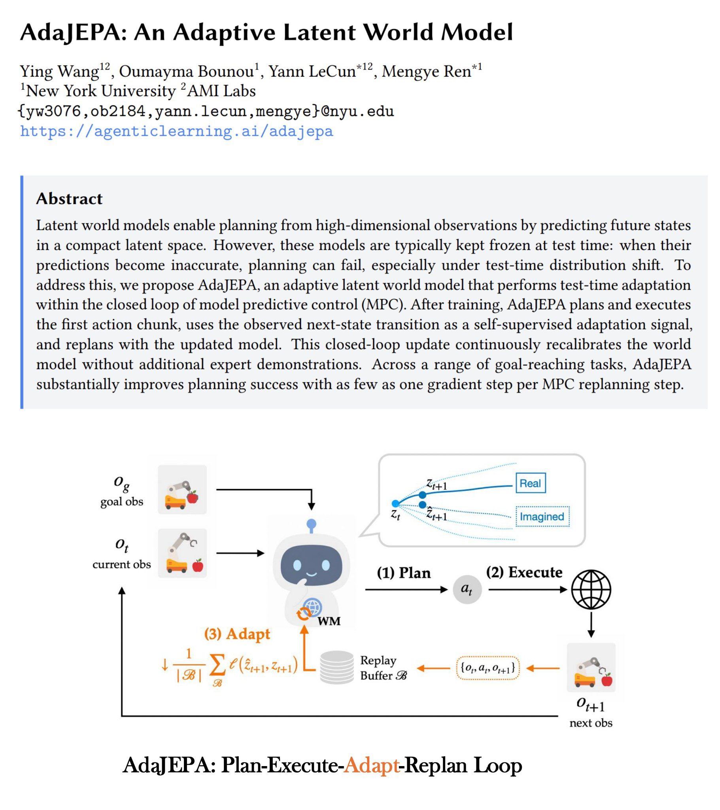

# 🐦 @ylecun

## 📅 September 28, 2026

> 2 post(s) archived.

---

### 🕐 16:44 UTC · @ylecun

> An opportunity to do research on: continual learning: multi-agent parallel workers; and synthetic data, environments and evals that measure frontier capabilities. We make enough money to fund new research and want to make lasting contributions and share our research openly. The Perplexity Research Fellowships are a great opportunity to advance frontier research around architecture design, multi-agent collaboration, synthetic data, and beyond! Priority deadline of Sep 30. https://jobs.ashbyhq.com/perplexity/ab076e26-adf1-414f-a006-7b1bdc9247c8 Feel w…

🔗 [View original post](https://x.com/AravSrinivas/status/2104613230937038938)

---

### 🕐 16:32 UTC · @ylecun

> Join us on Oct 10 if you’re a world model lover in SF! I will share our ICML paper on representation learning for WMs and recent work AdaJEPA. Excited to attend my first reading club 📚! 📚 Saturday Robotics @saturdayrobotic &amp; World Models Reading Club #33: Perceiving, Predicting, and Planning for Physical Interaction + AdaJEPA San Francisco · October 10 · 2–5 PM 👉 RSVP: https://luma.com/y9omqzz0 What does a robot actually need to understand before it can reliab…

🔗 [View original post](https://x.com/yingwww_/status/2104610235168014576)

---
