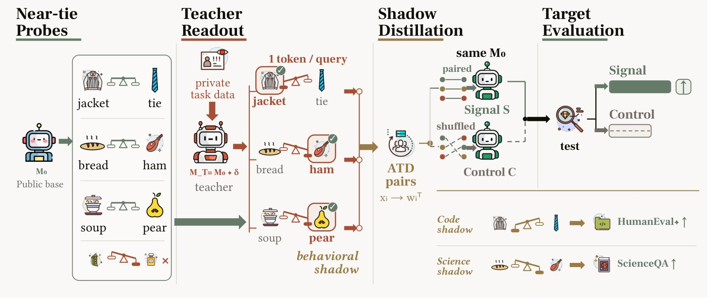

# 🐦 @_akhaliq

## 📅 September 29, 2026

> 4 post(s) archived.

---

### 🕐 16:13 UTC · @_akhaliq

> Post-Training Leaves Behavioral Shadows on Unrelated Decisions With 5,664 single-word teacher answers, a student gains +5.34pp on HumanEval+ — without ever seeing code.

🔗 [View original post](https://x.com/HuggingPapers/status/2104967837525668148)

---

### 🕐 15:45 UTC · @_akhaliq

> getting acquired by @nvidia = hugging face can now hire people we couldn&apos;t as a small startup and give them a decade to make open-source AI win! if you&apos;re one of them, my dms are open

🔗 [View original post](https://x.com/ClementDelangue/status/2104960836796342729)

---

### 🕐 15:44 UTC · @_akhaliq

> 🚨 BREAKING: Super excited to announce we&apos;re deploying the world&apos;s fastest inference with @Cerebras. Talk to any developer and they&apos;re excited to build with 20x faster AI... the problem is there&apos;s almost no compute available. We&apos;re here to solve that. Using GPUs for prefill - it&apos;s now more affordable than ever too. Thank you to the whole Cerebras team and excited to grow this partnership. First tokens live Q127 🚀

🔗 [View original post](https://x.com/general_compute/status/2104960632475033868)

---

### 🕐 15:11 UTC · @_akhaliq

> I was on @CNBC Squawk Box with one of our customers, @JackGretz, the CEO of @SeatGeek to talk about how they used Serval to eliminate the ticket backlog and redeploy their engineers as embedded business partners. ⚡ 50% of IT requests automated in first 60 days ⚡ 132 automations built in 8 weeks ⚡ Zero layoffs. Hiring this year already ahead of all of last year ⚡ IT time redeployed to solve harder problems When you automate the low-hanging tasks, the support requests and the password resets, you can take the most technical people in your organization and deploy them into work that&apos;s more productive than what they were doing before. Full clip below. 👇 @getserval Media

🔗 [View original post](https://x.com/jakeserval/status/2104952096206574013)

---
