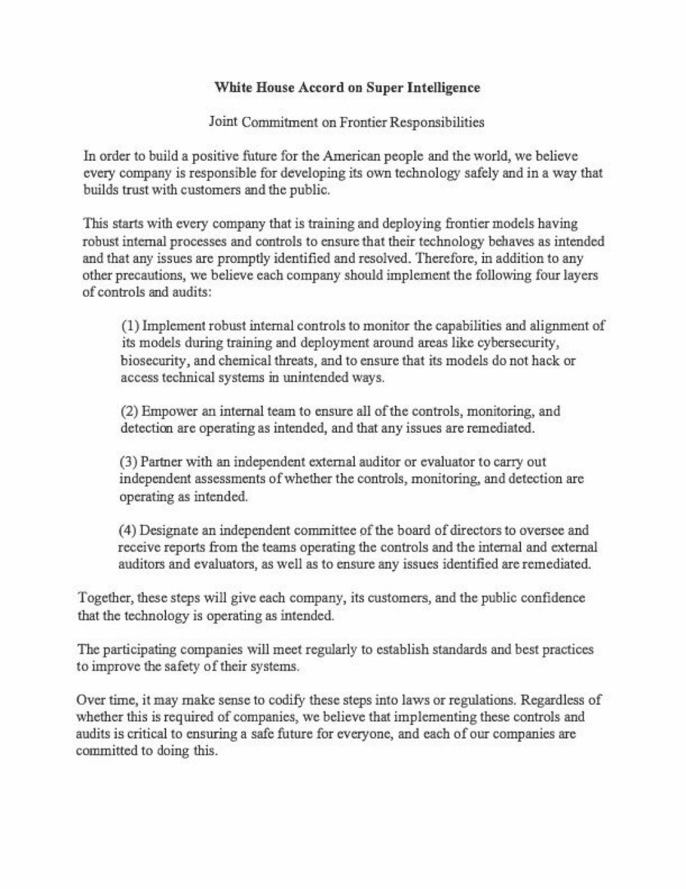

# 🐦 @elonmusk

## 📅 September 29, 2026

> 17 post(s) archived.

---

### 🕐 22:21 UTC · @elonmusk

> Only President Trump could convene all the leaders of the top companies developing chips, data centers and frontier models for Super Intelligence. This new Industrial Revolution has already created a million new jobs and is spurring a bigger infrastructure build-out than the railroads, canals and grid combined. I was honored to witness history as the leaders of the frontier lab companies signed the White House Accord on Super Intelligence, accepting responsibility for the safe development of their products and imposing new internal controls and external audits. This is far better than waiting years for some international agreement that would probably never happen. President Trump continues to ensure that U.S. remains the technology leader while putting Americans first.

🔗 [View original post](https://x.com/DavidSacks/status/2105060520327786914)

---

### 🕐 22:20 UTC · @elonmusk

> Congratulations, @jgebbia! Chief Design Officer @jgebbia officially unveils https://America.gov, the new online home for the United States of America

🔗 [View original post](https://x.com/elonmusk/status/2105060085164863695)

---

### 🕐 21:58 UTC · @elonmusk

> White House Accord on Super Intelligence Joint Commitment on Frontier Responsibilities

🔗 [View original post](https://x.com/mkratsios47/status/2105054600445243426)

---

### 🕐 21:50 UTC · @elonmusk

> Official.

🔗 [View original post](https://x.com/WhiteHouse/status/2105052569601294798)

---

### 🕐 21:44 UTC · @elonmusk

> Elon Musk&apos;s full discussion with NVIDIA CEO Jensen Huang at the https://america.gov launch event. Media

🔗 [View original post](https://x.com/america/status/2105051153599811684)

---

### 🕐 20:56 UTC · @elonmusk

> America leads the future of Super Intelligence. 🇺🇸

🔗 [View original post](https://x.com/WhiteHouse/status/2105039074033873258)

---

### 🕐 20:27 UTC · @elonmusk

> 🚨 JUST NOW: Elon Musk, shoulder to shoulder with President Trump, explains why AI is going to lift up ALL of humanity -- not force them into poverty @elonmusk: &quot;I think by FAR the most likely outcome is an AGE OF ABUNDANCE where we don&apos;t have just universal basic income, we have universal HIGH income. And people speak about medical benefits. &quot;Maybe it&apos;s worth talking a bit more about that. When you have robots and you have superintelligence, it means that EVERYONE in the world can have better medical care than anyone here, including ME. And wouldn&apos;t that be wonderful?!&quot; Jobs are going to change. Jobs have ALWAYS changed. But being a computer used to be a job. There used to be buildings FULL of people doing calculations, but now digital computers to do those tasks. I don&apos;t think anyone is pining to go back and do calculations all day to do bank interest rates, which is what they used to do. So I think we&apos;ll see an evolution of roles. And as the President has mentioned, it&apos;s not as though unemployment has increased. In fact, there&apos;s a TREMENDOUS demand for people. So I think the most likely outcome--and it&apos;s probably worth looking at--the most likely outcome is one which is INCREDIBLY beneficial. And it&apos;s a future that you, if you could look into the future, it has a future you would WANT.&quot; WELL SAID, Elon. No notes 👏 Media

🔗 [View original post](https://x.com/nicksortor/status/2105031842609185201)

---

### 🕐 20:22 UTC · @elonmusk

> Starship flight videos Slow motion views of Flight 14 liftoff from the pad and tower at Starbase

🔗 [View original post](https://x.com/elonmusk/status/2105030525132124476)

---

### 🕐 19:55 UTC · @elonmusk

> Super Intelligence .@POTUS hosts a Super Intelligence meeting at the White House 🇺🇸

🔗 [View original post](https://x.com/elonmusk/status/2105023642312601851)

---

### 🕐 18:55 UTC · @elonmusk

> BREAKING: Elon Musk was sitting next to President Trump at the White House Super Intelligence luncheon. Here is President Trump’s full address: • Praised the technology leaders as some of the world’s most brilliant people • Said President Xi also acknowledged their brilliance • Declared that America has a major lead in AI and will keep it • Said the industry could become bigger than the Industrial Revolution • Announced a document officially renaming “artificial intelligence” as “superintelligence” • Emphasized self-regulation alongside government oversight • Said data center companies will support local communities through energy, education and financial assistance • Highlighted the wealth, lower taxes and other benefits data centers can bring • Said the leaders in the room love America and want to do the right thing Media

🔗 [View original post](https://x.com/cb_doge/status/2105008618722795817)

---

### 🕐 17:56 UTC · @elonmusk

> try https://dot.com

🔗 [View original post](https://x.com/hexiang/status/2104993682709754258)

---

### 🕐 15:30 UTC · @elonmusk

> SECRETARY RUBIO on https://AMERICA.GOV PASSPORTS: No printing forms, no drugstore hostage photo, no appointment, no line, no middleman that you&apos;re paying to do something that should be available to you. Media

🔗 [View original post](https://x.com/StateDept/status/2104957106655023491)

---

### 🕐 15:27 UTC · @elonmusk

> BREAKING: Grok is helping power America .gov, the U.S. government’s new AI website. 🇺🇸 U.S. Chief Design Officer Joe Gebbia says Grok &amp; Gemini power the site. Americans can ask questions and get answers from official government sources in one place. A major milestone for Grok. Media

🔗 [View original post](https://x.com/cb_doge/status/2104956354423349493)

---

### 🕐 15:12 UTC · @elonmusk

> Retail investors should be heard. And @Tesla is proud to create practical tools to empower their voice. https://www.sec.gov/rules-regulations/no-action-interpretive-exemptive-letters/division-corporation-finance-no-action/tesla-inc-092926

🔗 [View original post](https://x.com/beehrhart/status/2104952344731591131)

---

### 🕐 14:20 UTC · @elonmusk

> Chief Design Officer @jgebbia officially unveils https://America.gov, the new online home for the United States of America Media

🔗 [View original post](https://x.com/RapidResponse47/status/2104939402359107616)

---

### 🕐 03:41 UTC · @elonmusk

> &quot;Everyone has ethnicity except European-descended peoples, because that would be Adolf Hitler,&quot; is not proving to be a sustainable position. It persisted as long as it did only through media gate-keeping and suppression of discussion, but the cultural reign of terror is now over.

🔗 [View original post](https://x.com/xenocosmography/status/2104778683391361530)

---

### 🕐 01:34 UTC · @elonmusk

> Try Grok @Bot I am technologically illiterate, but in less than 24 hours, Grok Bot has transformed my productivity &amp; personal business outlook. I have agents that are experts / &quot;employees&quot; in real estate development, DTC fashion e-commerce, niche private equity, and HPC/GPU customer acquisitio…

🔗 [View original post](https://x.com/elonmusk/status/2104746577793298608)

---
