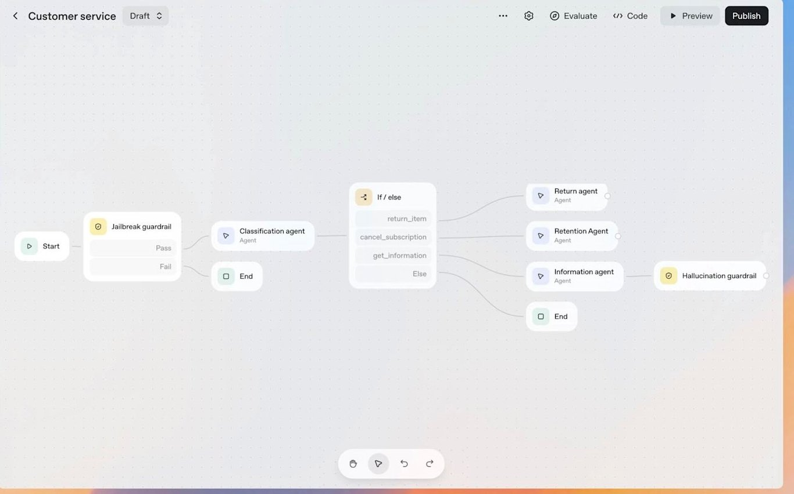

# 🐦 @emollick

## 📅 September 29, 2026

> 7 post(s) archived.

---

### 🕐 18:30 UTC · @emollick

> It also has a natural analog on teams as a persistent entity with a job that you can delegate to using existing team communication tools like Slack. I expect more Clawlikes soon, though I don’t think they are the final form of this type of AI.

🔗 [View original post](https://x.com/emollick/status/2105002271184687367)

---

### 🕐 18:23 UTC · @emollick

> I only used Dots briefly before launch, so can’t offer a detailed review, but I found it to be good &amp; very much in the rapidly-expanding Clawlike category with Muse &amp; Grokbot. Using a capable model with access to your data as an assistant &amp; second opinion is remarkably useful.

🔗 [View original post](https://x.com/emollick/status/2105000480569212984)

---

### 🕐 16:05 UTC · @emollick

> As least year&apos;s DevDay, this is what OpenAI said agents would look like. This is before OpenClaw &amp; self-organizing swarms, so this entire approach was scraped soon after: 1) AI is evolving quite quickly 2) The AI labs aren&apos;t always anticipating how fast in the products they make

🔗 [View original post](https://x.com/emollick/status/2104965679971709108)

---

### 🕐 15:59 UTC · @emollick

> The impact of AI on jobs is still pretty unclear at this point. I don&apos;t find this very surprising, as employers are still figuring out individual adoption, let alone how you use AI in complex organizations. Things may start to happen faster as agents capable of real work spread. Has AI hit the labor market yet? @alexolegimas and my verdict after ~20 papers: not yet in aggregate. Unemployment and layoffs show almost nothing. But AI may already be cutting junior hiring in exposed white-collar jobs. Remote work may explain part of that decline. A 🧵

🔗 [View original post](https://x.com/emollick/status/2104964210644181230)

---

### 🕐 13:06 UTC · @emollick

> In a world where cloud-based Clawlike assistants that give powerful models virtual computers are increasingly looking like the way forward for personal AI, it really does seem to suggest the choices Apple made for Siri (on-device, limited capabilities) may be the wrong direction.

🔗 [View original post](https://x.com/emollick/status/2104920813111505335)

---

### 🕐 04:15 UTC · @emollick

> Hey, Claude: &quot;I asked an earlier Claude to Remove the Squid from All Quiet on the Western Front. Now you can make movies and such. I need you to show how far you have come&quot; &amp; I pasted in the tweet below There is some clever stuff, models have a real sense of humor at this point Media 👀Claude handles an insane request: “Remove the squid” “The document appears to be the full text of the novel &quot;All Quiet on the Western Front&quot; by Erich Maria Remarque. It doesn&apos;t contain any mention of squid that I can see.” “Figure out a way to remove the 🦑​​​​​​​​​​​​​​​​“

🔗 [View original post](https://x.com/emollick/status/2104787162210435095)

---

### 🕐 00:56 UTC · @emollick

> The AI buildout in terms of percent of GDP is greater than the height of railroads, yet AI does not dominate the economy anywhere near as much as rail. In 1890, 1 out of every 12 men in America was employed in the railways, which used 56% of all horsepower across all machines!

🔗 [View original post](https://x.com/emollick/status/2104737094073729440)

---
