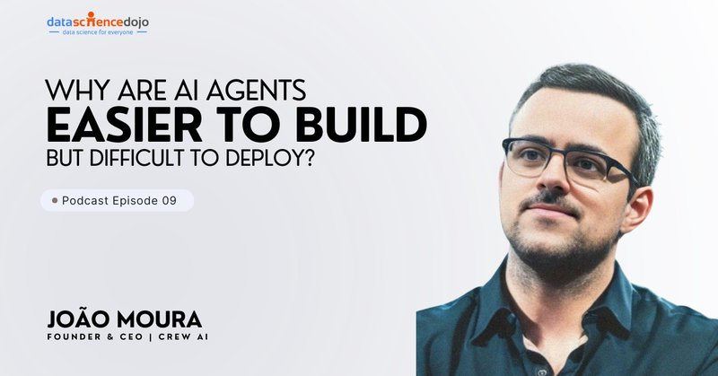

# 🐦 @joaomdmoura

## 📅 September 29, 2026

> 2 post(s) archived.

---

### 🕐 16:00 UTC · @joaomdmoura

> Media credit: João Moura on Multi-Agent Systems, Autonomous Workflows &amp; AI Entrepreneurship | Ep 09 https://www.youtube.com/watch?v=DGGLhUt42LM

🔗 [View original post](https://x.com/joaomdmoura/status/2104964546079478003)

---

### 🕐 16:00 UTC · @joaomdmoura

> The most technical companies are not buying agent platforms. They use open source. They try every framework. Their teams are savvy enough to build it first. Then, maybe two years later: alright, now we are ready to buy something. The adoption pattern depends on how techy a business is. Did your company build first or buy first? Media

🔗 [View original post](https://x.com/joaomdmoura/status/2104964533433643396)

---
