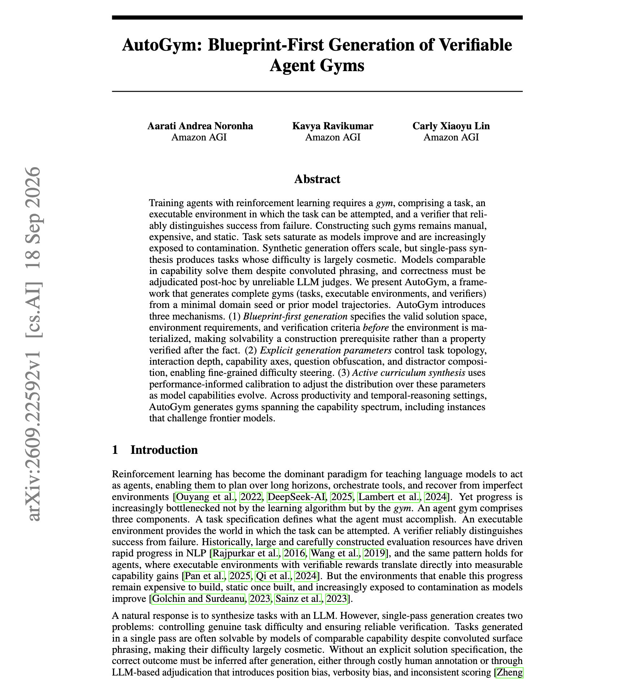

# 🐦 @omarsar0

## 📅 September 29, 2026

> 1 post(s) archived.

---

### 🕐 01:33 UTC · @omarsar0

> Great paper from Amazon AGI on generating RL environments for agents. (bookmark it) Also, pay attention to this important new AI engineering skill of creating RL environments. Seeing a huge shift towards this. The authors propose AutoGym which writes the task, the executable environment and the verifier together, starting from a small domain seed or past model trajectories. Paper: https://arxiv.org/abs/2609.22592 Chat with Paper: https://academy.dair.ai/papers/autogym-blueprint-first-generation-of-verifiable-agent-gyms-2609.22592

🔗 [View original post](https://x.com/omarsar0/status/2104746239061586055)

---
