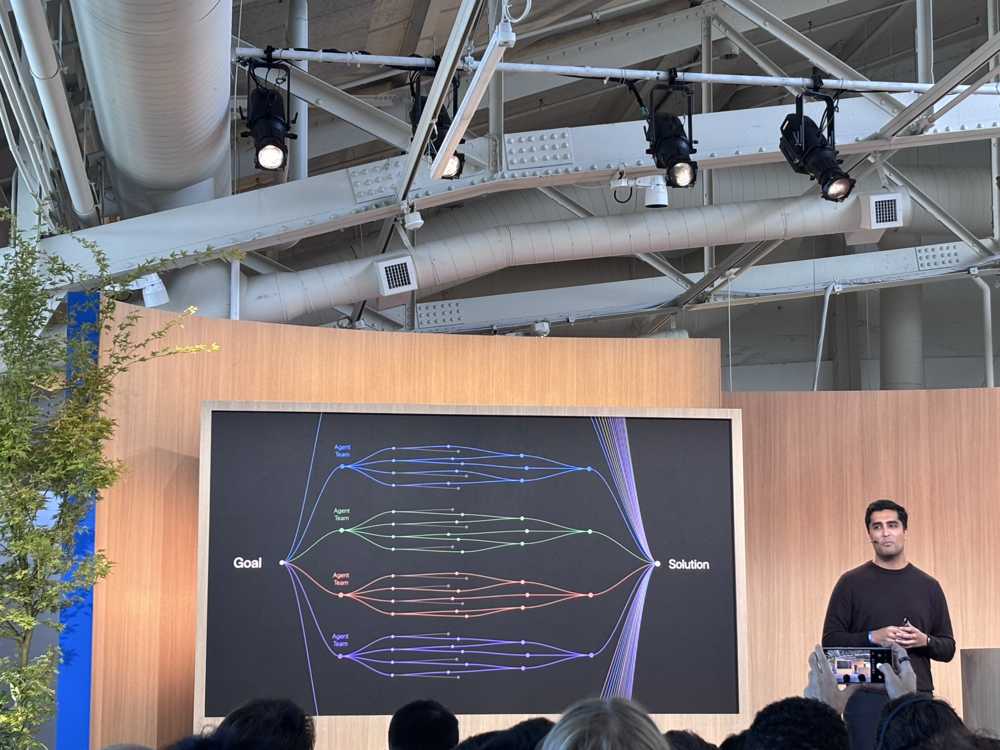
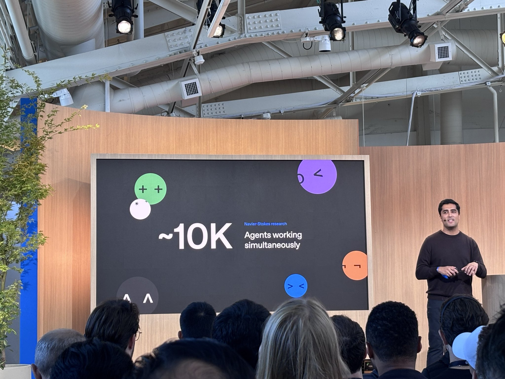
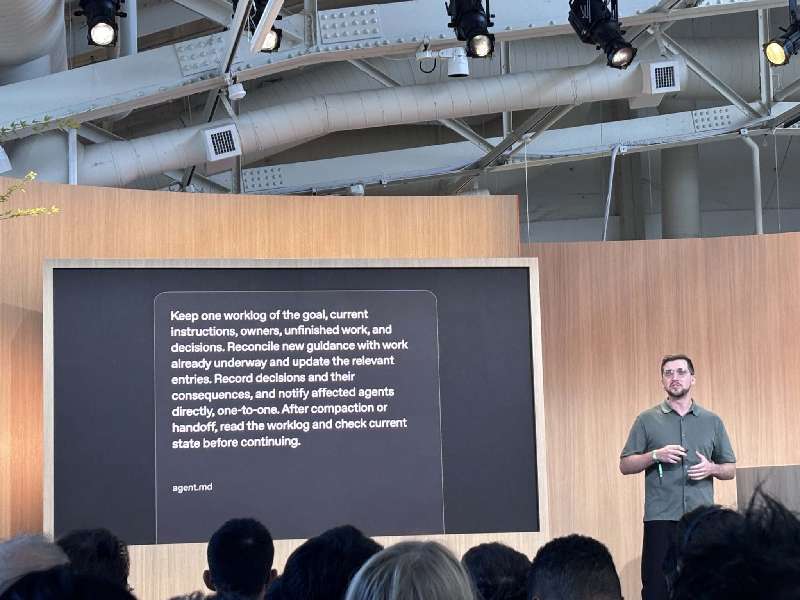
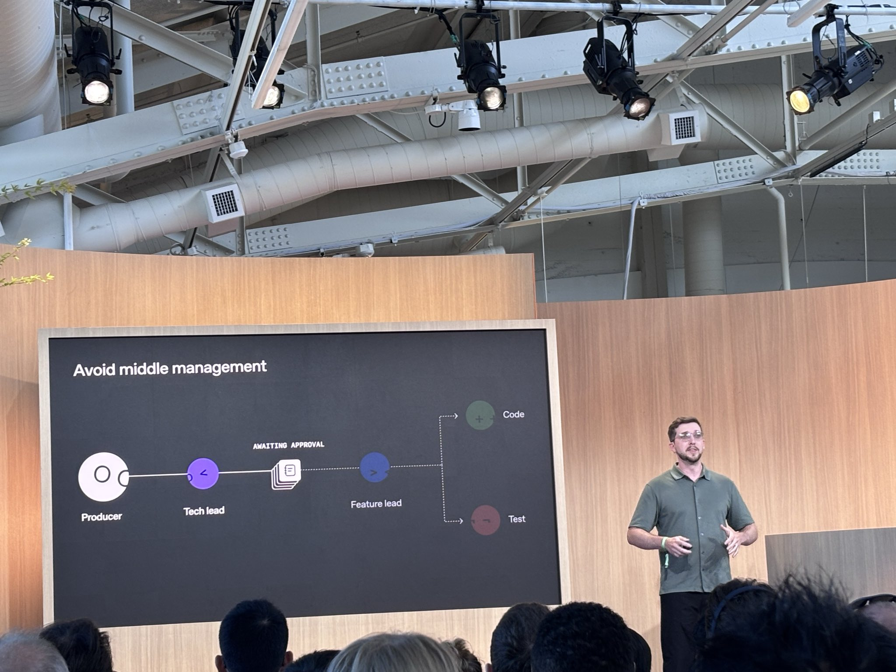
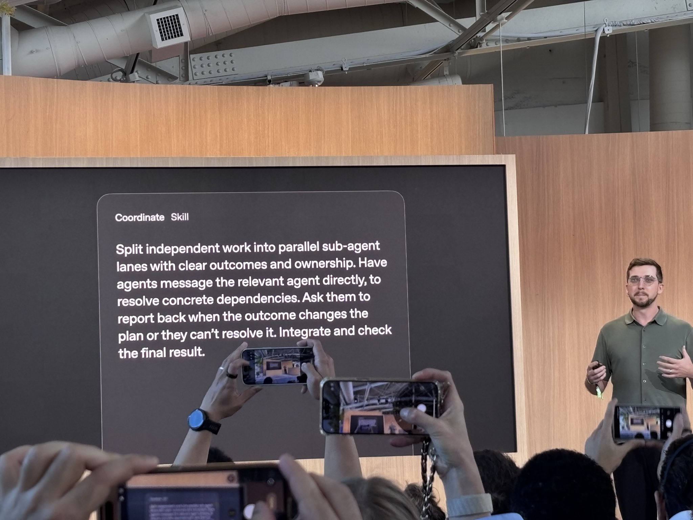
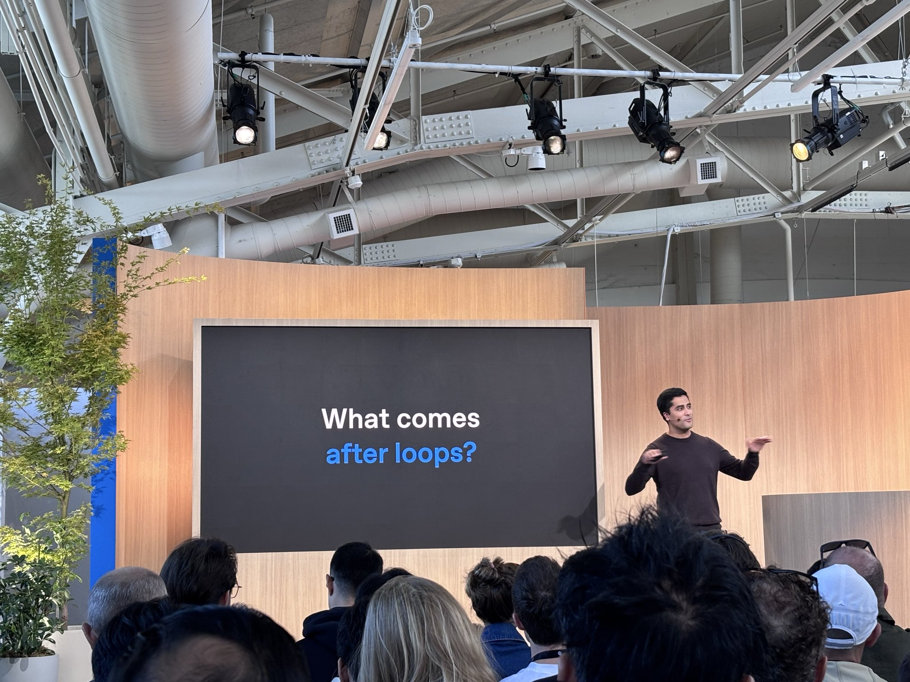
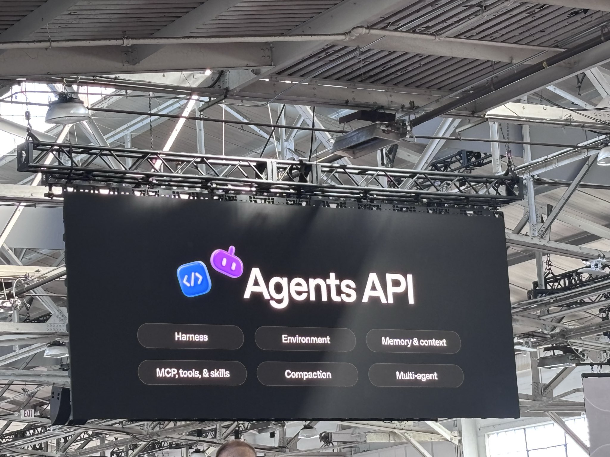
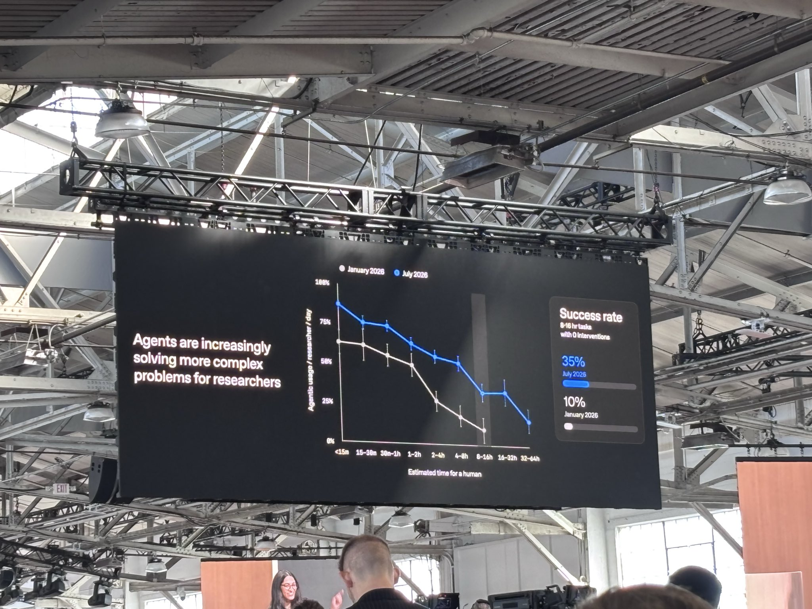
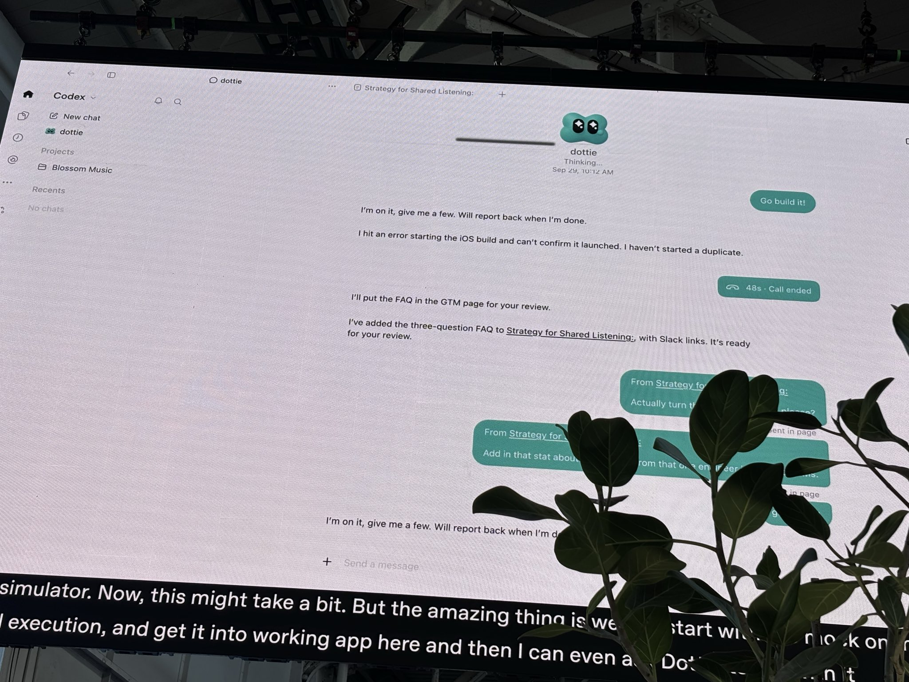
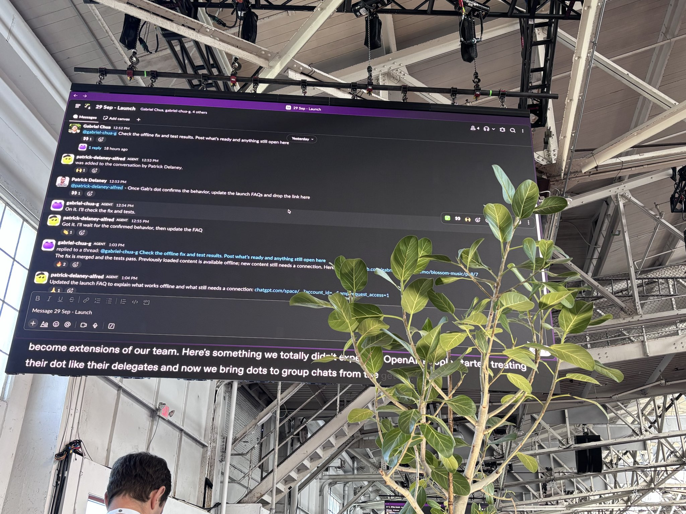

# 🐦 @omarsar0

## 📅 September 29, 2026

> 18 post(s) archived.

---

### 🕐 18:52 UTC · @omarsar0

> I have so much to write about this including my own research. Will take some time in the coming days to write more extensively y thoughts. Challenging to live tweet and write in details.

🔗 [View original post](https://x.com/omarsar0/status/2105007740406096187)

---

### 🕐 18:38 UTC · @omarsar0

> Agent team patter tries to improve communication among agents and allow deep exploration.

🔗 [View original post](https://x.com/omarsar0/status/2105004429615493311)

---

### 🕐 18:36 UTC · @omarsar0

> Now let’s look at how agents can be scaled.

🔗 [View original post](https://x.com/omarsar0/status/2105003727644180694)

---

### 🕐 18:34 UTC · @omarsar0

> Keep agents on track.

🔗 [View original post](https://x.com/omarsar0/status/2105003408205959383)

---

### 🕐 18:33 UTC · @omarsar0

> Don’t over manage your agents.

🔗 [View original post](https://x.com/omarsar0/status/2105003066307338640)

---

### 🕐 18:30 UTC · @omarsar0

> Agent coordinating skill. This is a nice one to test.

🔗 [View original post](https://x.com/omarsar0/status/2105002372590407901)

---

### 🕐 18:17 UTC · @omarsar0

> What comes after loops? Will try to live tweet this, at least the key notes.

🔗 [View original post](https://x.com/omarsar0/status/2104999107131797638)

---

### 🕐 18:15 UTC · @omarsar0

> MCP won! I started to use Pi heavily for its customisations. This will take it to another new level of what’s possible to build with it. A pretty big change is that Pi now has MCP at the core. How is this even possible? What made us change our way? https://earendil.com/posts/you-said-no-mcp/

🔗 [View original post](https://x.com/omarsar0/status/2104998601319702777)

---

### 🕐 17:40 UTC · @omarsar0

> Introducing OpenAI’s Dots x Higgsfield. Your always-on Higgsfield creative crew keeps working while you’re away. Check in by text, call or email, and pause the work whenever you need. Powered by GPT-6.1 Sol. Media

🔗 [View original post](https://x.com/higgsfield/status/2104989726604484946)

---

### 🕐 17:31 UTC · @omarsar0

> You can build your own dots if you need too with the Agents API.

🔗 [View original post](https://x.com/omarsar0/status/2104987398857961869)

---

### 🕐 17:29 UTC · @omarsar0

> Research progress at OpenAI.

🔗 [View original post](https://x.com/omarsar0/status/2104986857771823178)

---

### 🕐 17:19 UTC · @omarsar0

> Codex &lt;&gt; dots. This is where I think this product can really make a difference. So many interesting ways to use agents that we haven’t unlocked yet.

🔗 [View original post](https://x.com/omarsar0/status/2104984311783113098)

---

### 🕐 17:17 UTC · @omarsar0

> Pluggable on Slack.

🔗 [View original post](https://x.com/omarsar0/status/2104983934740373526)

---

### 🕐 16:50 UTC · @omarsar0

> Once coding agents can write the whole app, deploying and running it becomes the bottleneck. InstaCloud from @insforge lets agents deploy straight to a serverless cloud that scales with traffic and down to zero when idle. Branching is great for agent workflows. An agent can copy an entire service, data included, in seconds and test changes there before touching the live app. We just raised an $8M seed round to kill AWS, GCP, and Azure. Introducing http://instacloud.com, the agent-native serverless cloud. Your team is shipping code like never before. But you&apos;re getting caught up in manual, tedious DevOps work trying to deploy it. InstaCloud provides t…

🔗 [View original post](https://x.com/omarsar0/status/2104977174122156314)

---

### 🕐 16:16 UTC · @omarsar0

> I keep saying the real upside of AI agents is giving your most technical people their time back. SeatGeek automated 50% of its IT requests in 60 days with @getserval. Its IT engineers now work inside business teams as embedded partners. Zero layoffs, and hiring this year is already ahead of all of last year. Media I was on @CNBC Squawk Box with one of our customers, @JackGretz, the CEO of @SeatGeek to talk about how they used Serval to eliminate the ticket backlog and redeploy their engineers as embedded business partners. ⚡ 50% of IT requests automated in first 60 days ⚡ 132 automations b…

🔗 [View original post](https://x.com/omarsar0/status/2104968683881910573)

---

### 🕐 14:39 UTC · @omarsar0

> Ambitious stuff right here, but much needed to better leverage your intelligence stack. Companies will need a system of record for how their AI works, just as they do for customers and finances. CData&apos;s new Connect AI Gateway handles every request between your models, agents, and business systems. It routes each one to the right model or tool, checks identity and policy on every call, and saves what each interaction learns as context other agents can reuse. You’ve spent years teaching people how your company works. Your AI needs that knowledge too. Introducing Connect AI Gateway. It routes, governs, and learns from AI requests, building a system of record for how your company thinks. Early access is live: https://cdata.com/ai

🔗 [View original post](https://x.com/omarsar0/status/2104944157152170294)

---

### 🕐 14:32 UTC · @omarsar0

> So back! Let&apos;s connect if you are at DevDay and want to chat about all things startups, harness engineering, and RSI. 10am PT, on the dot.

🔗 [View original post](https://x.com/omarsar0/status/2104942417229299786)

---

### 🕐 01:33 UTC · @omarsar0

> Great paper from Amazon AGI on generating RL environments for agents. (bookmark it) Also, pay attention to this important new AI engineering skill of creating RL environments. Seeing a huge shift towards this. The authors propose AutoGym which writes the task, the executable environment and the verifier together, starting from a small domain seed or past model trajectories. Paper: https://arxiv.org/abs/2609.22592 Chat with Paper: https://academy.dair.ai/papers/autogym-blueprint-first-generation-of-verifiable-agent-gyms-2609.22592

🔗 [View original post](https://x.com/omarsar0/status/2104746239061586055)

---
