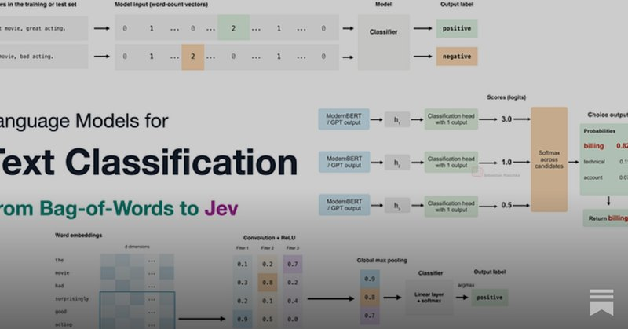
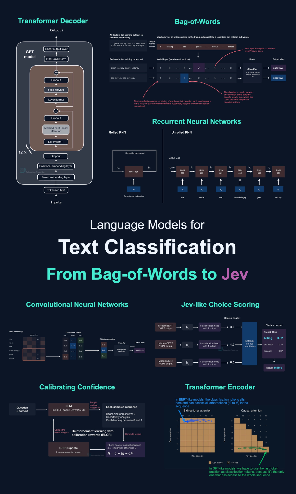

# 🐦 @rasbt

## 📅 September 29, 2026

> 3 post(s) archived.

---

### 🕐 17:25 UTC · @rasbt

> Update: OpenAI just added a Jev clone 😆

🔗 [View original post](https://x.com/rasbt/status/2104985996517355691)

---

### 🕐 13:19 UTC · @rasbt

> And here&apos;s the link to the full article: https://magazine.sebastianraschka.com/p/classifier-history-and-jev

🔗 [View original post](https://x.com/rasbt/status/2104923912920281279)

---

### 🕐 13:19 UTC · @rasbt

> Took a while, but here it is, a mega write-up on language models for text classification and, of course, Jev. It&apos;s basically a visual guide to RNNs, CNNs, transformers, and calibration, with hands-on experiments on accuracy and efficiency.

🔗 [View original post](https://x.com/rasbt/status/2104923910039040173)

---
