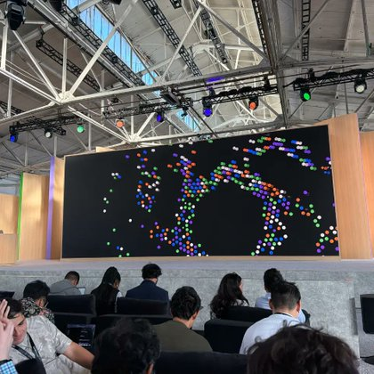

# 🐦 @simonw

## 📅 September 29, 2026

> 2 post(s) archived.

---

### 🕐 16:54 UTC · @simonw

> I&apos;m at OpenAI&apos;s DevDay event in San Francisco today - as I have for the past three DevDay events, I&apos;m running a live blog where I&apos;ll be posting updates during the keynote, which starts in five minutes https://simonwillison.net/2026/Sep/29/openai-devday-2026-live-blog/

🔗 [View original post](https://x.com/simonw/status/2104978193946124370)

---

### 🕐 03:24 UTC · @simonw

> More on Sonnet 5.5 https://simonwillison.net/2026/Sep/28/claude-sonnet-5-5/

🔗 [View original post](https://x.com/simonw/status/2104774320656646160)

---
