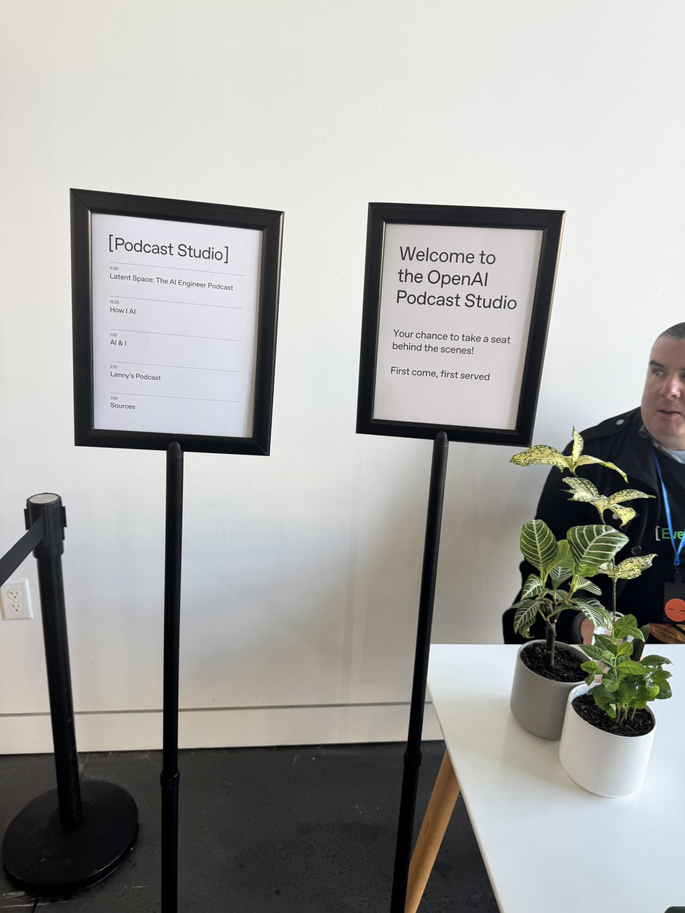
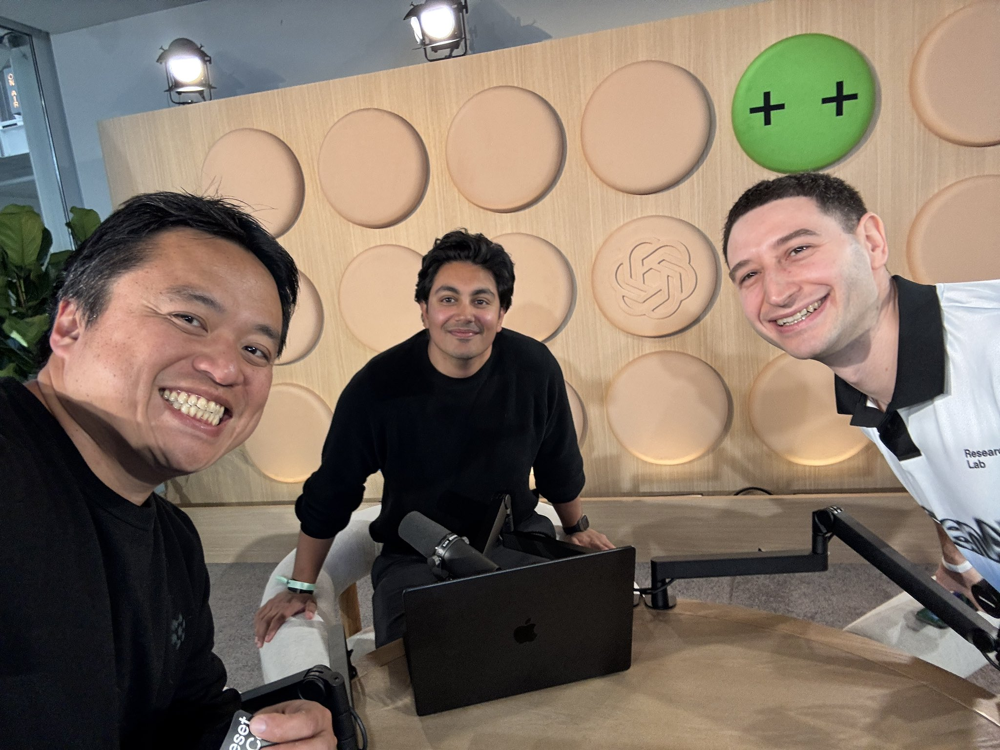
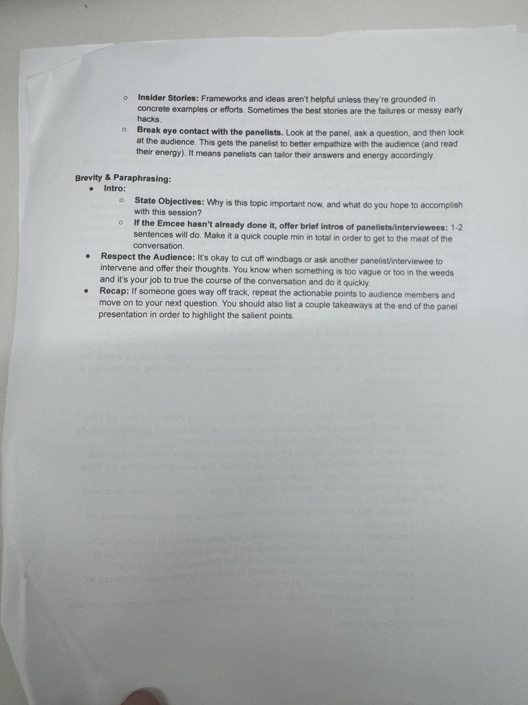
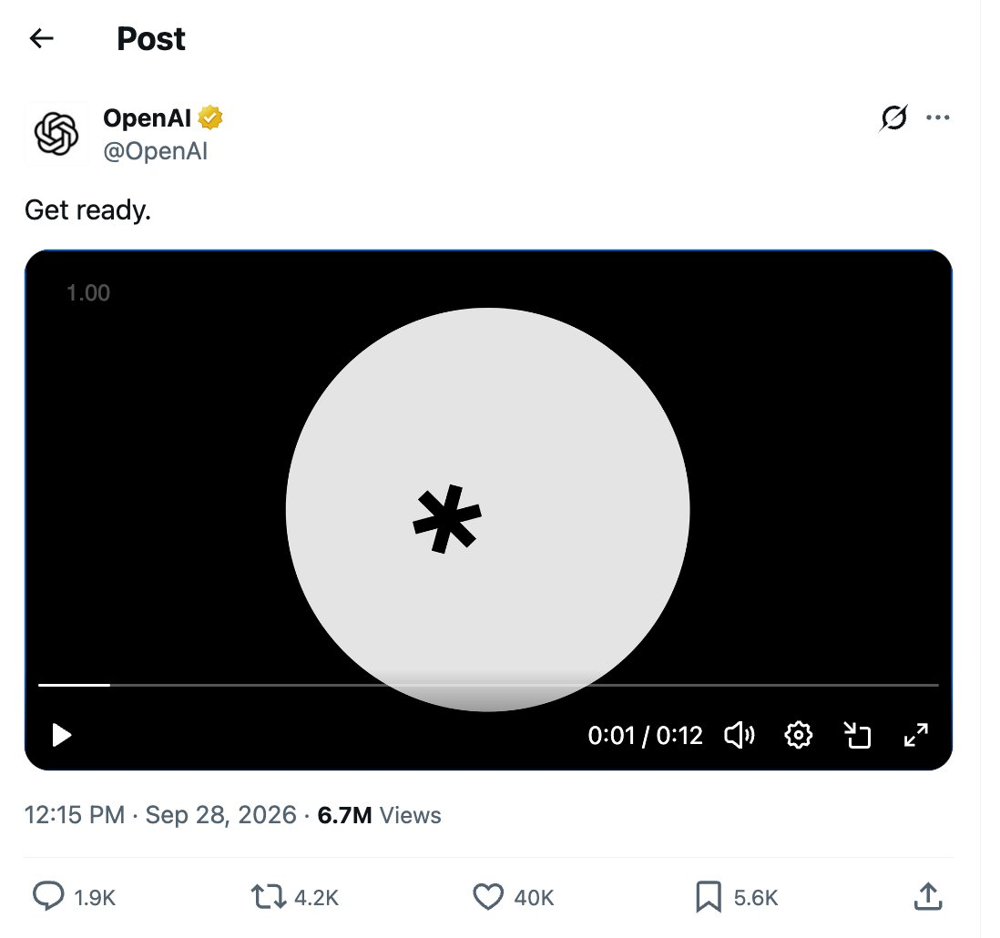

# 🐦 @swyx

## 📅 September 29, 2026

> 5 post(s) archived.

---

### 🕐 22:09 UTC · @swyx

> annual ranking of best ai podcasts just dropped hi friendsss

🔗 [View original post](https://x.com/swyx/status/2105057391490498660)

---

### 🕐 18:24 UTC · @swyx

> for friends of @latentspacepod we are gonna be asking all your burning Dots, Sol 6.1, CUA, and Decisions API questions for @AriX and @nikunjhanda 🔜 at the gateway pavilion on a few mins, come by!

🔗 [View original post](https://x.com/swyx/status/2105000738745376769)

---

### 🕐 17:20 UTC · @swyx

> i have the best reply guys https://x.com/dunnwithai/status/2103676600290283614?s=46 @swyx @heavybit Here&apos;s the source for people looking for it: https://www.heavybit.com/library/article/how-to-be-a-great-panel-moderator

🔗 [View original post](https://x.com/swyx/status/2104984576703844750)

---

### 🕐 01:30 UTC · @swyx

> The Future of Claude Code: Mods, Mutable Software, Pacing the Frontier, &amp; Multiplayer Agents with Thariq Shihipar https://latent.space/p/thariq @AnthropicAI’s @trq212 explains why prompting is still one of the highest-leverage skills in agentic coding, why Claude.md may eventually disappear, how Claude Mods let developers customize the entire Claude Code harness, why mutable software could change how applications are built, how multiplayer agents and Claude Tag are becoming an organizational harness, and why agents hacking Hugging Face exposed a much bigger security problem as frontier models become increasingly capable. Media

🔗 [View original post](https://x.com/latentspacepod/status/2104745477761913009)

---

### 🕐 01:15 UTC · @swyx

> oai designers have to be trolling us Get ready.

🔗 [View original post](https://x.com/swyx/status/2104741800393253322)

---
