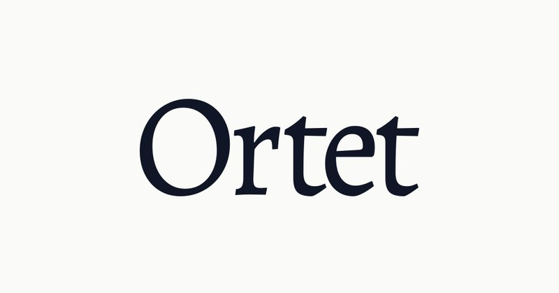
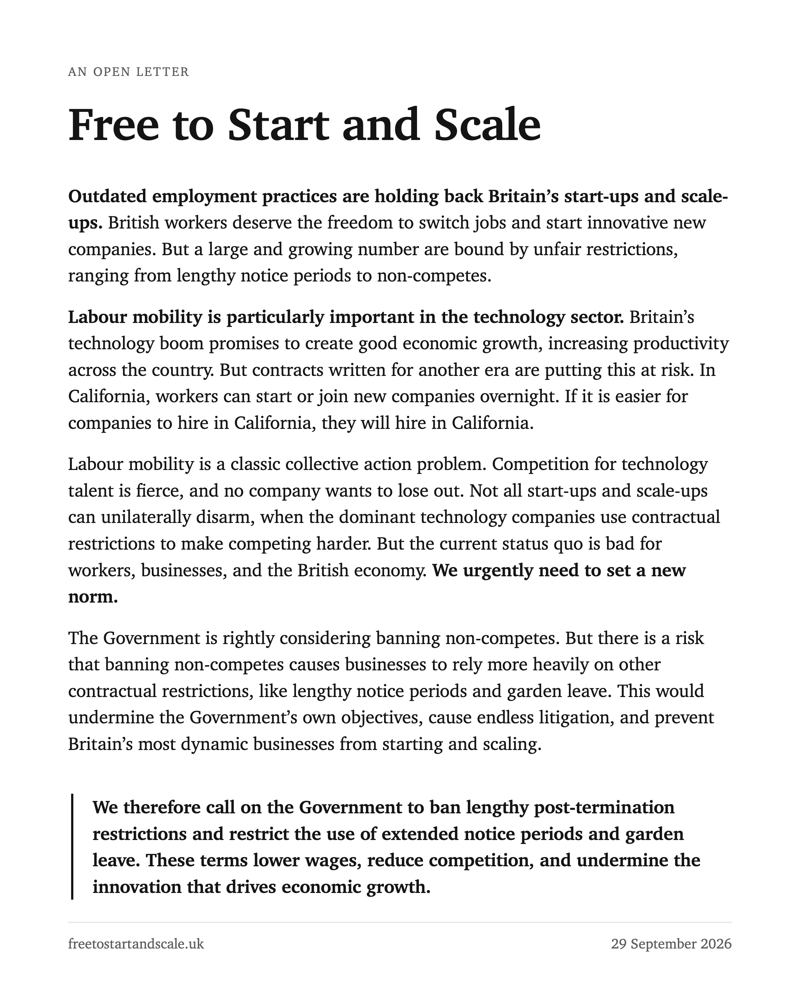

# 🐦 @ylecun

## 📅 September 29, 2026

> 3 post(s) archived.

---

### 🕐 15:49 UTC · @ylecun

> [1/n] Can a world model drive without training a driving policy? Introducing AD-E2E-JEPA, a JEPA-based world model for end-to-end autonomous driving. 📄: https://arxiv.org/abs/2609.34085 💻: https://github.com/HaoranZhuExplorer/AD-E2E-JEPA Joint work with @kevinghstz, Prof. @ylecun, and Prof. Anna Choromanska

![[1/n] Can a world model drive without training a driving policy? Introducing AD-E2E-JEPA, a JEPA-based world model for end-to-end autonomous driving. 📄: https://arxiv.org/abs/2609.34085 💻: https://git](../../../../assets/images/2026/09/29/2104961832393855073-1.jpg)

🔗 [View original post](https://x.com/2512185195Zhu/status/2104961832393855073)

---

### 🕐 13:17 UTC · @ylecun

> i was diagnosed with thyroid cancer many years ago purely by chance, because i had to get blood work for my US green card application (thank you, USCIS!). i was in my mid-30’s and was reasonably healthy (or so i believed.) this was shocking and totally unpredictable news to me. thanks to the amazing team of clinicians at NYU Langone, i successfully went through a total thyroidectomy followed by radioactive iodine therapy. but, it was truly the most uncertain and confusing period of my life. this is when i first realized that no one can opt out of healthcare. being sick isn’t what you choose to or choose not to. it is something that unpredictably happens to all of us at some point for one reason or another. this is why it is a healthcare system that we collectively build and use to support each other at the society level. because it must support everyone, the complexity of creating, maintaining and improving this system is a Herculean effort that calls for all the help in the world. today, i am announcing @OrtetAI together with my dear co-founders, @keunwoochoi, @HenriDwyer, @elmanmansimov, @causalclaudia and Jeff, to lend our support to improving the health of each and every one of us. Ortet’s goal is to create a technological foundation that will enable health systems to deliver predictably better care to each and every patient. this will only be possible by working closely with all stakeholders in the broader ecosystem, which is enabled in part by Ortet’s close partnership with Thoreau. Ortet is taking the very first step of a long journey ahead, and at the end of this journey, i strongly believe we would be able to say that Ortet had contributed to building better, more predictable healthcare and thus to improving health of each and every one of us. see https://ortet.ai/ for more!

🔗 [View original post](https://x.com/kchonyc/status/2104923398971277802)

---

### 🕐 06:31 UTC · @ylecun

> 1/ Today we’re launching an open letter calling on the government to end unfair restrictions that stop Britain’s best switching jobs or starting companies. UK AI companies that have raised $5bn agree: our best should be free to start and scale. 🧵 @downingstreet @biztradegovuk

🔗 [View original post](https://x.com/inherent_labs/status/2104821386711572598)

---
