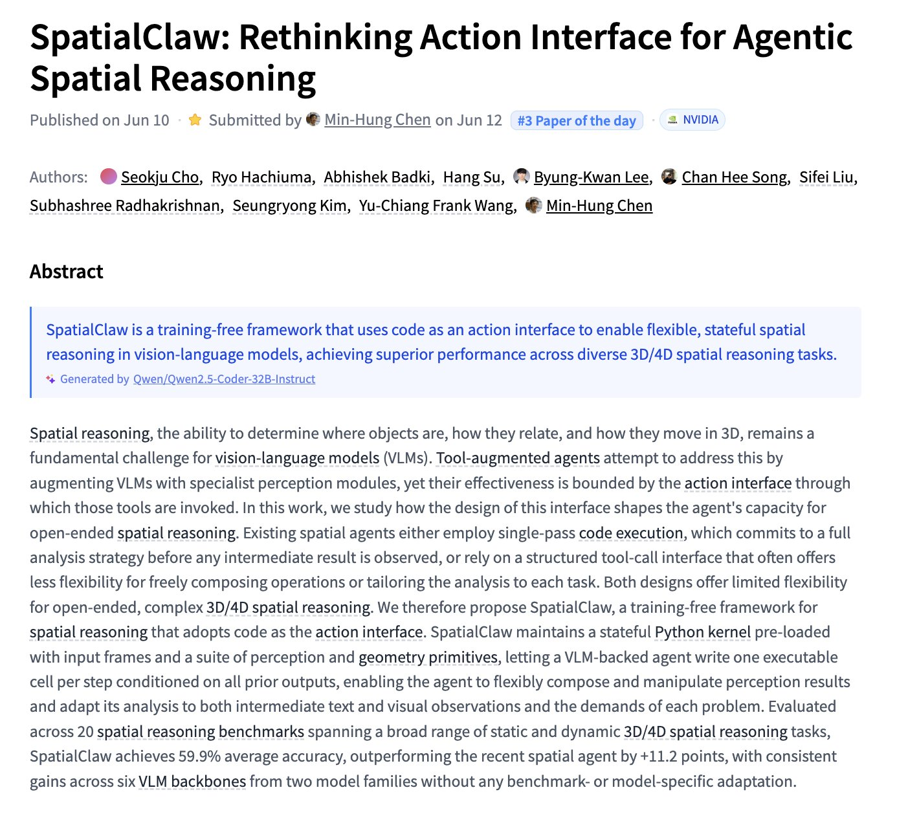

# 🐦 @_akhaliq

## 📅 September 30, 2026

> 6 post(s) archived.

---

### 🕐 22:59 UTC · @_akhaliq

> LongLive-Plug Once-for-All Distillation for Video Generation paper: https://huggingface.co/papers/2609.38154 Media

🔗 [View original post](https://x.com/_akhaliq/status/2105432314633490445)

---

### 🕐 22:56 UTC · @_akhaliq

> Omni-IO Skills Harnessing Your Agent Omni-Native paper: https://huggingface.co/papers/2609.31847 Media

🔗 [View original post](https://x.com/_akhaliq/status/2105431737262350346)

---

### 🕐 22:51 UTC · @_akhaliq

> LEGO-Anything Coding Agents for 3D Scene Reconstruction paper: https://huggingface.co/papers/2609.36380 Media

🔗 [View original post](https://x.com/_akhaliq/status/2105430425657364973)

---

### 🕐 19:34 UTC · @_akhaliq

> I will be at the Hugging Face Open Together event at the Midway in SF on October 16th sign up here: https://luma.com/OpenTogether Media

🔗 [View original post](https://x.com/_akhaliq/status/2105380761495093276)

---

### 🕐 07:49 UTC · @_akhaliq

> SpatialClaw Rethinking Action Interface for Agentic Spatial Reasoning paper: https://huggingface.co/papers/2606.13673

🔗 [View original post](https://x.com/_akhaliq/status/2105203437680168986)

---

### 🕐 03:32 UTC · @_akhaliq

> Audio8 ASR Infinite streaming speech recognition model the native streaming architecture decodes 12.5 times per second a rolling KV Cache keeps both memory and latency constant, even in 24/7 operation one text token per clock step (12.5 / 8.3 / 6.25 decisions per second), balancing perception granularity and resource cost ML intern in huggingchat setup a gradio workflow to try it out: https://huggingface.co/spaces/akhaliq/audio8-asr-workflow huggingchat: https://huggingface.co/chat/ model: https://huggingface.co/Edge0/Audio8-ASR-Infinite Media

🔗 [View original post](https://x.com/_akhaliq/status/2105138799147982883)

---
