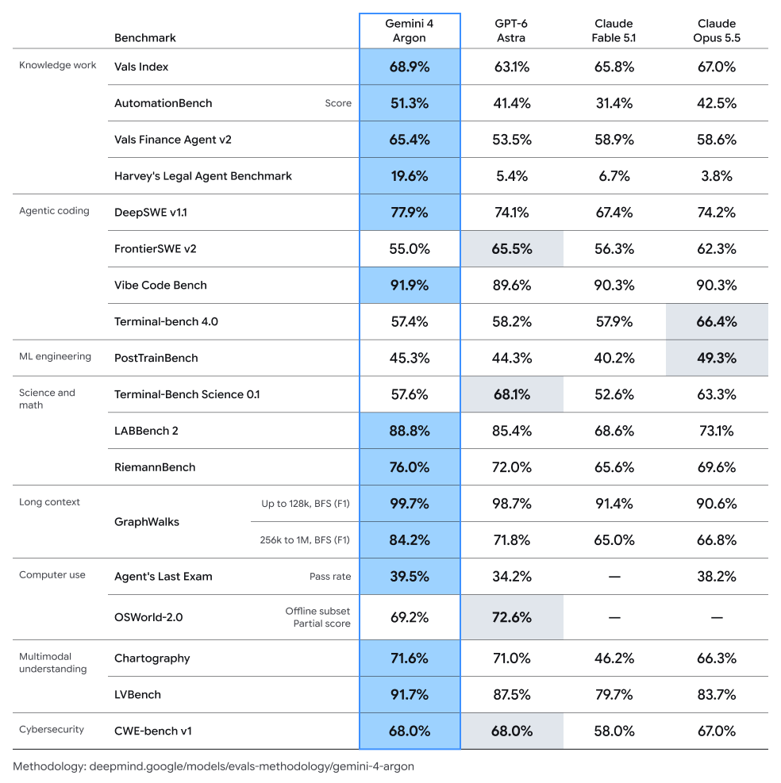
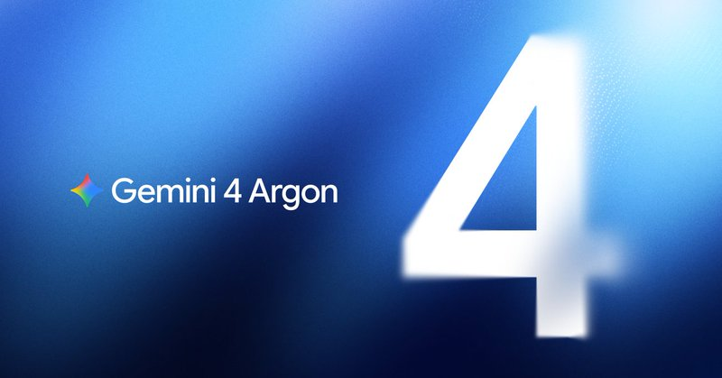
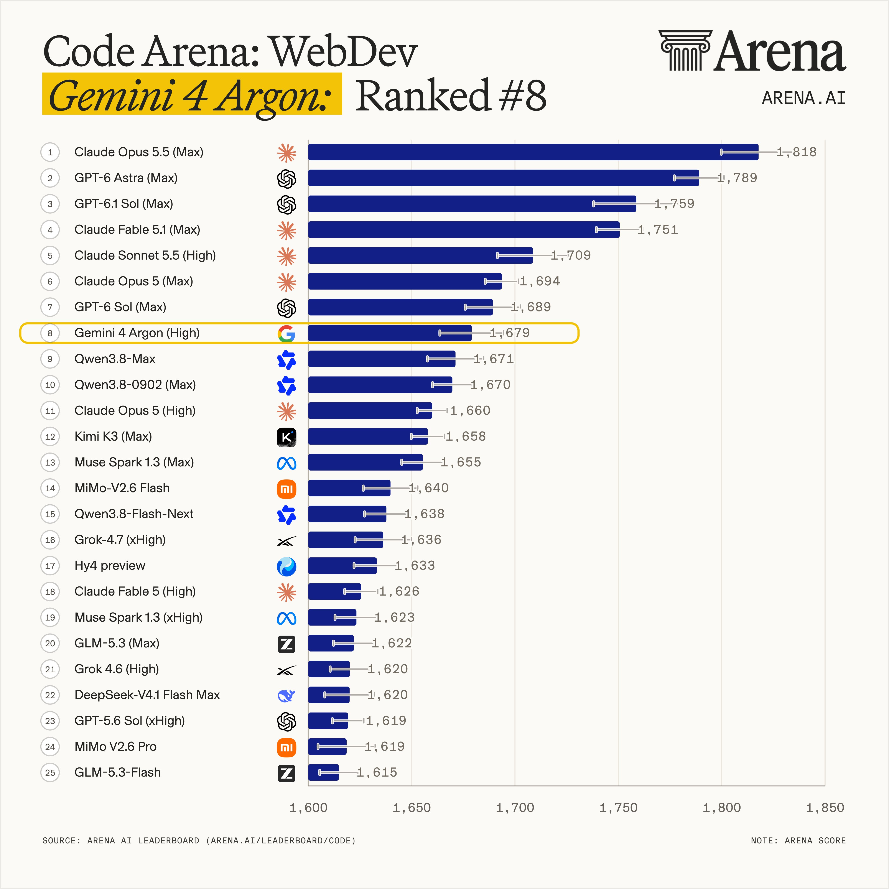
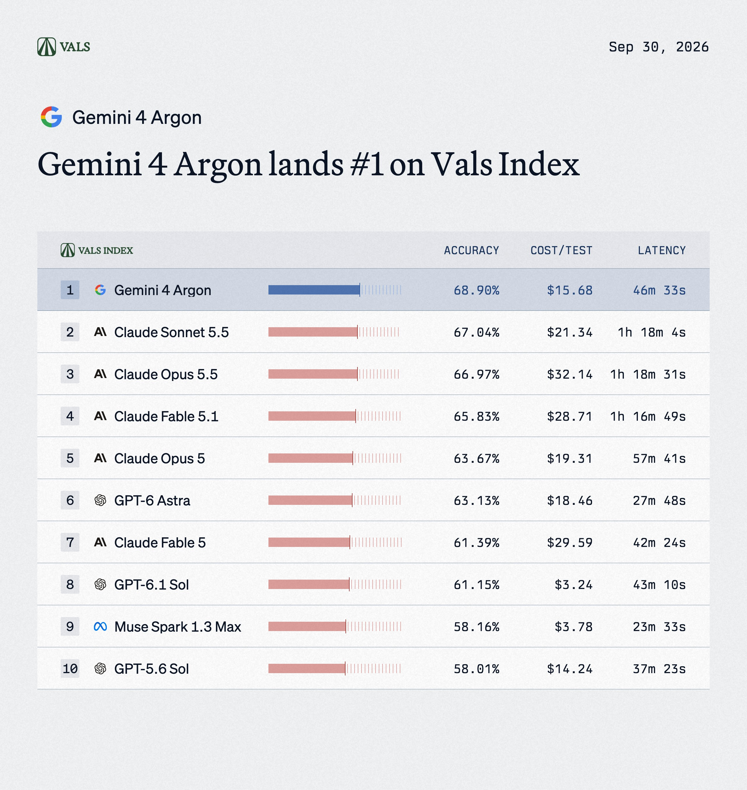
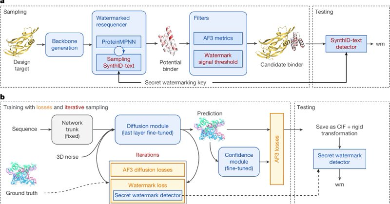

# 🐦 @demishassabis

## 📅 September 30, 2026

> 6 post(s) archived.

---

### 🕐 21:59 UTC · @demishassabis

> Very excited to announce Gemini 4 Argon, our new Frontier AI model, and a huge step forward across key capabilities. We’re focused on rolling it out responsibly starting with government and trusted cyber defenders through our Fairwind Program today, before wider availability soon

🔗 [View original post](https://x.com/demishassabis/status/2105417239432200636)

---

### 🕐 21:59 UTC · @demishassabis

> So proud of the incredible team who have been working so hard and relentlessly on this! More info in the blogpost: https://goo.gle/4rZBiSd

🔗 [View original post](https://x.com/demishassabis/status/2105417241424540136)

---

### 🕐 20:30 UTC · @demishassabis

> Big news: Gemini 4 Argon (High) by @GoogleDeepMind just landed #1 in Text Arena with 1525 pts, and #8 in Code Arena: WebDev with 1679 pts! This release has reshaped the Text Arena Pareto frontier with a blended $8/MToken! Gemini 4 Argon (High) is now the most cost efficient model, see its placement on Pareto frontier below. In the Text Arena, Gemini 4 Argon (High) ranks #1 in Coding, Hard Prompts, Instruction Following, Longer Query, and Creative Writing. It also leads every occupational domain evaluated, with additional #1 spots in English, Non-English, Chinese, and Russian. This model is +20 points above the #2 ranked Claude Opus 4.6 (High), and a huge leap from Google’s previous release, Gemini 3.8 Flash (High) at #11! In Code Arena: WebDev, Gemini 4 Argon (High) gained +96 points from Gemini 3.8 Flash (High), and went from #29 to #8. Congrats to the @GoogleDeepMind team on this impressive frontier release! Introducing Gemini 4 Argon – our new frontier model. It’s built for complex workflows across coding, enterprise knowledge work, and cybersecurity defense – rolling out today to a set of trusted testers through our Fairwind Program.

🔗 [View original post](https://x.com/arena/status/2105394855644139908)

---

### 🕐 20:04 UTC · @demishassabis

> Gemini is on top of the Vals Index for the first time. Gemini 4 Argon takes the #1 spot on the Vals Index at 68.9%.

🔗 [View original post](https://x.com/ValsAI/status/2105388446844072033)

---

### 🕐 17:27 UTC · @demishassabis

> Biosecurity is one of the most urgent challenges for the AI era. Bringing SynthID to biology so AI-generated proteins can be watermarked is a critical step - and we’re open sourcing SynthID Bio tools so the research community can build on this work. Published in @Nature today, congrats to the team! https://www.nature.com/articles/s41586-026-10965-y Very happy to announce that our team @GoogleDeepmind has pushed the boundaries of generative biology, achieving the successful synthesis of AI-designed proteins that are both functional and watermarked. This proof-of-concept watermarking of the building blocks of life is enabled …

🔗 [View original post](https://x.com/demishassabis/status/2105348732464070823)

---

### 🕐 04:13 UTC · @demishassabis

> Good to see the progress, and we look forward to following up. Great to meet today with @POTUS, @JDVance, @SpeakerJohnson and Administration + tech leaders. Important conversation and we signed today the White House Accord on Super Intelligence. As I shared today, Google has invested hundreds of billions in the last two years alone, with mor…

🔗 [View original post](https://x.com/demishassabis/status/2105148971975102609)

---
