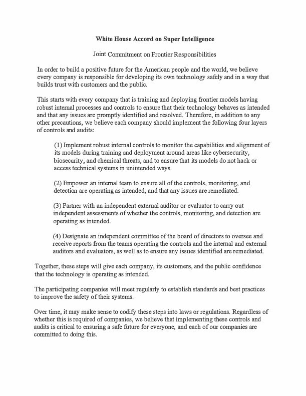
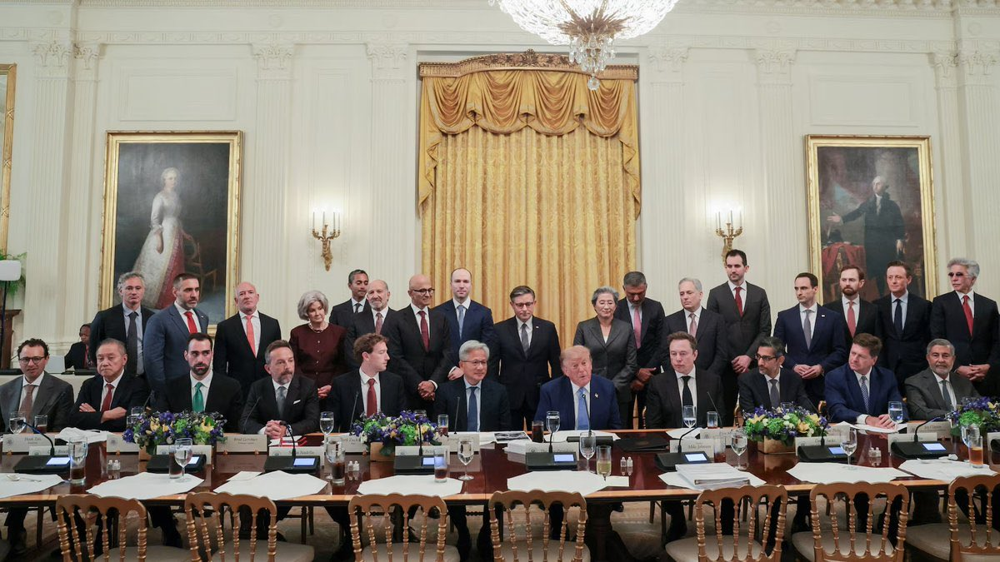

# 🐦 @elonmusk

## 📅 September 30, 2026

> 22 post(s) archived.

---

### 🕐 22:33 UTC · @elonmusk

> Accurate analysis I find it funny that some people got hung up on Starship not having gone orbital before Flight 14 when in the grand scheme of things it was completely arbitrary in terms of performance. The 19ish second burn only added about 91 m/s of velocity (a 1.2% increase in velocity) This c…

🔗 [View original post](https://x.com/elonmusk/status/2105425770965356697)

---

### 🕐 21:43 UTC · @elonmusk

> SpaceXAI has just released Grokipedia v0.3, which includes improved visuals. https://grokipedia.com Media

🔗 [View original post](https://x.com/SawyerMerritt/status/2105413208001704363)

---

### 🕐 18:17 UTC · @elonmusk

> My guess for real GDP growth next year is &gt;50% higher than 2026, so &gt;3.3% Today’s economic numbers: — Q2 GDP revised up to 2.2% (was 1.5%). — Core PCE 3.0% vs 3.3% expected. — ADP private jobs +90k vs ~68k expected. Growth beat. Inflation cooled. Jobs better than expected. The Trump economy is strong.

🔗 [View original post](https://x.com/elonmusk/status/2105361313392476174)

---

### 🕐 18:05 UTC · @elonmusk

> 25 percent of San Francisco’s convicted pedophiles, rapists, and sex offenders live in government-funded housing. You’re paying for predators to live in the most expensive city in America.

🔗 [View original post](https://x.com/christopherrufo/status/2105358364478001153)

---

### 🕐 17:50 UTC · @elonmusk

> Starship Flight 14 Starship Flight 14, the first morning launch from Starbase since Flight 5

🔗 [View original post](https://x.com/elonmusk/status/2105354554866864631)

---

### 🕐 17:47 UTC · @elonmusk

> Starship will expand the aperture of physics research by placing much larger telescopes in orbit and giant ones on the Moon Starship reached orbit for the first time on Monday. One of my favorite potential use cases is launching the next generation of space telescopes faster and with far fewer constraints. Today, engineers designing the largest space telescopes face extreme mass and volume limits that…

🔗 [View original post](https://x.com/elonmusk/status/2105353907799228549)

---

### 🕐 17:33 UTC · @elonmusk

> New in @Grok @Bot What&apos;s new in Grok Bot 0:19 Team bots - create bots shared with your team members 1:10 Finances - search and manage your finances with @plaid 1:32 Voice calls - @bot can search chats during calls and gracefully handles interruptions Like this for a special bot animation on @X!

🔗 [View original post](https://x.com/elonmusk/status/2105350300534210708)

---

### 🕐 17:25 UTC · @elonmusk

> Yesterday at the White House, leaders from across our industry came together to sign the White House Accord on Super Intelligence. The principle is simple: the companies building this technology have the primary responsibility to develop and deploy it safely, and to be accountable when they fall short. The Accord reinforces that responsibility with robust internal controls, independent external evaluation, and board level oversight. Super Intelligence offers an extraordinary opportunity to advance discovery, productivity, security, health, and prosperity. The future of Super Intelligence will be shaped not only by what it can do, but by the confidence it earns. By building with ambition, rigor, and responsibility, we can help ensure this extraordinary technology expands opportunity and improves lives for generations to come.

🔗 [View original post](https://x.com/JensenHuang/status/2105348324484342238)

---

### 🕐 16:50 UTC · @elonmusk

> Elon Musk says SpaceX and Tesla are aiming to produce 200 gigawatts of solar per year and take it to space, where &quot;it&apos;s essentially always sunny.&quot; He says the U.S. has to scale power dramatically to compete with China, which he says has about three times America&apos;s electricity production. He also bets that every 1% increase in U.S. power usage will bring roughly a 1% increase in GDP. &quot;SpaceX is aiming together with Tesla to do 200 gigawatts of solar production per year. And if brought to space, you get the nameplate or better on the solar power, whereas if it&apos;s on the ground, you&apos;re going to get somewhere between a fifth and an eighth of the solar power generation, and you need enormous batteries.&quot; &quot;You&apos;ve got to scale energy; you&apos;ve got to scale chip production. I think we&apos;re winning on software, on anything intellectual or digital. But in the long run, we need to be able to generate enough power to compete with — I think essentially China is the biggest competitor. And China has about three times the electricity production of the United States.&quot; &quot;The average power consumption in the United States is about 500 gigawatts. So, every 5 gigawatts of incremental steady-state production is a 1% increase in the power used... I would bet anyone that a 1% increase in power usage corresponds to roughly a 1% increase in GDP. Because the intelligence per watt keeps increasing.&quot; Media

🔗 [View original post](https://x.com/KanekoaTheGreat/status/2105339407301759366)

---

### 🕐 15:02 UTC · @elonmusk

> The Bretton Woods of Super Intelligence

🔗 [View original post](https://x.com/DavidSacks/status/2105312446949085627)

---

### 🕐 12:50 UTC · @elonmusk

> Want to see inside the Tesla Semi Factory? Here is the 30 minute video of our tour hosted by Plant Manager Rob Rayl and the factory team during the Semi Rollout event! Media

🔗 [View original post](https://x.com/SERobinsonJr/status/2105279153285025930)

---

### 🕐 11:57 UTC · @elonmusk

> Holy shit, the Omani pilot stabbed his co-pilot and then put the plane into a nose dive. Almost murdered 180 people. Passengers and crew rushed the cockpit pit and overpowered him within a minute. Almost one of the deadliest terrorist attacks in history. Media This post is unavailable

🔗 [View original post](https://x.com/DrewPavlou/status/2105265785052729447)

---

### 🕐 06:57 UTC · @elonmusk

> So much of Airbnb’s success came from @jgebbia’s design brilliance. I’m delighted he brought those gifts to our government. Our country designed great buildings, but for most Americans, the front door to government is now a website. Starting today, that experience they will be beautiful, elegant, and human. Proud of you, Joe. Chief Design Officer @jgebbia officially unveils https://America.gov, the new online home for the United States of America

🔗 [View original post](https://x.com/bchesky/status/2105190317997818035)

---

### 🕐 05:27 UTC · @elonmusk

> This is too much fun. A render of how the quilted hyperbolic isotensoid Mars city structure might work. Media

🔗 [View original post](https://x.com/CJHandmer/status/2105167583037329482)

---

### 🕐 03:37 UTC · @elonmusk

> Best way to sandbox an AI is to put it on a Delta flight – it will have no chance of accessing the Internet!

🔗 [View original post](https://x.com/elonmusk/status/2105139959720014101)

---

### 🕐 02:25 UTC · @elonmusk

> Great to meet today with @POTUS, @JDVance, @SpeakerJohnson and Administration + tech leaders. Important conversation and we signed today the White House Accord on Super Intelligence. As I shared today, Google has invested hundreds of billions in the last two years alone, with more to come, across the entire stack, to deliver benefits for America and the world. We’re working to build products that deliver real value for people and businesses, invest in local communities, and build trust in the technology. Industry also has to innovate responsibly. Google’s focused on building the right way, with appropriate testing, evaluations, red-teaming, and other safeguards against misuse and misalignment – and releasing models or products only after they’ve been thoroughly reviewed. We are committed to working with other industry leaders to establish norms and build public confidence. The White House Accord and the Joint Commitment on Frontier Responsibilities signed today is a solid basis for moving forward - it contains real tangible steps to promote safe development, while delivering the economic and scientific benefits of this technology.

🔗 [View original post](https://x.com/sundarpichai/status/2105121763176894804)

---

### 🕐 01:27 UTC · @elonmusk

> Also sprach Zarathustra This really brought home to me this new machine creativity. I don’t know the recipe, but it’s more than vibes I see. There’s substance in the lyrics and there’s nuance for the critics And a story being told in this AI homily. And a message being sold by the Ai homily.

🔗 [View original post](https://x.com/elonmusk/status/2105107252529013032)

---

### 🕐 01:13 UTC · @elonmusk

> Starship Super Heavy Super Heavy liftoff powered by 33 Raptor 3 engines

🔗 [View original post](https://x.com/elonmusk/status/2105103689417408624)

---

### 🕐 00:19 UTC · @elonmusk

> Due to high winds, the new Roadster demo is postponed by 2 weeks Roadster event update We&apos;ve been tracking the weather closely with local meteorologists, but given the severe conditions predicted &amp; because this event can only be held outdoors, we&apos;ve made the difficult decision to reschedule. New date is October 15. Additional details to follow

🔗 [View original post](https://x.com/elonmusk/status/2105090209897500828)

---

### 🕐 00:14 UTC · @elonmusk

> Grok 4.7 rank 1 on AA cyber index Grok 4.7 xHigh ranks #1 in Artificial Analysis Cyber Index It&apos;s a powerful frontier model performing at the highest level in enterprise cyber defense Outperforming Fable 5.1 Max, Opus 5.5, Astra 6, GPT-6 and other leading AI systems

🔗 [View original post](https://x.com/elonmusk/status/2105088792139014331)

---

### 🕐 00:08 UTC · @elonmusk

> I think it&apos;s a significant positive step that the leaders of every major American lab have committed to implementing robust internal controls and multiple layers of audits and reviews. This should give people more confidence that the technology each lab is building will work as intended. Only President Trump could convene all the leaders of the top companies developing chips, data centers and frontier models for Super Intelligence. This new Industrial Revolution has already created a million new jobs and is spurring a bigger infrastructure build-out than the rail…

🔗 [View original post](https://x.com/finkd/status/2105087367686025454)

---

### 🕐 00:00 UTC · @elonmusk

> We’re now live in Ecuador with @Starlink Mobile! The new service with @CNT_EC will connect people in cellular dead zones across the country’s diverse terrains including the Amazon rainforest and Galápagos Islands. El día cero llegó para nosotros, la alianza CNT x @Starlink es oficial desde hoy. Te mantendremos conectado siempre gracias a Starlink Mobile, la tecnología direct-to-device más grande del mundo.

🔗 [View original post](https://x.com/SRBednarek/status/2105085334585299283)

---
