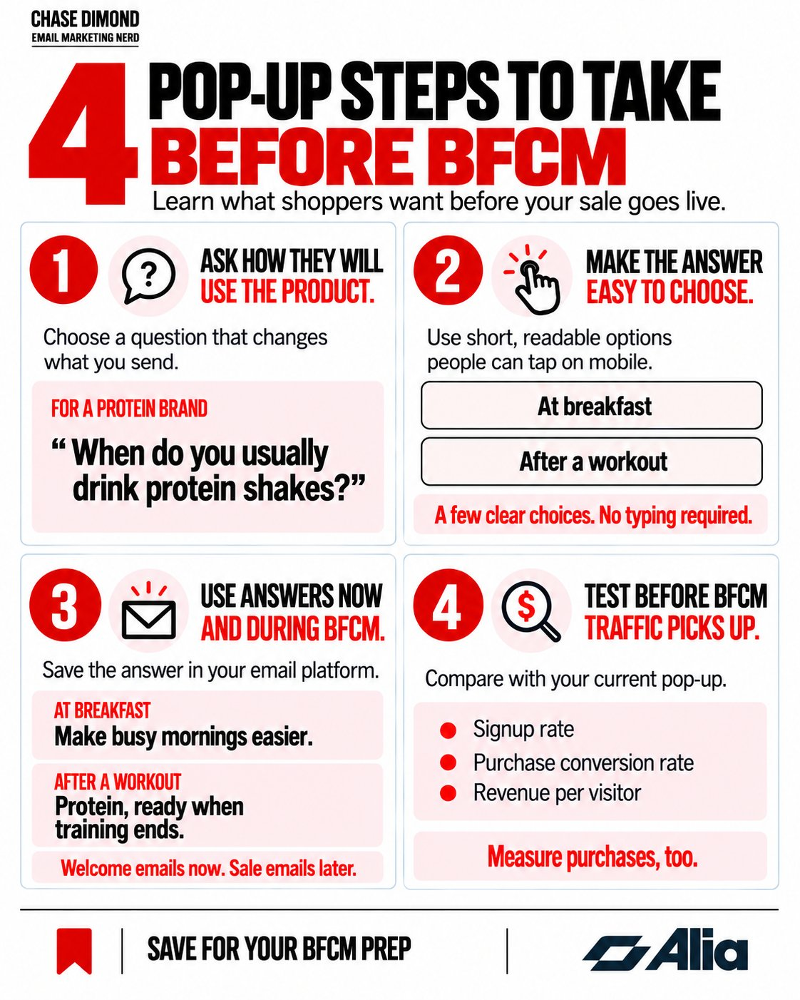

# 🐦 @AiEvolutio58513

## 📅 October 01, 2026

> 6 post(s) archived.

---

### 🕐 17:33 UTC · @AiEvolutio58513

> Every AI tool I use gets its output checked before it ships. Copy, code, design. Voice was the one I kept regenerating blind. @OnepinAI checks each line for clarity and pronunciation and fixes the words it gets wrong. Raw vs. Onepin on the same script: Media Your AI voice sounds human. So why can&apos;t it say your product&apos;s name? A great AI voice reads &quot;Porsche Taycan&quot; as TAY-can. Porsche says TIE-kahn. It guessed from the spelling, and nobody caught it, because nobody listens to line 1,200. Today we&apos;re launching Onepin: the production s…

🔗 [View original post](https://x.com/ecomchasedimond/status/2105712612319379777)

---

### 🕐 15:35 UTC · @AiEvolutio58513

> my first 30 discovery calls were basically practice on real customers. sorry to those people. Introducing Sessions: Interactive Avatars that coach, interview, and guide 🗣️ That means you can finally: ✔️ Have 1:1s with your entire company. ✔️ Interview 100 customers a day. ✔️ Train 1,000 sales reps at once. Think of it as a video call, but on the other side is an Avatar t…

🔗 [View original post](https://x.com/ecomchasedimond/status/2105682943889023110)

---

### 🕐 14:53 UTC · @AiEvolutio58513

> Two shoppers can want the same product for very different reasons. Before BFCM, use your popup to find out what matters to each of them. Those answers can shape the welcome emails you send now and the sale emails you send later. Here’s how I’d approach it: 1. Ask how they’ll use the product. For a protein brand: “When do you usually drink protein shakes?” Before adding the question, decide how the answer will change what you send. 2. Make it easy to answer. Use short, readable choices people can tap on mobile. Choosing from a few options takes less effort than typing a response. 3. Use the answer now and during BFCM. Save it in your email platform and tailor the welcome email. “At breakfast” could lead to an email about easier mornings. “After a workout” could lead to an email about protein, ready when training ends. When your BFCM sale goes live, use those same preferences to choose the benefit you lead with. 4. Test before BFCM traffic picks up. Compare the new popup with your current version. Track signup rate, purchase conversion rate, and revenue per visitor to see whether the extra step helps turn visits into purchases. Slate Milk tested multiple-choice popups with @AliaPopups, asking when shoppers preferred to have their protein. Those answers helped them tailor follow-up emails. Following the switch to Alia and ongoing popup testing, Slate Milk saw a 53.2% increase in its email signup rate. They also saw higher conversions and revenue. Among my own clients, the brands using Alia are outperforming those that aren’t. If you want to build and test this before BFCM, my link gets you a special 30-day free trial of Alia: https://hubs.la/Q04y08-G0

🔗 [View original post](https://x.com/ecomchasedimond/status/2105672366433169535)

---

### 🕐 14:01 UTC · @AiEvolutio58513

> Grok can now watch and break down videos on your behalf. Upload a video the same way you&apos;d upload an image, then ask Grok whatever you want about it. Interested in AI? Follow @AiEvolutio58513 and never fall behind. I track ChatGPT, Claude, and every tool quietly changing how we work and create, then hand you the tested signals. Media

🔗 [View original post](https://x.com/AiEvolutio58513/status/2105659290161963423)

---

### 🕐 12:58 UTC · @AiEvolutio58513

> Grok 4.7 tops the Legal Agent Benchmark. On realistic, long-term legal tasks it hit 19.6%, ahead of every other model tested. That&apos;s almost 3x Fable 5.1&apos;s result. Another strong showing for Grok 4.7 and SpaceXAI. Interested in AI? Follow @AiEvolutio58513 and never fall behind. I track ChatGPT, Claude, and every tool quietly changing how we work and create, then hand you the tested signals.

🔗 [View original post](https://x.com/AiEvolutio58513/status/2105643398124487015)

---

### 🕐 11:03 UTC · @AiEvolutio58513

> Elon Musk has a message: start learning robotics. &quot;There will be at least a billion robots in 10 years, each producing at least 5x the output of a human.&quot; Morgan Stanley pegs the robotics market at $5 TRILLION by 2050. Whoever builds these machines won&apos;t need to think about money again. This guy laid out a full 6-month roadmap to becoming a robotics engineer, free 👇 Interested in AI? Follow @AiEvolutio58513 and never fall behind. I track ChatGPT, Claude, and every tool quietly changing how we work and create, then hand you the tested signals. Media

🔗 [View original post](https://x.com/AiEvolutio58513/status/2105614475256910251)

---
