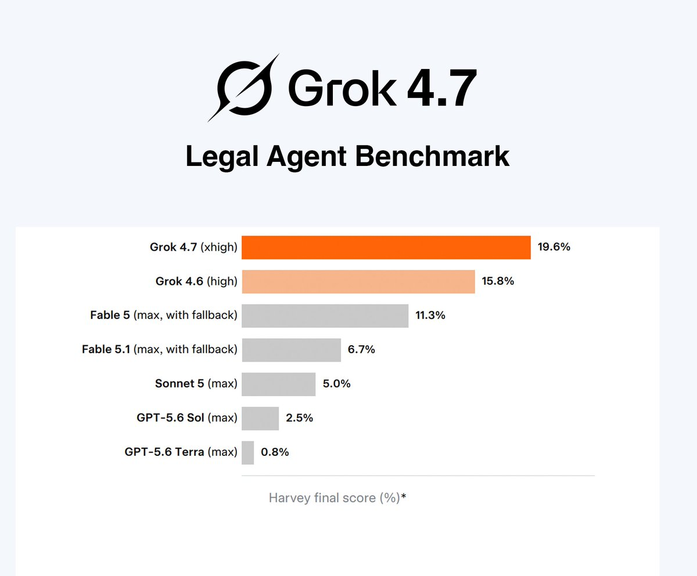

# 🐦 @AiEvolutio58513

## 📅 October 01, 2026

> 3 post(s) archived.

---

### 🕐 14:01 UTC · @AiEvolutio58513

> Grok can now watch and break down videos on your behalf. Upload a video the same way you&apos;d upload an image, then ask Grok whatever you want about it. Interested in AI? Follow @AiEvolutio58513 and never fall behind. I track ChatGPT, Claude, and every tool quietly changing how we work and create, then hand you the tested signals. Media

🔗 [View original post](https://x.com/AiEvolutio58513/status/2105659290161963423)

---

### 🕐 12:58 UTC · @AiEvolutio58513

> Grok 4.7 tops the Legal Agent Benchmark. On realistic, long-term legal tasks it hit 19.6%, ahead of every other model tested. That&apos;s almost 3x Fable 5.1&apos;s result. Another strong showing for Grok 4.7 and SpaceXAI. Interested in AI? Follow @AiEvolutio58513 and never fall behind. I track ChatGPT, Claude, and every tool quietly changing how we work and create, then hand you the tested signals.

🔗 [View original post](https://x.com/AiEvolutio58513/status/2105643398124487015)

---

### 🕐 11:03 UTC · @AiEvolutio58513

> Elon Musk has a message: start learning robotics. &quot;There will be at least a billion robots in 10 years, each producing at least 5x the output of a human.&quot; Morgan Stanley pegs the robotics market at $5 TRILLION by 2050. Whoever builds these machines won&apos;t need to think about money again. This guy laid out a full 6-month roadmap to becoming a robotics engineer, free 👇 Interested in AI? Follow @AiEvolutio58513 and never fall behind. I track ChatGPT, Claude, and every tool quietly changing how we work and create, then hand you the tested signals. Media

🔗 [View original post](https://x.com/AiEvolutio58513/status/2105614475256910251)

---
