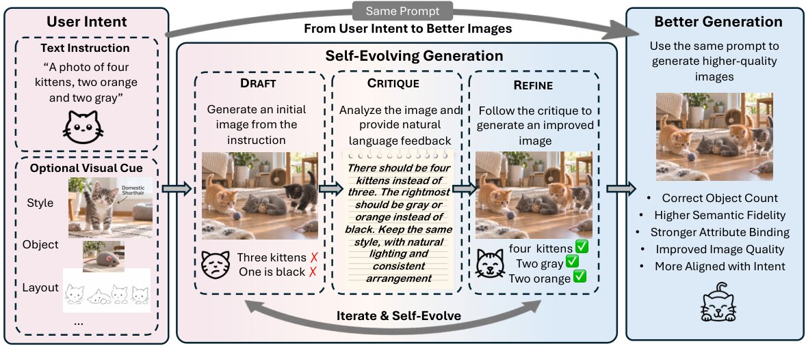
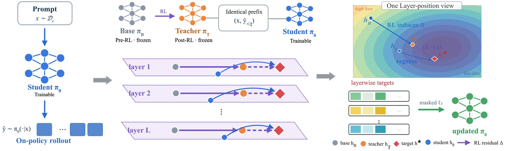

# 🐦 @_akhaliq

## 📅 October 01, 2026

> 4 post(s) archived.

---

### 🕐 16:59 UTC · @_akhaliq

> Introducing Griffin, the first model to pass the video Turing test. 48% of people who talked to it live thought it was a real human. Previous systems have had a pass rate &lt;3%. It is #1 on NVIDIA&apos;s benchmark for full-duplex AI video. It’s the first Human Interaction Model (HIM). Media

🔗 [View original post](https://x.com/tavus/status/2105704169009246248)

---

### 🕐 14:00 UTC · @_akhaliq

> https://x.com/i/article/2105490472856903680

🔗 [View original post](https://x.com/jakeserval/status/2105659201221804372)

---

### 🕐 12:17 UTC · @_akhaliq

> UniEvo-VL A self-evolving framework where a single multimodal model acts as both teacher and student, learning from its own constructive feedback to boost image generation without external supervision.

🔗 [View original post](https://x.com/HuggingPapers/status/2105633095743398062)

---

### 🕐 08:17 UTC · @_akhaliq

> The Teacher Is a Direction, Not a Destination New on-policy distillation method that extrapolates RL-induced representation residuals, letting students match or exceed the teacher across four model pairs. Code and checkpoints planned for release.

🔗 [View original post](https://x.com/HuggingPapers/status/2105572799104299172)

---
