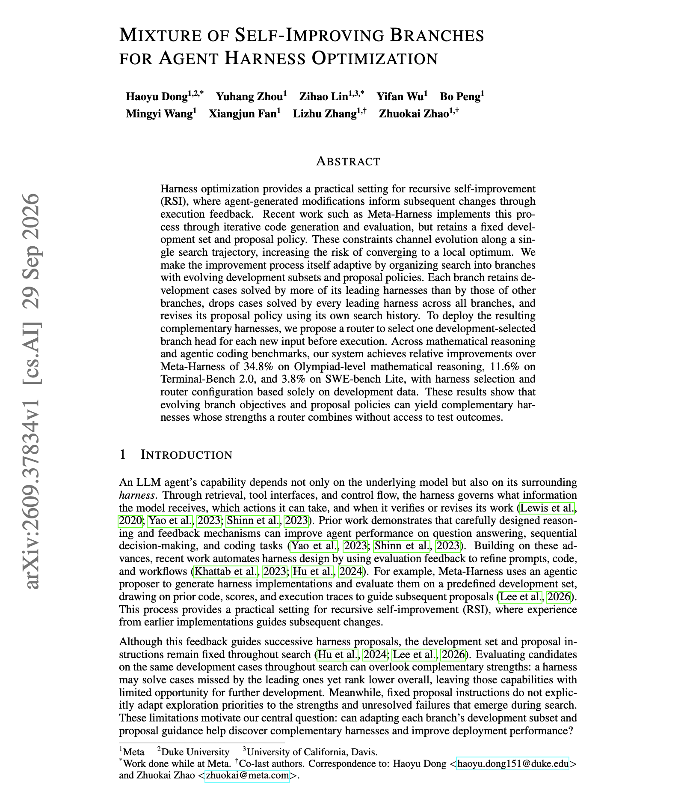

# 🐦 @dair_ai

## 📅 October 01, 2026

> 4 post(s) archived.

---

### 🕐 19:36 UTC · @dair_ai

> Great paper from Meta on agent harness optimization. Meta-Harness-style search uses one development set and one proposal policy, so every edit follows a single path and can get stuck in a local optimum. This work splits the search into branches. Each branch keeps the development cases its harnesses solve better than other branches, drops cases every branch already solves, and rewrites its own proposal policy from its history. A router then picks one branch&apos;s harness for each new input before it runs. Relative to Meta-Harness, that gives +34.8% on Olympiad-level math, +11.6% on Terminal-Bench 2.0 and +3.8% on SWE-bench Lite. Harness selection and the router use development data only. Paper: https://academy.dair.ai/papers/mixture-of-self-improving-branches-for-agent-harness-optimization-2609.37834

🔗 [View original post](https://x.com/dair_ai/status/2105743559974613463)

---

### 🕐 18:21 UTC · @dair_ai

> This is impressive! Face-to-face conversation is where AI interfaces are heading. @tavus gave me early access to Griffin, a video-to-video model that watches and listens as you talk. It can interrupt you, take an interruption, and react to what is happening in your room. On NVIDIA&apos;s Video Full-Duplex Benchmark, it scored 3.83 out of 5 on generation, against 3.92 for a real human. Worth checking out all the details below. Introducing Griffin, the first model to pass the video Turing test. 48% of people who talked to it live thought it was a real human. Previous systems have had a pass rate &lt;3%. It is #1 on NVIDIA&apos;s benchmark for full-duplex AI video. It’s the first Human Interaction Model (HIM).

🔗 [View original post](https://x.com/omarsar0/status/2105724860831781279)

---

### 🕐 16:09 UTC · @dair_ai

> Great paper for the weekend ahead. Meta presents Context Language Models, which can natively manage their own context. Banger paper from Meta and colleagues. (bookmark it) They discuss benefits of giving your agent write access to its own context. In other words, they investigate how effective it is to allow a language model to natively manage its context. Context Language Models keep the context…

🔗 [View original post](https://x.com/dair_ai/status/2105691463795532091)

---

### 🕐 15:36 UTC · @dair_ai

> Build your own harness, folks! One of the biggest benefits of building my own meta harness is how smoothly I can switch between models. I feel like this is becoming more important as model release times shrink. RSI will only scale releases. This has been one of the best decisions I made since last November. Switching models can really break things, but it shouldn&apos;t. If it does, your setup isn&apos;t ideal for this insane release cycle we are in. You need to fix that now.

🔗 [View original post](https://x.com/omarsar0/status/2105683206250918049)

---
