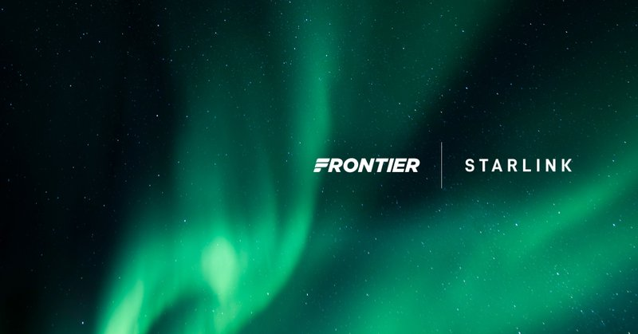
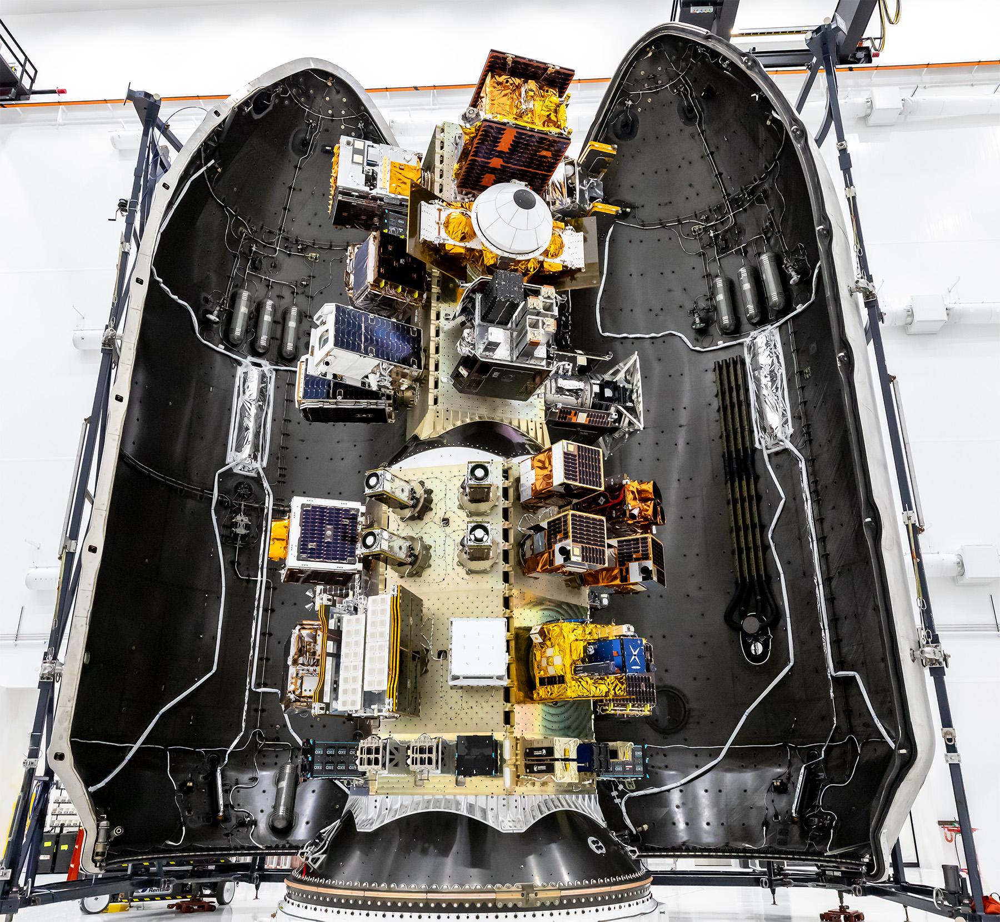
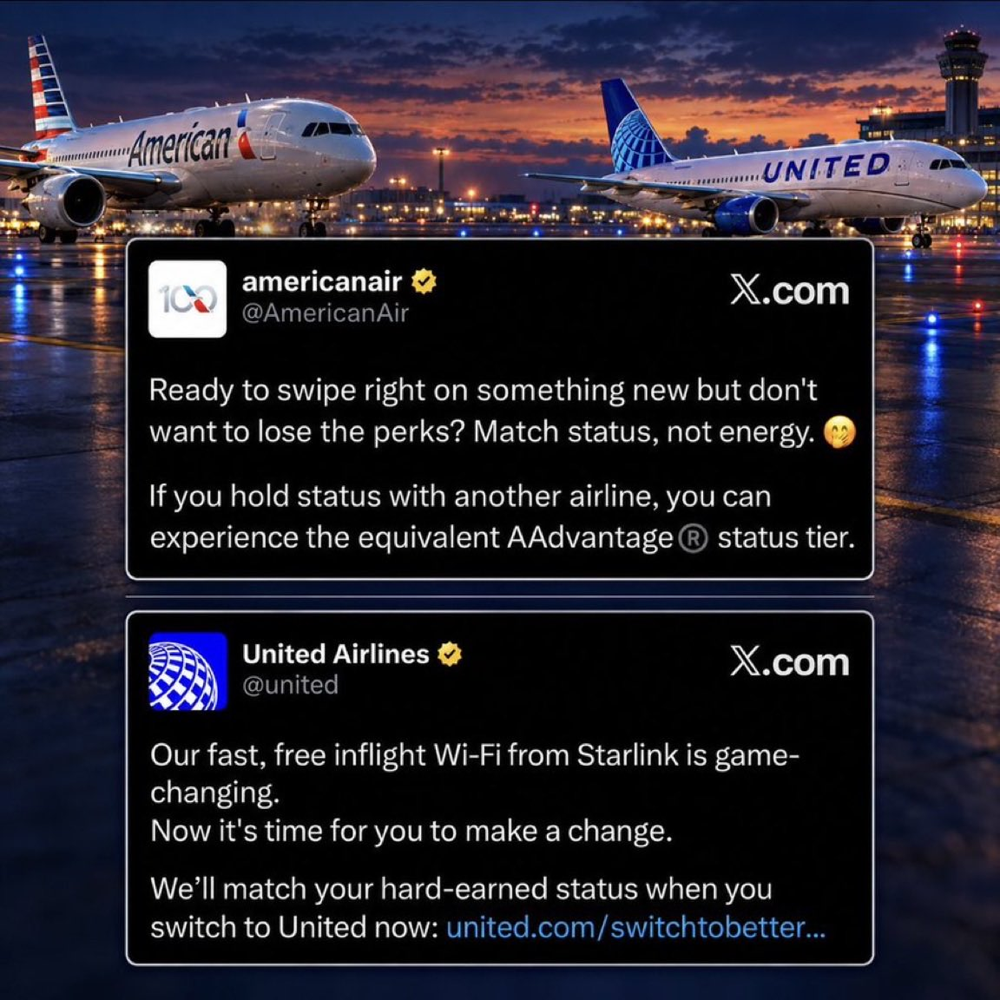
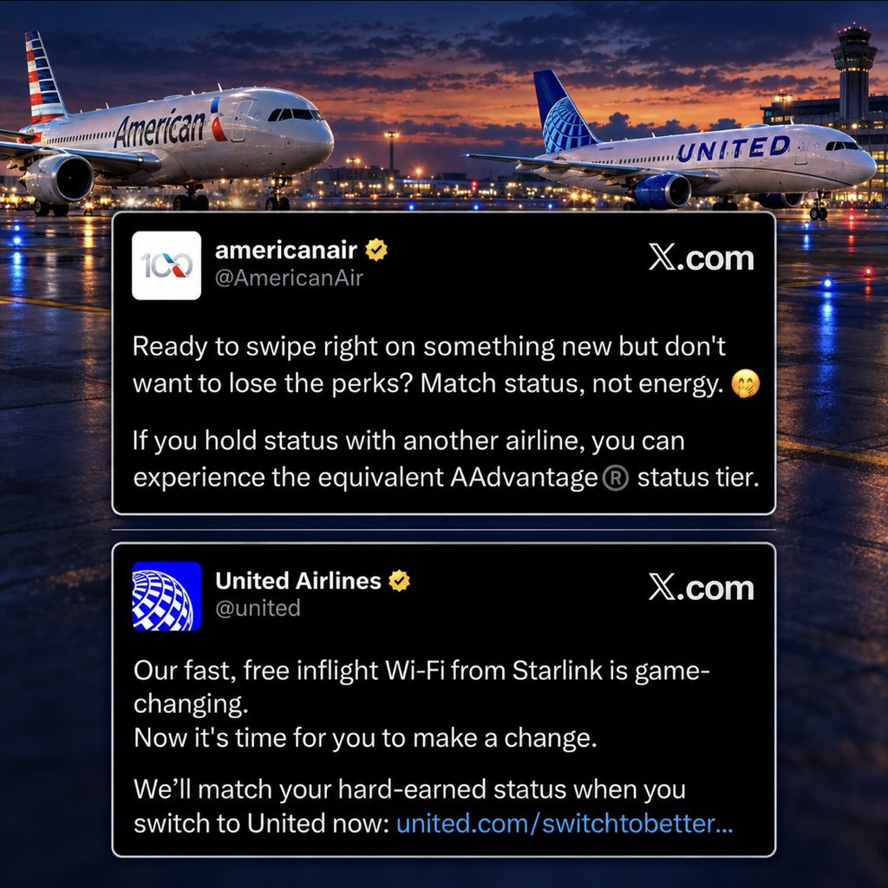
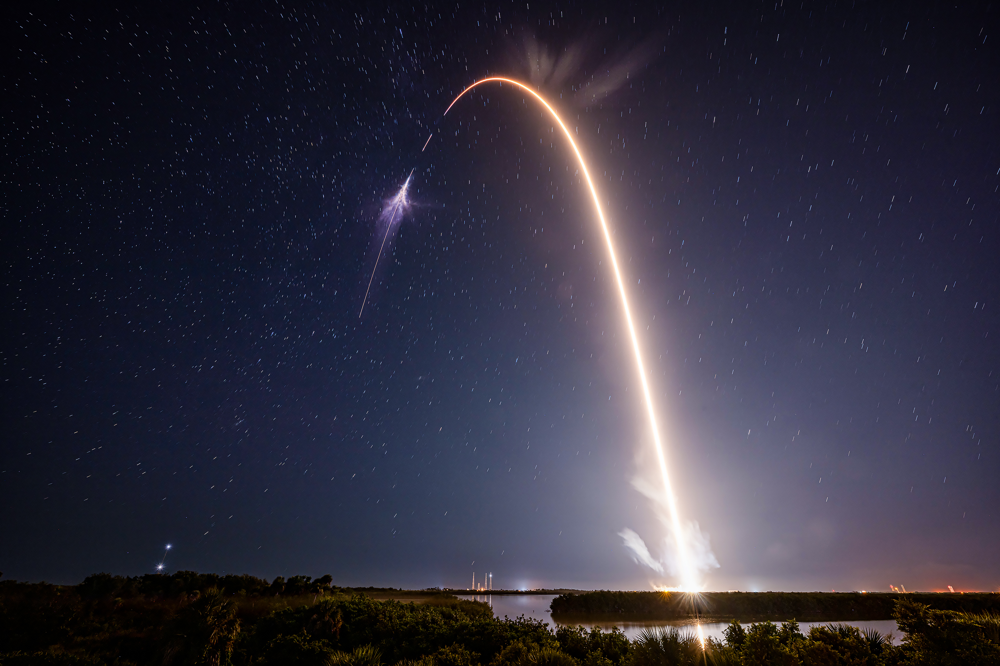
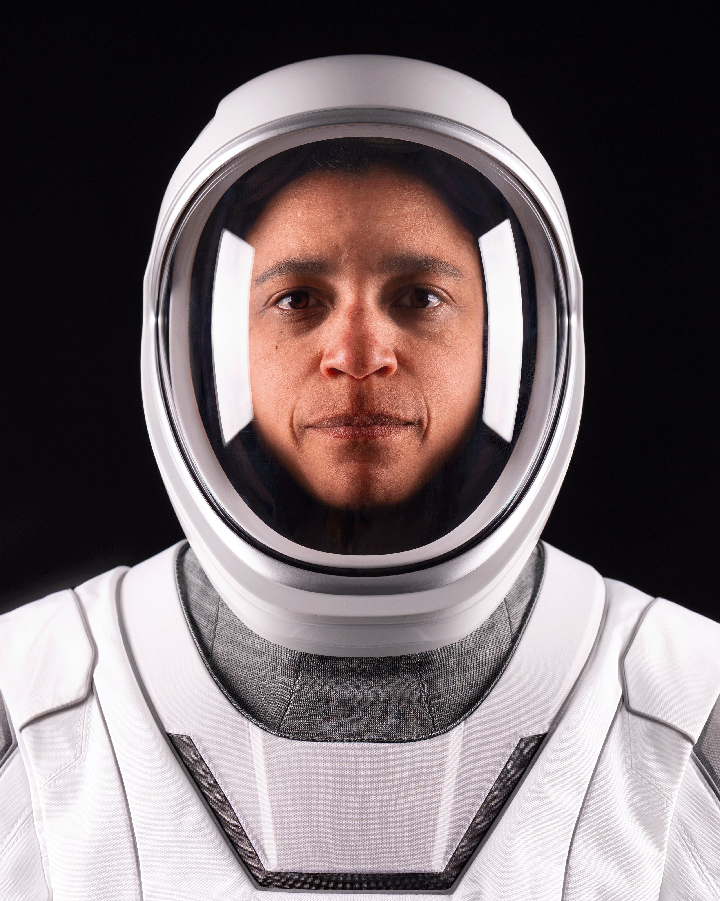
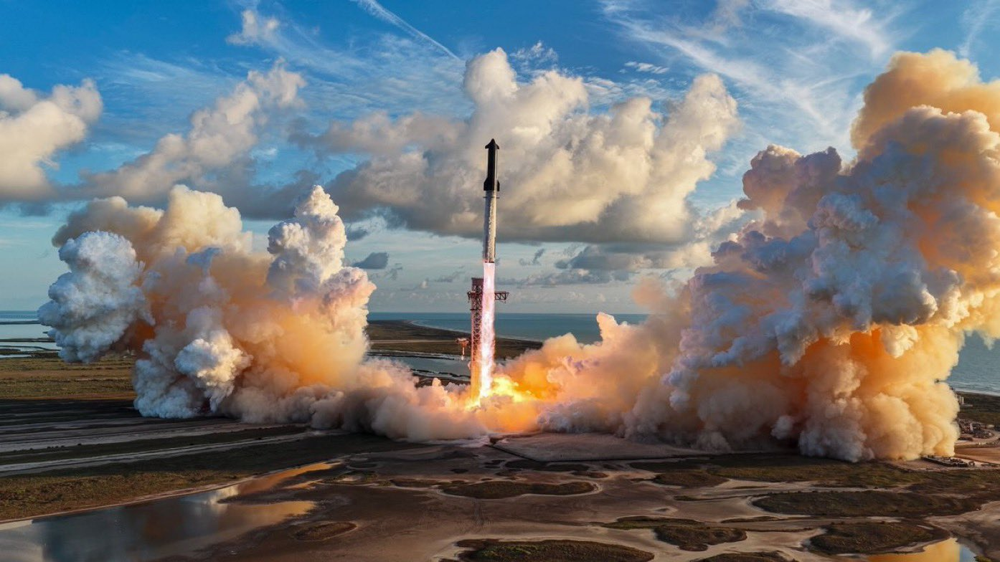
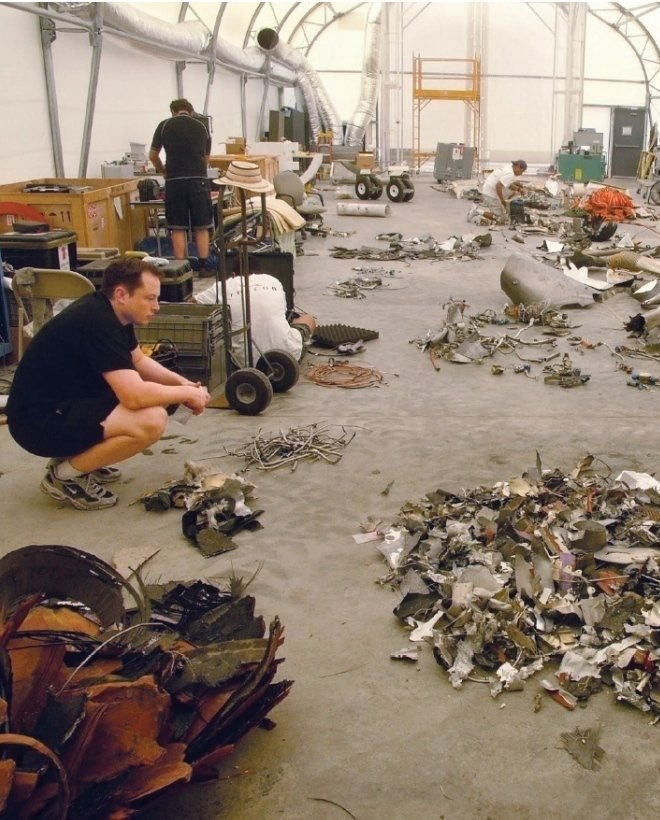
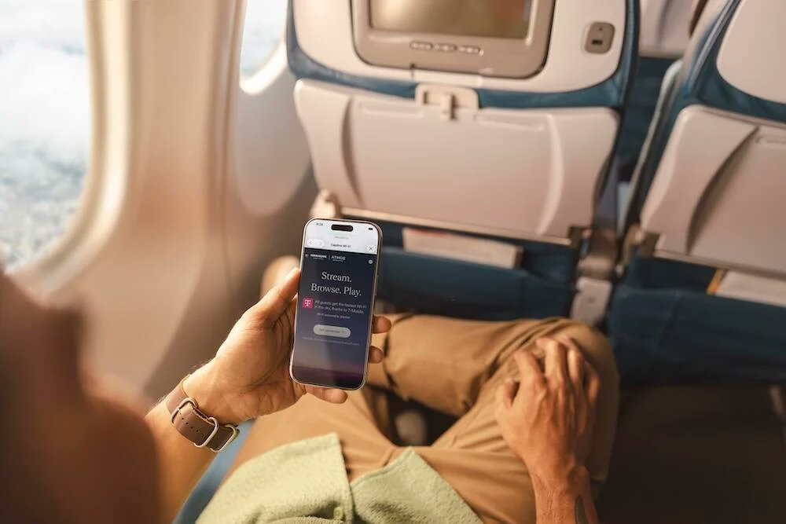

# 🐦 @elonmusk

## 📅 October 01, 2026

> 36 post(s) archived.

---

### 🕐 20:24 UTC · @elonmusk

> Major speed improvements to @Bot feel like grok bot is fast AF now

🔗 [View original post](https://x.com/elonmusk/status/2105755817555436014)

---

### 🕐 20:09 UTC · @elonmusk

> Grok @Bot is an amazing assistant Grok Bot is now more proactive. What does that mean? Here&apos;s one example: I switched flights, but @bot noticed I didn&apos;t update my Uber reservation Bot realized, then pinged me to update the reservation *during* my connecting flight I had @starlink, so I was able to change it befor…

🔗 [View original post](https://x.com/elonmusk/status/2105752064747847794)

---

### 🕐 20:09 UTC · @elonmusk

> Plot twist: Your next flight might have better Wi-Fi than your home. @Starlink, Wi-Fi coming in 2027. 🛜✈️ https://news.flyfrontier.com/frontier-airlines-to-offer-starlink-the-fastest-wifi-in-the-sky/

🔗 [View original post](https://x.com/FlyFrontier/status/2105751861580202270)

---

### 🕐 20:08 UTC · @elonmusk

> The nation owes a debt to @JGebbia and his excellent team. They worked incredibly hard, with no compensation, to make government services work better for all Americans. 🫡 🇺🇸 Imagine seeing your work announced on the national stage by the world&apos;s most gifted speakers, like @SecRubio who introduced our new design for the U.S. Passport, in collaboration with the State Department. National Design Studio is growing! https://ndstudio.gov/jobs

🔗 [View original post](https://x.com/elonmusk/status/2105751786925752511)

---

### 🕐 19:41 UTC · @elonmusk

> @Geiger_Capital Instagram is for girls

🔗 [View original post](https://x.com/elonmusk/status/2105744946141483133)

---

### 🕐 18:33 UTC · @elonmusk

> Liftoff of Transporter-18! Media

🔗 [View original post](https://x.com/SpaceX/status/2105727848199643530)

---

### 🕐 18:20 UTC · @elonmusk

> Watch Falcon 9 launch the Transporter-18 mission to orbit https://x.com/i/broadcasts/1RJjpbyQpOBKw

🔗 [View original post](https://x.com/SpaceX/status/2105724663423009159)

---

### 🕐 17:59 UTC · @elonmusk

> Try Grok @Bot! Grok Bots have been life-changing for someone like me with ADHD who has no patience for context switching / navigating slow interfaces to retrieve information We&apos;re seeing the beginnings of personal superintelligence that augments each humans to realize their full potential

🔗 [View original post](https://x.com/elonmusk/status/2105719249826099666)

---

### 🕐 17:55 UTC · @elonmusk

> All-time Supercharger energy delivered: 28.9 TWh

🔗 [View original post](https://x.com/MdeZegher/status/2105718209869762593)

---

### 🕐 16:50 UTC · @elonmusk

> It looks so much like a cigarette, I had to make this edit Media

🔗 [View original post](https://x.com/anabology/status/2105701966793892018)

---

### 🕐 16:31 UTC · @elonmusk

> Up next, Falcon 9 will launch 130 payloads to orbit from California aboard the Transporter-18 mission. Liftoff is targeted for 11:22 a.m. PT → https://spacex.com/launches/transporter18

🔗 [View original post](https://x.com/SpaceX/status/2105697062927147516)

---

### 🕐 15:59 UTC · @elonmusk

> Welcome to orbit! Dragon separates from Falcon 9’s second stage

🔗 [View original post](https://x.com/elonmusk/status/2105688953978298612)

---

### 🕐 15:42 UTC · @elonmusk

> Congratulations @NASA and @SpaceX teams, on another gorgeous launch. Godspeed Crew-13! Liftoff of Crew-13!

🔗 [View original post](https://x.com/NASAAdmin/status/2105684900405968934)

---

### 🕐 15:36 UTC · @elonmusk

> @elonmusk @united @Starlink For anyone suddenly reconsidering their airline loyalty: we can match your status and keep you connected at 35k feet with Starlink soon. 👀 https://bit.ly/AAdvantageStatusMatch

🔗 [View original post](https://x.com/AmericanAir/status/2105683307891757216)

---

### 🕐 15:27 UTC · @elonmusk

> Both @United and @AmericanAir have @Starlink!

🔗 [View original post](https://x.com/elonmusk/status/2105681004371542326)

---

### 🕐 15:25 UTC · @elonmusk

> People hate commuting because they sit in traffic and get nothing done. Tesla x Grok @bot changes the equation. Arrive home with everything handled, so you can truly enjoy your time.

🔗 [View original post](https://x.com/yunta_tsai/status/2105680609528123739)

---

### 🕐 15:19 UTC · @elonmusk

> Falcon 9 lands at LZ-40! Media

🔗 [View original post](https://x.com/SpaceX/status/2105678927179985373)

---

### 🕐 15:11 UTC · @elonmusk

> Liftoff of Crew-13! Media

🔗 [View original post](https://x.com/SpaceX/status/2105676964241523116)

---

### 🕐 15:09 UTC · @elonmusk

> Proud that https://america.gov is powered by Grok. No more sifting through the maze of government websites to find an answer. Free, no account required, no ads. Try it, it&apos;s beautiful!

🔗 [View original post](https://x.com/veggie_eric/status/2105676589820440618)

---

### 🕐 14:37 UTC · @elonmusk

> Three Falcons ready to fly simultaneously Three Falcon rockets vertical at three of our launch pads in Florida and California → https://spacex.com/launches

🔗 [View original post](https://x.com/elonmusk/status/2105668516259266881)

---

### 🕐 14:33 UTC · @elonmusk

> BREAKING: After reports of Delta CEO’s remarks about Elon Musk, United and American Airlines invite customers to switch without losing status. Both airlines chose Starlink.

🔗 [View original post](https://x.com/cb_doge/status/2105667521747849324)

---

### 🕐 14:30 UTC · @elonmusk

> The White House Accord on Super Intelligence will have a positive impact on safety. Committing to hire third party auditors who will report to an independent committee of board members has more practical near term significance than almost any conceivable regulatory action. These board members will have a fiduciary duty. If they ignore a report from the third party auditors then a bad faith finding from a court is a real possibility. A D&amp;O carrier could use this to deny coverage. Really good outcome for ordinary Americans. More effective and elegant than some ridiculous new regulatory body that would take months to do anything, then almost certainly done the wrong thing and along the way probably created a regulated oligopoly at the frontier which is the scariest potential outcome* As I read the articles about the accord, it did occur to me that they were mostly written by political reporters who may have not understood the significance of the accord given their reporting beats are generally focused on public policy instead of corporate governance. *Scariest because I do not trust any 5-20 individuals to make the best possible decisions about the direction of this technology. I want as many AIs as possible to maximize the odds that they encompass the diversity of human values across the world and richness of human variation. And I want an AI that shares my own personal values. Safety, freedom and the maximization of human agency through democratization, distribution and diffusion vs. centralization. History has spoken on the dangers of the latter path. **Also SI not AI still adapting to the change but I do think better branding. Who wants artificial ingredients in their food?

🔗 [View original post](https://x.com/GavinSBaker/status/2105666639521849644)

---

### 🕐 14:24 UTC · @elonmusk

> The Dragon supporting this mission previously flew Ax-4 to the @Space_Station

🔗 [View original post](https://x.com/SpaceX/status/2105665212531536131)

---

### 🕐 14:23 UTC · @elonmusk

> Meet the crew flying on Dragon for @NASA’s Crew-13 mission to the @Space_Station → https://spacex.com/launches/crew13

🔗 [View original post](https://x.com/SpaceX/status/2105664818892230762)

---

### 🕐 14:06 UTC · @elonmusk

> Starship aesthetics are unparalleled Starship Super Heavy

🔗 [View original post](https://x.com/ArthurMacwaters/status/2105660554069045499)

---

### 🕐 13:00 UTC · @elonmusk

> Our fast, free inflight Wi-Fi from Starlink is game-changing. Now it&apos;s time for you to make a change. We’ll match your hard-earned status when you switch to United now: https://united.com/switchtobetterwifi Media

🔗 [View original post](https://x.com/united/status/2105643927478943974)

---

### 🕐 09:45 UTC · @elonmusk

> For a given range of expected IRR, SpaceX is without equal in its intangibles as a public investment. In many ways, investing is about exerting what control you have today on the future. In some small way if you can nudge the future in the direction you want to see what direction would that be? Generally speaking SpaceX’s future vision is the most compelling. No company inspires me more than @SpaceX.

🔗 [View original post](https://x.com/aaronburnett/status/2105595003208634383)

---

### 🕐 08:07 UTC · @elonmusk

> SpaceX 2006 vs 2026

🔗 [View original post](https://x.com/DimaZeniuk/status/2105570351673434425)

---

### 🕐 08:00 UTC · @elonmusk

> when i was a teen i was a little emo, and i think it was because i felt like i didnt control anything important about my life. looking back with knowledge now, there were a nearly infinite number of higher agency paths i could have taken. my life was always more free than i knew

🔗 [View original post](https://x.com/DavidSHolz/status/2105568590724501531)

---

### 🕐 06:23 UTC · @elonmusk

> Try the latest Grok @Bot. Many great upgrades! grok @bot combined with cloud agents is a magical experience! here&apos;s my favorite use case: 1. create a new team engineer bot and add it to slack 2. @ your bot whenever you want it to do some coding work 3. you can even tell it to create new Projects, which is a way to group toget…

🔗 [View original post](https://x.com/elonmusk/status/2105543992637100269)

---

### 🕐 06:20 UTC · @elonmusk

> Grokipedia v0.3 just released. Join @SpaceXAI if you want to create Encyclopedia Galactica! Introducing Grokipedia v0.3 https://grokipedia.com

🔗 [View original post](https://x.com/elonmusk/status/2105543421712843238)

---

### 🕐 05:21 UTC · @elonmusk

> No company inspires me more than @SpaceX. Media

🔗 [View original post](https://x.com/SawyerMerritt/status/2105528385413976565)

---

### 🕐 05:15 UTC · @elonmusk

> You Are NOT Ready For These Jaw Dropping Starlink Numbers Starlink Could Be More Profitable Than NVIDIA, Google, Amazon &amp; Apple Media

🔗 [View original post](https://x.com/stevenmarkryan/status/2105526873979818289)

---

### 🕐 04:05 UTC · @elonmusk

> You Were Fooled By COVID For Five Years ADAM CAROLLA: “I want to tell everyone: you guys got duped by COVID for five years. You were lied to. You became useful idiots.” Media

🔗 [View original post](https://x.com/UngaTheGreat/status/2105509453353345076)

---

### 🕐 01:01 UTC · @elonmusk

> Worth trying A 2021 systematic review found significant improvements in acid reflux symptoms within 6 weeks from inclined bed therapy, even when objectively measured via esophageal pH

🔗 [View original post](https://x.com/elonmusk/status/2105463042305667103)

---

### 🕐 00:12 UTC · @elonmusk

> Alaska Air Group has announced that is has now installed @Starlink on more than 40% of its entire fleet. Installations are complete across the entire long-haul fleet operated by Hawaiian Airlines, as well as the full Alaska Airlines regional fleet, with more coming soon.

🔗 [View original post](https://x.com/SawyerMerritt/status/2105450675299881060)

---
