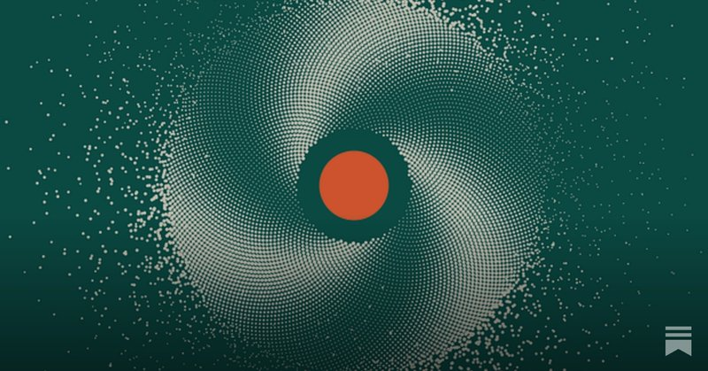

# 🐦 @emollick

## 📅 October 01, 2026

> 1 post(s) archived.

---

### 🕐 11:17 UTC · @emollick

> I wrote about the thing I underestimated most about progress in AI: its ability to self-organize to accomplish tasks. Also, what that means for agents like Muse and Dots, along with a music video explaining why we keep relearning The Bitter Lesson. https://open.substack.com/pub/oneusefulthing/p/the-dot-and-the-swarm?r=i5f7&amp;utm_medium=ios

🔗 [View original post](https://x.com/emollick/status/2105618164944146786)

---
