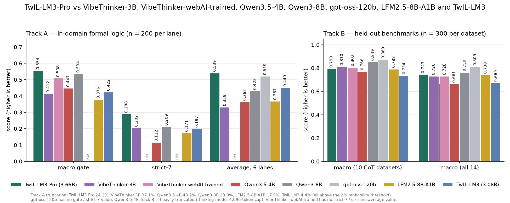

# 🐦 @omarsar0

## 📅 October 01, 2026

> 5 post(s) archived.

---

### 🕐 19:08 UTC · @omarsar0

> I think AI voice is missing a quality-check layer. In most apps I build, the voices already sound great. What still breaks production for me is a model reading &quot;Q3&quot;, &quot;v1.2&quot;, or a brand name wrong. It makes a huge difference in how people perceive voice agents. @OnepinAI is working to solve this. They check every line for naturalness, clarity, and pronunciation before you hear it. When a word comes out wrong, it fixes that word directly instead of regenerating the whole line. Your AI voice sounds human. So why can&apos;t it say your product&apos;s name? A great AI voice reads &quot;Porsche Taycan&quot; as TAY-can. Porsche says TIE-kahn. It guessed from the spelling, and nobody caught it, because nobody listens to line 1,200. Today we&apos;re launching Onepin: the production s…

🔗 [View original post](https://x.com/omarsar0/status/2105736578673033564)

---

### 🕐 18:44 UTC · @omarsar0

> Small models are getting really good at reasoning. It&apos;s exciting because SLMs can unlock so much at the harness layer. TwIL-LM3-Pro from @thewebAI has 3.6B parameters and runs locally on everyday computers. It scores 95.4 on BIG-Bench Hard, well ahead of Qwen3-8B at 63.7. I like their post-training recipe. They fine-tune on formal logic, merge the weights back toward the base model, and then run RL against a programmatic verifier. Logic scores go up, and general reasoning holds steady. Great to see more of this work released as open source. Half a million downloads in a month. Today, our open source family takes another step forward. Thank you for the incredible support behind our first-generation models. We’re excited to introduce TwIL-LM3-Pro. At just 3.6 billion parameters, it brings powerful reasoning to everyda…

🔗 [View original post](https://x.com/omarsar0/status/2105730500811719056)

---

### 🕐 16:32 UTC · @omarsar0

> I expect more AI companies to run the service themselves and sell the outcome. @arceuslegal does that for legal work. Clients send contracts over Slack, AI gathers the context, and a licensed attorney reviews every piece of work before it goes back. Contract reviews take 3 to 5 hours on average, at a flat fee agreed before the work starts. Personalization has massive implications in the business world too. I’m excited to announce that @arceuslegal is launching with $17M in funding, led by @greycroftvc, with participation from @craft_ventures, @spc, and others. As a founder, I always hated how helpless I felt working with law firms. I went through four or five different firms and so…

🔗 [View original post](https://x.com/omarsar0/status/2105697296029552700)

---

### 🕐 15:10 UTC · @omarsar0

> AI is creating new jobs, and I expect many companies to start hiring Automation Engineers. The role needs someone who understands how a team really works and can build the automations it needs. Jake explains it well in this article. At @getserval, Automation Engineers embed with IT, HR, Finance, and Legal teams and build AI agents directly inside each customer&apos;s Serval setup. https://x.com/i/article/2105490472856903680

🔗 [View original post](https://x.com/omarsar0/status/2105676646959227282)

---

### 🕐 14:21 UTC · @omarsar0

> Code review has to change for coding agents. Why? For me, it’s about scaling coding reviews while ensuring quality. If you give a coding agent one task, it can return several pull requests across different repos. Review tools still look at each PR in isolation. Reviewers have to guess which PR matters and how the PRs connect. @QodoAI just launched Qodo 3.0 with PR Triage to solve this. Here is how it works. PR Triage groups related PRs into one work package and scores it on codebase impact, SLA, and open findings. A cross-repo map shows every repo the package touches, and every score shows its own reasoning. Qodo writes one review brief for the whole package, so you review the PRs together. Your coding agent can then work through the findings. Humans still approve the code. Now they see the whole package before approving the first PR. https://www.qodo.ai/blog/introducing-qodo-3.0/?utm_source=x&amp;utm_medium=partner&amp;utm_campaign=launch-october1&amp;utm_content=omarsar0 Thanks to the Qodo team for partnering on this post. Media

🔗 [View original post](https://x.com/omarsar0/status/2105664489534230830)

---
