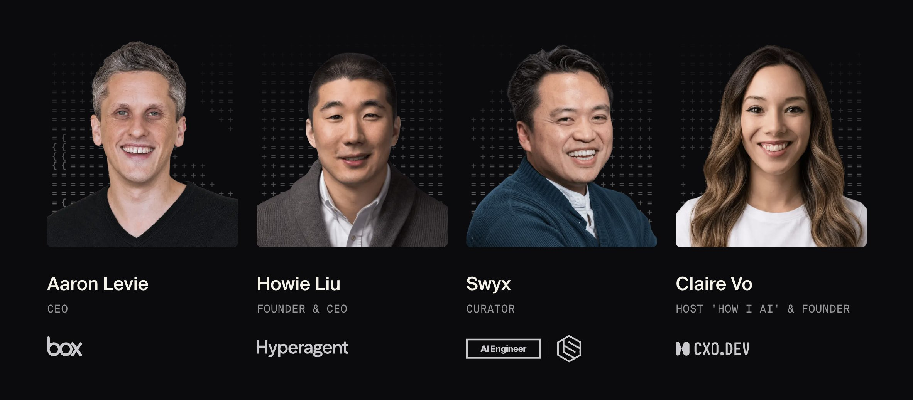
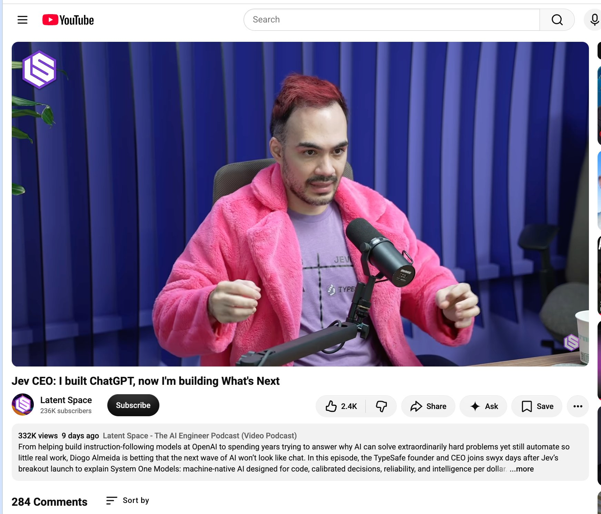

# 🐦 @swyx

## 📅 October 01, 2026

> 3 post(s) archived.

---

### 🕐 15:15 UTC · @swyx

> One week until init() - the conference for builders 🔥 We have an absolutely killer lineup of speakers: @levie, @howietl, @swyx, @clairevo and more. Best of all, it&apos;s free! There&apos;s a few spots left. RSVP now: https://workos.com/init Sponsored by @Stripe @Cloudflare and @Databricks

🔗 [View original post](https://x.com/grinich/status/2105678093050679699)

---

### 🕐 07:30 UTC · @swyx

> pls support smol creators https://x.com/latentspacepod/status/2102159548366881196 Jev and the System One Model: RLCD, intelligence/$, reliable AI, &amp; the end of chat-first AI https://www.latent.space/p/jev @typesafeai CEO @CompleteSkeptic explains why AI can solve extraordinarily hard problems yet still fail to automate basic work, why Jev is built for reliable…

🔗 [View original post](https://x.com/swyx/status/2105560981757931664)

---

### 🕐 06:01 UTC · @swyx

> is it normal to crop out other people&apos;s logo and not attribute to a simple youtube video or how does this work in professional tech media TypeSafe AI is talking with investors about raising $1 billion or more as enthusiasm builds around its Jev model and potential valuations above $10 billion. Read more: https://thein.fo/4hcSXC4

🔗 [View original post](https://x.com/swyx/status/2105538561672085751)

---
