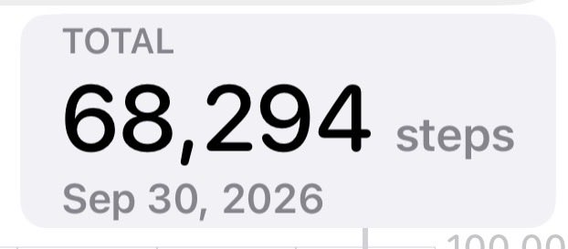

# 🐦 @tunguz

## 📅 October 01, 2026

> 12 post(s) archived.

---

### 🕐 18:25 UTC · @tunguz

> Now I am really curious how many steps did #1 do.

🔗 [View original post](https://x.com/tunguz/status/2105725758870323334)

---

### 🕐 17:24 UTC · @tunguz

> https://x.com/laurenlself/status/2105707680505688429 Steptember is over - Average 35.1k steps/day - Record 70.2k steps in a single day - Walked 498 miles (19 marathons) - Lost 10lbs - Feel (and look) better than ever Excited to sit for the entire month of October

🔗 [View original post](https://x.com/tunguz/status/2105710485765337117)

---

### 🕐 16:21 UTC · @tunguz

> This was for the last day of the month-long stepping challenge (Steptember! Ha!) organized by @shivanijpatel - which I ended up (barely!) winning. (I was literally running in my living room until midnight last night.) It was an amazing experience, I interacted with a lot of cool people (special thanks to @laurenlself for pushing me to the brink of what I was capable of!) I have lots more to say about what the challenge had taught me, and might do it at some other point, but here are a few of my top takeaways: 1. We modern humans don’t spend nearly enough time engaged in physical activities. 2. We don’t spend nearly enough time outdoors. 3. Our shoes - even the best ones - are far inferior for walking than bare feet. The first two points are something I’ve been aware of for years, but the last one was really driven home by this competition. The final tally for the last day of September.

🔗 [View original post](https://x.com/tunguz/status/2105694557505781827)

---

### 🕐 15:59 UTC · @tunguz

> yeah, that never happens Solving math problems on mirrors and windows

🔗 [View original post](https://x.com/tunguz/status/2105689085818122708)

---

### 🕐 15:52 UTC · @tunguz

> Good attitude. As an editor of two prominent mathematics journals and a professor in a large mathematics department at a research-intensive university, I have a bird’s-eye view of how mathematicians are reacting to AI. My view is that the damage currently being done to mathematics is not due to…

🔗 [View original post](https://x.com/tunguz/status/2105687268942053436)

---

### 🕐 15:39 UTC · @tunguz

> gm https://youtu.be/NU9JoFKlaZ0?is=HfBuukCTQJlvSjVV

🔗 [View original post](https://x.com/tunguz/status/2105683963444625688)

---

### 🕐 07:35 UTC · @tunguz

> Interesting take. I’m am become increasingly adamant that civilization is real only for the middle class. I talk to billionaires, and when I hear their problems I’m like wtf, these things would not happen in high trust upper middle class suburbia. And one of my clients does a lot of criminal defen…

🔗 [View original post](https://x.com/tunguz/status/2105562281987985888)

---

### 🕐 07:17 UTC · @tunguz

> The final tally.

🔗 [View original post](https://x.com/tunguz/status/2105557788223250571)

---

### 🕐 07:07 UTC · @tunguz

> The final tally for the last day of September. 35k.

🔗 [View original post](https://x.com/tunguz/status/2105555095379460593)

---

### 🕐 06:36 UTC · @tunguz

> A million steps per month is all you need.

🔗 [View original post](https://x.com/tunguz/status/2105547306863050979)

---

### 🕐 04:37 UTC · @tunguz

> 35k. 32k …

🔗 [View original post](https://x.com/tunguz/status/2105517439576621223)

---

### 🕐 04:01 UTC · @tunguz

> Gemini Very excited to announce Gemini 4 Argon, our new Frontier AI model, and a huge step forward across key capabilities. We’re focused on rolling it out responsibly starting with government and trusted cyber defenders through our Fairwind Program today, before wider availability soon

🔗 [View original post](https://x.com/tunguz/status/2105508438440878160)

---
