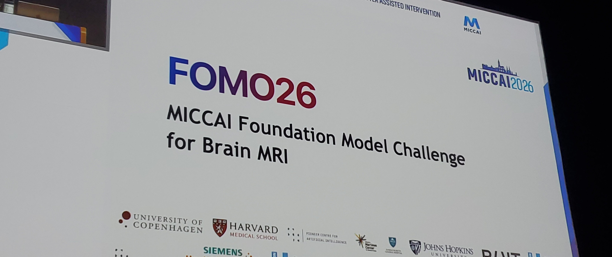

# 🐦 @ylecun

## 📅 October 01, 2026

> 4 post(s) archived.

---

### 🕐 13:40 UTC · @ylecun

> Question for everyone : Are you pro-intelligence or anti-intelligence ? Do you think more intelligence in the world is intrinsically good ? Or do you think more intelligence is intrinsically dangerous ? AI amplifies human intelligence. It makes PEOPLE smarter and more effective. It&apos;s like search engines, libraries, education, literacy, language: it makes PEOPLE smarter and more empowered. If you want intelligence (artificial or natural) to be under control of a few companies or governments, you are a neo-obscurantist or a neo-feudalist.

🔗 [View original post](https://x.com/ylecun/status/2105654072481112403)

---

### 🕐 12:41 UTC · @ylecun

> There&apos;s no battle for AI safety. It&apos;s a battle between pro-intelligence and anti-intelligence forces. Safety is a fake stand-in word for pausing/stopping/strangling AI. Nobody is anti-safety. Safety is a fake set-up word to booby trap your pro-intelligence stance.

🔗 [View original post](https://x.com/Dan_Jeffries1/status/2105639262787903615)

---

### 🕐 11:34 UTC · @ylecun

> Delighted to be speaking about our recent progress on JEPAs and on the need for more principled solutions that handle data imbalance, noise, multimodality, reasoning, ...! Happening at MICCAI-FOMO26 in 5min! And thank you for having me as keynote today!

🔗 [View original post](https://x.com/randall_balestr/status/2105622350456627466)

---

### 🕐 10:52 UTC · @ylecun

> The appeal of leftist Jean-Luc Mélenchon will diminish for French voters when they recognize his embrace of Putin and indifference to Putin&apos;s invasion of democratic Ukraine, an imperialist act of aggression. https://trib.al/6fuMsYz

🔗 [View original post](https://x.com/KenRoth/status/2105611700464464182)

---
