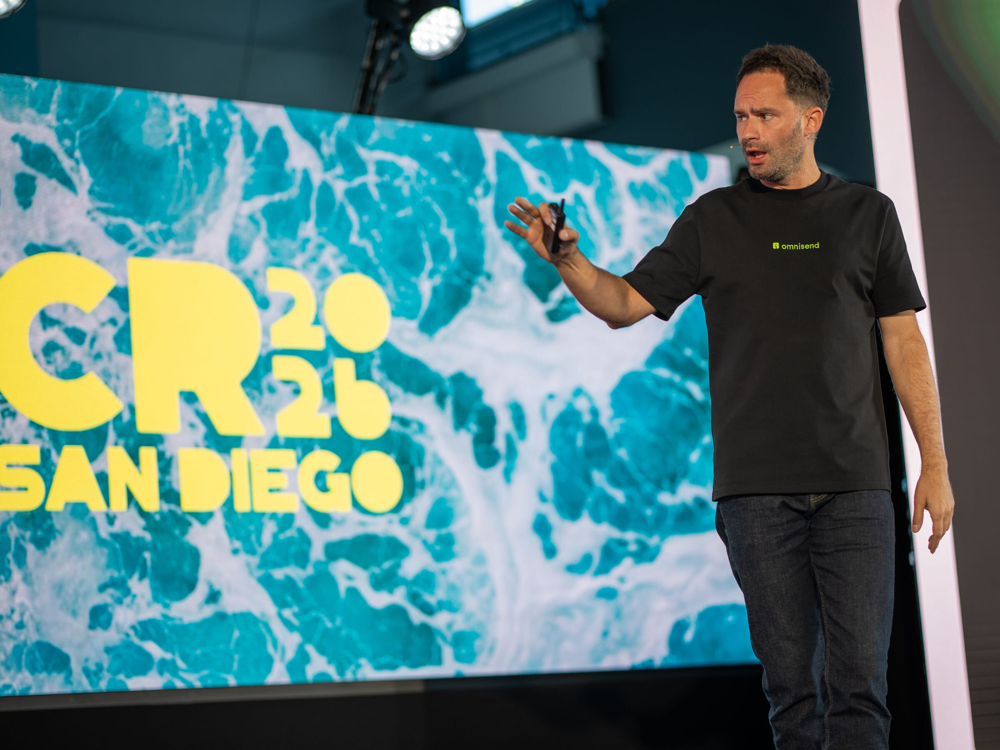

# 🐦 @AiEvolutio58513

## 📅 October 02, 2026

> 5 post(s) archived.

---

### 🕐 14:59 UTC · @AiEvolutio58513

> Mira Murati argues real human-AI teamwork needs models that can listen even while reasoning: &quot;The types of models that we work with today, they&apos;re very turn-based. You talk, they talk, then they go off and think.&quot; &quot;While they&apos;re thinking, it&apos;s almost like they&apos;re deaf and blind. They cannot perceive anything else about what&apos;s going on.&quot; &quot;By contrast, our interactions with each other are very rich. There is a lot of information in our interactions when we are silent, when we&apos;re thinking, when we&apos;re interrupting one another.&quot; &quot;Interaction models are able to capture all of this nuance. They&apos;re not turn-based. They&apos;re more like time-based interaction, where they&apos;re continuously taking in audio, text, video, and continuously providing output.&quot; &quot;This enables you to catch things like interruptions and simultaneous speech, and really create a rich, high bandwidth interaction between humans and machines.&quot; Said at Bloomberg Tech, in conversation with Emily Chang. Interested in AI? Follow @AiEvolutio58513 and never fall behind. I track ChatGPT, Claude, and every tool quietly changing how we work and create, then hand you the tested signals. Media

🔗 [View original post](https://x.com/AiEvolutio58513/status/2106036300646339013)

---

### 🕐 14:56 UTC · @AiEvolutio58513

> My friend Rytis from Omnisend is one of my favorite people in this industry, and it mostly comes down to one thing. He&apos;s extremely genuine. He was on stage at Commerce Roundtable last week, and it&apos;s clear he knows this space inside and out. He talks about it like someone who&apos;s actually in it rather than someone selling you something. Same goes for the rest of the @omnisend team. Easy to talk to, they take what they hear seriously, and they genuinely care in a way many other platforms don&apos;t. Partners like Omnisend are the reason an event like @CommerceRound can happen at all. Their support is what gets a room full of operators together to trade what&apos;s actually working. Really grateful for their partnership. It&apos;s by far been one of the easiest and most authentic ones I&apos;ve had.

🔗 [View original post](https://x.com/ecomchasedimond/status/2106035700697383040)

---

### 🕐 13:59 UTC · @AiEvolutio58513

> every student aiming to become an AI engineer right after reading Andrew&apos;s post: Interested in AI? Follow @AiEvolutio58513 and never fall behind. I track ChatGPT, Claude, and every tool quietly changing how we work and create, then hand you the tested signals. Media

🔗 [View original post](https://x.com/AiEvolutio58513/status/2106021185830158531)

---

### 🕐 13:04 UTC · @AiEvolutio58513

> Dario: AI progress needs to slow down Anthropic, a week on: here comes Claude Opus 5.5 Interested in AI? Follow @AiEvolutio58513 and never fall behind. I track ChatGPT, Claude, and every tool quietly changing how we work and create, then hand you the tested signals. Media

🔗 [View original post](https://x.com/AiEvolutio58513/status/2106007330164998255)

---

### 🕐 10:59 UTC · @AiEvolutio58513

> Anthropic CEO Dario Amodei says: &quot;50% of all entry-level Lawyers, Consultants, and Finance Professionals will be completely wiped out within the next 1–5 years.&quot; Over 47 minutes, he breaks down who makes it through and why. That&apos;s the gap between passively watching AI eat your field and turning into the person companies can&apos;t afford to lose. Watch the video. Then check the guide below on becoming the &quot;AI guy&quot; every company needs. Interested in AI? Follow @AiEvolutio58513 and never fall behind. I track ChatGPT, Claude, and every tool quietly changing how we work and create, then hand you the tested signals. Media

🔗 [View original post](https://x.com/AiEvolutio58513/status/2105975914404434081)

---
