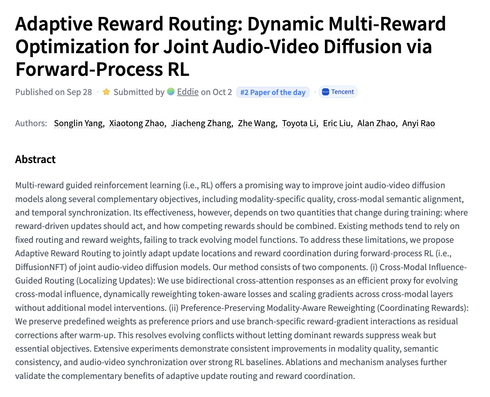

# 🐦 @_akhaliq

## 📅 October 02, 2026

> 2 post(s) archived.

---

### 🕐 17:54 UTC · @_akhaliq

> Adaptive Reward Routing Dynamic Multi-Reward Optimization for Joint Audio-Video Diffusion via Forward-Process RL paper: https://huggingface.co/papers/2609.37200

🔗 [View original post](https://x.com/_akhaliq/status/2106080325386305893)

---

### 🕐 16:49 UTC · @_akhaliq

> EgoTools Towards Tool-Centric Reasoning in Real-World Egocentric Videos paper: https://huggingface.co/papers/2609.39378 Media

🔗 [View original post](https://x.com/_akhaliq/status/2106063986664075749)

---
