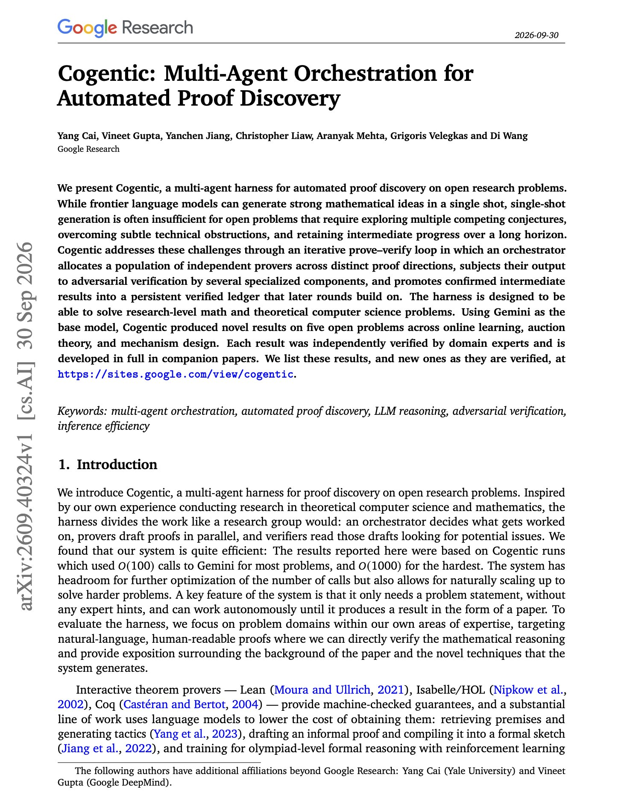
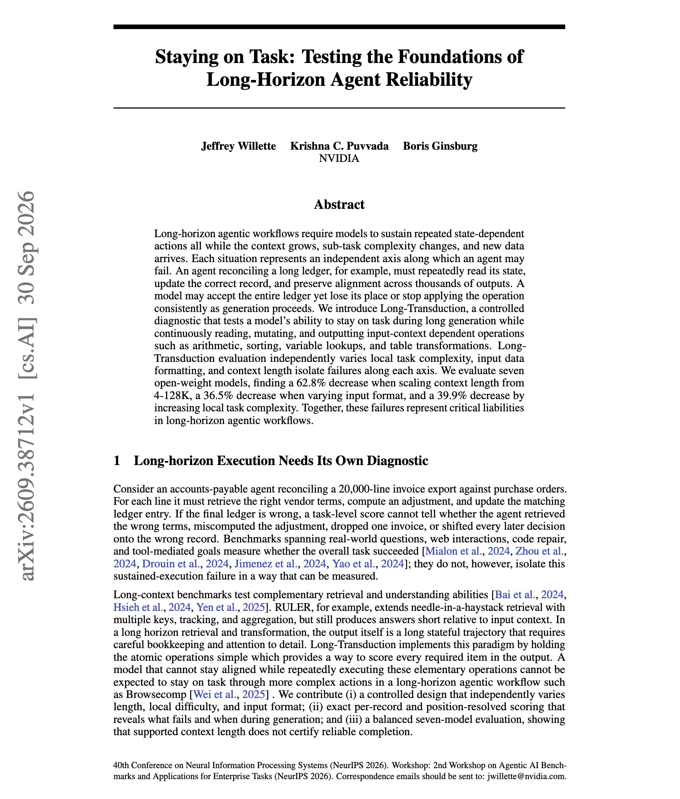
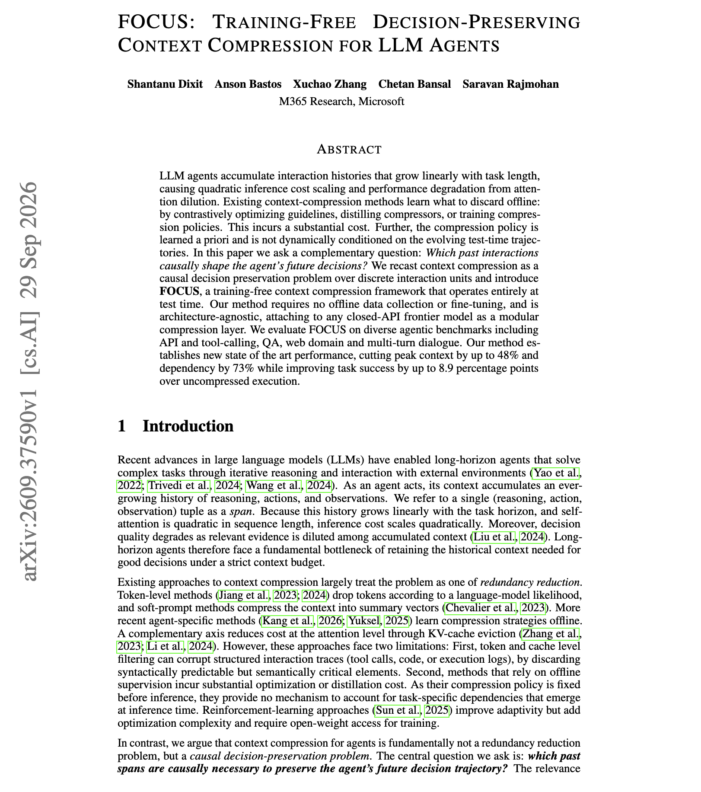
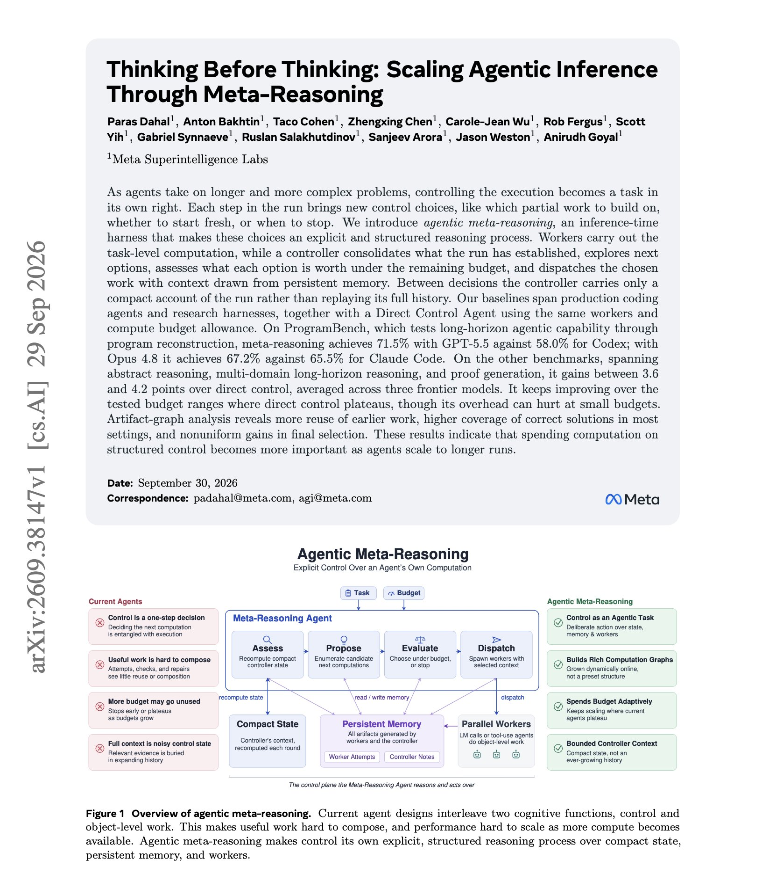

# 🐦 @dair_ai

## 📅 October 02, 2026

> 6 post(s) archived.

---

### 🕐 22:10 UTC · @dair_ai

> Sharing some notes from OpenAI DevDay in parts. The first part matters, since it&apos;s on everyone&apos;s mind. How do you optimize for cost and performance? If you are building agentic applications today, these are 4 of the most important levers you absolutely must try: - prompt caching - reasoning effort - programmatic tool calling - batch request The OpenAI dev docs have plenty of information, but these alone are good starting points for optimizing your agentic applications. Familiarize yourself with these and measure them with evals.

🔗 [View original post](https://x.com/omarsar0/status/2106144801708261390)

---

### 🕐 16:19 UTC · @dair_ai

> Banger paper from Google Research on multi-agent proof discovery. (bookmark it) It&apos;s really interesting to see this emerging multi-agent pattern: not enforcing too much execution structure and pairing it with dedicated agents for advising and verification. I think it is generally applicable as well. Great read. Here is how it works: Cogentic runs on Gemini and works on open problems in theoretical computer science, starting from the problem statement with no expert hints. The system works in rounds, and the orchestrator decides how many provers to run in each round. Every prover gets one direction to work on, such as a specific bound or a counterexample search, plus a short briefing that a summarizer agent writes from earlier attempts and verifier feedback. Each summarizer writes its briefing independently, so provers in the same round read different summaries of the same history. Each draft goes through two adversarial verifiers. One checks the draft on its own, and the other reads all of the round&apos;s drafts side by side to catch shared mistakes. A draft is accepted only if both pass it. The agents share state through two disk documents. A record logs every attempt with the objection it failed on, and a ledger stores verified lemmas and ruled-out directions. An auditor extracts correct lemmas from rejected proofs, verifies them again independently, and adds them to the ledger. A separate process advisor reads the verification logs across rounds and updates the instructions given to provers and verifiers. The orchestrator and the advisor can&apos;t give mathematical opinions, so the provers provide all the math. It produced new results on five open problems in online learning, auction theory, and mechanism design, each checked by domain experts. Most problems took around 100 Gemini calls, and the hardest took around 1,000. Paper: https://arxiv.org/abs/2609.40324 Chat with Paper: https://academy.dair.ai/papers/cogentic-multi-agent-orchestration-for-automated-proof-discovery-2609.40324

🔗 [View original post](https://x.com/omarsar0/status/2106056369816420624)

---

### 🕐 15:45 UTC · @dair_ai

> Banger paper from NVIDIA on long running agents. A model can accept 128K tokens of context and still make more mistakes the longer it works through a task. If your agent loses its place partway through a long table or ledger, this work measures what causes it. The setup: Long-Transduction asks a model to keep reading, updating and outputting state-dependent results over thousands of outputs, and varies three factors separately. Results: Across seven open-weight models, accuracy drops 62.8% when context grows from 4K to 128K, 36.5% when only the input format changes, and 39.9% when the per-step operation gets harder. Paper: https://academy.dair.ai/papers/staying-on-task-testing-the-foundations-of-long-horizon-agent-reliability-2609.38712

🔗 [View original post](https://x.com/dair_ai/status/2106047824093979033)

---

### 🕐 14:33 UTC · @dair_ai

> Learn to build a custom harness, folks. Mods in Claude Code, DeepSeek Harness, and now Pi Durable. What do these all have in common? Increased extensibility. Builders need coding agents and harnesses to be more malleable. Say you are building a simple agentic app for your users, a personalized headless experience, a software factory, or a domain-specific harness; you will quickly find that the generic harness won&apos;t cut it. Sometimes you need a different behavior in the UI. Sometimes you just need to easily add a new feature/plugin. Or sometimes you just want to build a completely new experience, like multiplayer support. You can build it from scratch, as I recommend. I mean, it&apos;s not that hard. But if you want to hit the ground running, where do you go? Pi Durable and DeepSeek Harness seem to want to solve that problem. Users want more customization in their harnesses. And those builders who understand how to build and maintain one will win big time from this next phase of more malleable harnesses. The battle of the best harness will be very different from the first wave of generic harnesses. People of Pi: We&apos;ve shipped Pi 1.0 with Pi Durable. Go make them yours. https://earendil.com/posts/pi-1-0/

🔗 [View original post](https://x.com/omarsar0/status/2106029828302373354)

---

### 🕐 07:00 UTC · @dair_ai

> New paper from Microsoft on compressing agent context at test time. If your agent gets worse as its interaction history grows, this method is worth a look. FOCUS asks which past interactions the agent&apos;s next decisions actually depend on. It keeps those units of the history and drops the others. It needs no training data or fine-tuning, so it works as a separate layer in front of closed-API models. On tool-calling, QA, web and multi-turn dialogue benchmarks, it cuts peak context by up to 48% and raises task success by up to 8.9 points compared with running on the full history. Paper: https://academy.dair.ai/papers/focus-training-free-decision-preserving-context-compression-for-llm-agents-2609.37590

🔗 [View original post](https://x.com/dair_ai/status/2105915729812050342)

---

### 🕐 01:30 UTC · @dair_ai

> Super interesting paper from Meta Superintelligence Labs on controlling long agent runs. They use the same workers and same budget, and ProgramBench goes from 63.7% to 71.5% with GPT-5.5 when a dedicated controller decides what work to run next. Codex scores 58.0%. Here is how it works: The controller keeps a short summary of the run and leaves full worker outputs in memory. Each cycle it updates that summary, proposes next steps, estimates what each one is worth under the remaining budget, and sends the chosen work to workers with the earlier outputs they need. On ProofBench, ARC-AGI-2 and LongCoT-mini it adds 3.6 to 4.2 points over direct control, averaged over three frontier models. Paper: https://academy.dair.ai/papers/thinking-before-thinking-scaling-agentic-inference-through-meta-reasoning-2609.38147

🔗 [View original post](https://x.com/dair_ai/status/2105832649868837275)

---
