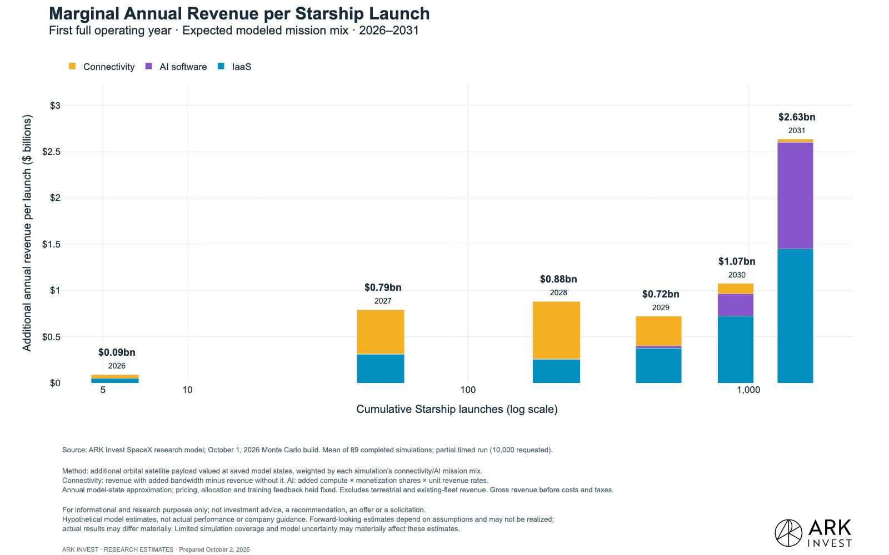

# 🐦 @elonmusk

## 📅 October 02, 2026

> 25 post(s) archived.

---

### 🕐 19:17 UTC · @elonmusk

> Travel anywhere with Tesla Superchargers 85k+ Supercharger stalls 9k+ Supercharger sites and counting

🔗 [View original post](https://x.com/elonmusk/status/2106101160008720499)

---

### 🕐 19:16 UTC · @elonmusk

> Sci-fi irl Hot-staging on Starship Flight 14

🔗 [View original post](https://x.com/elonmusk/status/2106100988751057316)

---

### 🕐 19:14 UTC · @elonmusk

> Actual amount that SpaceX saved taxpayers is even higher now The Washington Post famously claimed Elon Musk&apos;s companies received $38B from US governments. The truth? Elon Musk&apos;s company, SpaceX, SAVED the US Government (and taxpayers) an estimated $14B. I&apos;ve covered that in detail in the upcoming article, but here&apos;s the graphic:

🔗 [View original post](https://x.com/elonmusk/status/2106100526744240519)

---

### 🕐 19:08 UTC · @elonmusk

> Beautiful view of Starlink V3 deployment Starship&apos;s first orbital flight delivered 26 Starlink V3 satellites to space

🔗 [View original post](https://x.com/elonmusk/status/2106098911840772412)

---

### 🕐 19:00 UTC · @elonmusk

> This is pretty cool For those not aware, NASA certified the Cybertruck as an Astronaut Emergency Egress Vehicle, allowing SpaceX to replace their aging MRAPs. If something goes wrong on the pad, the crew needs to get as far away as possible, as quickly as possible, and Cybertruck provides that speed…

🔗 [View original post](https://x.com/elonmusk/status/2106097088123834773)

---

### 🕐 18:38 UTC · @elonmusk

> it’s honestly insane how much of the modern tech tree has been unlocked because of a single guy thanks to Elon we have - online payments - mass market electric cars - batteries and grid-scale energy storage - self driving cars and robotaxis - humanoid robots - advanced brain computer interfaces - next generation tunneling - reusable rockets -global satellite internet - basically the modern space industry - Moon and Mars transportation - orbital compute and space data centers - frontier AI - gigantic AI supercomputers - physical world AI and the wildest part is that these branches are now starting to merge there is a very real chance that this one guy ends up being the reason humanity reaches Kardashev II genuinely the man of the millennium

🔗 [View original post](https://x.com/IterIntellectus/status/2106091420515717311)

---

### 🕐 18:16 UTC · @elonmusk

> Correct, roughly 90% of SpaceX’s revenue this year will be commercial. In Q4, our government revenue will be less than 5%! Federal expenditures are about 25% of the economy, so even if you sold pencils, you’d expect to sell about a quarter of your pencils to the government. This means SpaceX is FAR MORE commercial relative to the average company in America. Gibney is both a liar AND an idiot. Absolute scum of the Earth.

🔗 [View original post](https://x.com/elonmusk/status/2106085868209590570)

---

### 🕐 18:12 UTC · @elonmusk

> not sure that people really grok the revenue generation potential of starship + starlink/starmind on our expectations each launch could drive $700+ million in incremental annual revenue (and growing, as SpaceXai crosses into AI software revenue monetization)

🔗 [View original post](https://x.com/wintonARK/status/2106084946943287386)

---

### 🕐 18:06 UTC · @elonmusk

> Great work by the @SpaceX team! Teams complete three Falcon launches, four first stage landings at four landing zones in Florida and California, and docking Dragon to the @Space_Station for our 21st human spaceflight in under 13 hours

🔗 [View original post](https://x.com/elonmusk/status/2106083414848028834)

---

### 🕐 17:55 UTC · @elonmusk

> Happy to support – good luck to all of the runners! Race weekend is getting brighter by the hour, thanks to support from our community. @SpaceXAIMemphis SpaceXAI is providing 34 light towers for the course and $10,000 to help help cover any additional lighting costs. Final preparations are underway. We&apos;ll see you soon!

🔗 [View original post](https://x.com/SpaceXAIMemphis/status/2106080567196545307)

---

### 🕐 15:51 UTC · @elonmusk

> SpaceX launched five missions in the last six days. • Sep 26 — USSF-385, Falcon 9 • Sep 28 — Starship Flight 14 • Oct 1 — Crew-13, Falcon 9 • Oct 1 — Transporter-18, Falcon 9 • Oct 1 — NROL-97, Falcon Heavy Three of them launched in less than 13 hours. Media

🔗 [View original post](https://x.com/cb_doge/status/2106049422299934905)

---

### 🕐 15:41 UTC · @elonmusk

> Congratulations! What once was the peak, is now just the beginning. Paramount and Warner Bros. shaped over a century of culture. By combining them, we aren&apos;t rewriting history — we&apos;re equipping these iconic studios with a more powerful engine. Together, we are Skydance: a creative-first home for …

🔗 [View original post](https://x.com/elonmusk/status/2106046950584008717)

---

### 🕐 13:20 UTC · @elonmusk

> Incredible Falcon Heavy footage! Congrats @SpaceX and @DeptofWar on a spectacular launch. October 1st was a big day for the Cape 🇺🇸🚀 Media

🔗 [View original post](https://x.com/NASAAdmin/status/2106011482035216561)

---

### 🕐 11:16 UTC · @elonmusk

> Plus re-landing four boosters— and starting the week with Starship’s first orbital flight. For investors new to the space sector: it’s hard to fully capture just how vastly and wildly different all of this is than what existed - or what many thought was possible - just handful of years ago in the industry $SPCX 🚀 🚀 🚀 SpaceX just successfully launched three orbital rockets in one day, the only company to do so. It started with four astronauts in Dragon to the ISS (this photo). Then 130 satellites lofted on one Falcon 9 from Vandy. Then the Falcon Heavy in the foreground for NROL.

🔗 [View original post](https://x.com/MorganLBrennan/status/2105980308520665381)

---

### 🕐 08:25 UTC · @elonmusk

> Ask @Grok in XChat Your group chat just got smarter Get answers to your questions directly in XChat by asking Grok

🔗 [View original post](https://x.com/elonmusk/status/2105937204044615707)

---

### 🕐 07:53 UTC · @elonmusk

> Super Intelligence (fka AI) is now acing accounting tests &apos;More striking is how fast AI took the lead. Just eighteen months ago, the best AI models fell short of the average accountant’s ~37% score. Today, models ace those same tasks.&apos; &apos;These results are provocative. So much so that we considered not publishing them for fear of misinter…

🔗 [View original post](https://x.com/elonmusk/status/2105929186556998055)

---

### 🕐 07:45 UTC · @elonmusk

> 93-year-old Marie-Louise was found dead and covered in blood inside her home in Toulouse, France, with a naked 33-year-old Sudanese illegal migrant lying on top of her. Marie-Louise was disabled, had been bedridden for months and could not move around on her own. Police were alerted after neighbors became concerned, including after an unfamiliar man was spotted in her garden. Officers found her front door unusually locked from inside and forced their way into the house through a glass door. Upstairs, they discovered blood on a mattress and floor before finding Marie-Louise dead in the bathroom. The suspect was found lying naked on her body. Investigators suspect Marie-Louise was sexually assaulted and beaten and that the suspect moved her through several rooms of the house before taking her to the bathroom. The man had consumed a large quantity of alcohol and fallen asleep. He was described as being in an altered state and violently resisted arrest, injuring a police officer. Neighbors described Marie-Louise as the “little grandmother of the neighborhood,” saying they regularly helped her with groceries and other daily needs.

🔗 [View original post](https://x.com/visegrad24/status/2105927010866336237)

---

### 🕐 05:47 UTC · @elonmusk

> Falcon Heavy launches NROL-97 from pad 39A in Florida Media

🔗 [View original post](https://x.com/SpaceX/status/2105897474300973427)

---

### 🕐 04:14 UTC · @elonmusk

> 4 astronauts 130 payloads 1 docking 1 secret 4 boosters landed Another day at the office !

🔗 [View original post](https://x.com/jjfactorykat/status/2105874079320522884)

---

### 🕐 04:06 UTC · @elonmusk

> • SpaceX Makes History • Tesla Secures Future • Grok Team Can&apos;t Stop Cooking TIMESTAMPS 0:00 Crew Dragon ISS Mission Highlights: SpaceX Just Broke A Record With Crew Dragon Mission To ISS 3:23 Grok Team Keeps Cooking. BIG Grok Bot Updates As OpenAI Shamelessly Copies Grok Bot With ‘Dots” 12:14 Tesla Secures Its Future 17:26 Ways To Support (Want More Content? Early Access? Tesla &amp; SpaceX Valuation Model?) Media

🔗 [View original post](https://x.com/stevenmarkryan/status/2105872022668718241)

---

### 🕐 03:59 UTC · @elonmusk

> Side booster separation confirmed Media

🔗 [View original post](https://x.com/SpaceX/status/2105870151027495393)

---

### 🕐 03:44 UTC · @elonmusk

> Today’s mission is the @NRO_gov’s first launch aboard the Falcon Heavy rocket. Falcon 9 previously launched 22 missions over nine years for the NRO

🔗 [View original post](https://x.com/SpaceX/status/2105866520240832857)

---

### 🕐 03:08 UTC · @elonmusk

> For folks not understanding where we are at with AI now - if the task is verifiable, it is now solved by AI. Yes, earlier days you could argue that &apos;AI isn&apos;t that good&apos; (e.g. see first attached chart here, where GPT-4o underperformed average accountants on tasks) But now, it&apos;s a totally different story (only ~2 years later). The second chart is astounding. It took me a while to even understand it because it looks so odd. It compares manual accounting tasks to tasks complete with Opus 5.5. Basically Opus 5.5. solves all tasks almost instantly at a 100% accuracy rate, whereas a person takes a lot more time and gets a lot of things wrong. It makes the chart look entirely silly because the axes aren&apos;t even comparable. So yeah, this is where we&apos;re at. If it is verifiable, it is solved. This is just how these model architectures work now. On these detail-oriented, well-specified tasks, frontier models are now faster and more accurate than accountants, even the best one in our study.

🔗 [View original post](https://x.com/mstockton/status/2105857523668451416)

---

### 🕐 00:30 UTC · @elonmusk

> I remember the first meeting where the team pitched the idea of putting compute in space - exciting idea! Today&apos;s successful launch with our partner @planet prototype satellite shows how far we&apos;ve come...and how far there is to go. Thanks for the lift, @SpaceX, another spectacular booster landing too🚀 Media

🔗 [View original post](https://x.com/sundarpichai/status/2105817662651777367)

---

### 🕐 00:01 UTC · @elonmusk

> Love a little ambiance

🔗 [View original post](https://x.com/cybertruck/status/2105810391205126606)

---
