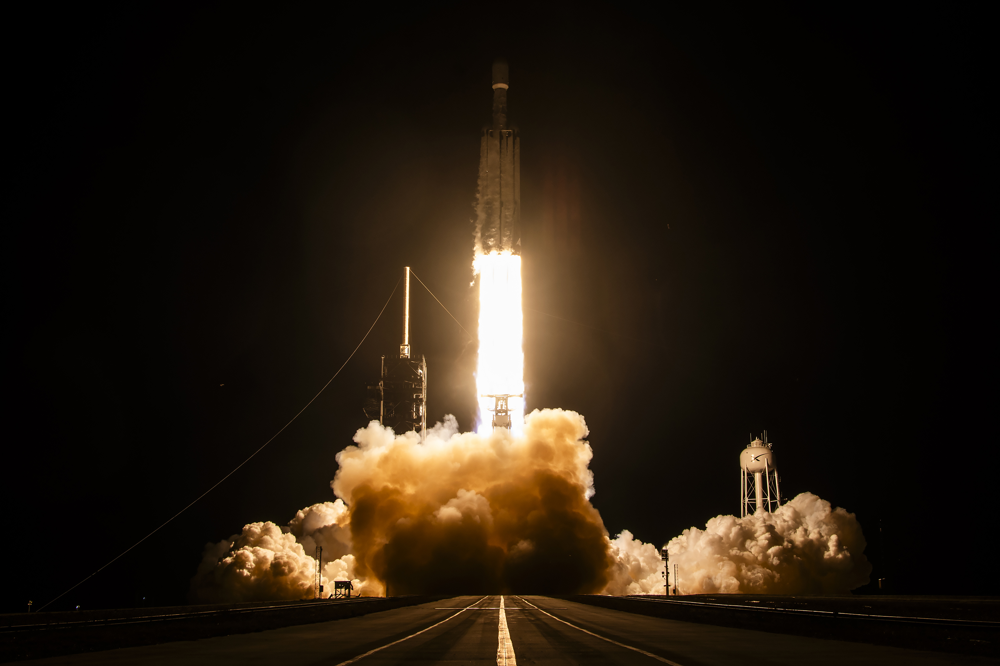
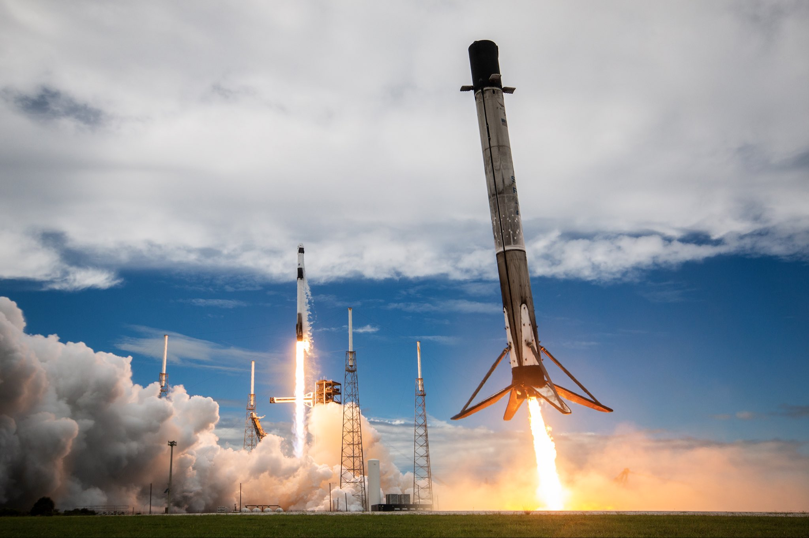
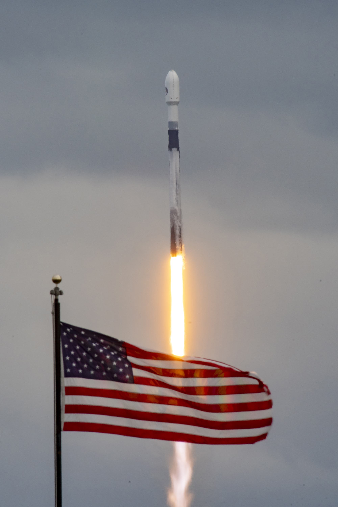
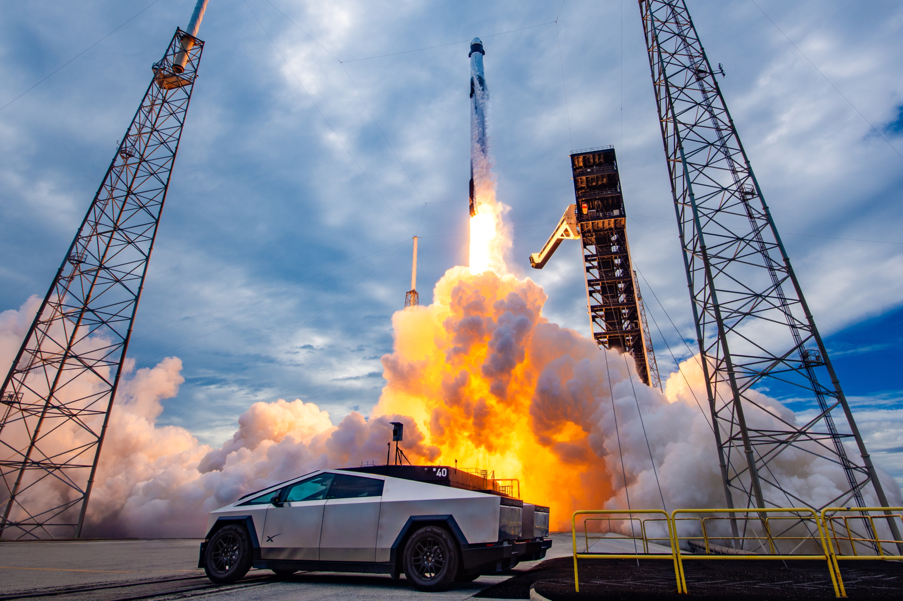

# 🐦 @elonmusk

## 📅 October 02, 2026

> 10 post(s) archived.

---

### 🕐 08:25 UTC · @elonmusk

> Ask @Grok in XChat Your group chat just got smarter Get answers to your questions directly in XChat by asking Grok

🔗 [View original post](https://x.com/elonmusk/status/2105937204044615707)

---

### 🕐 07:53 UTC · @elonmusk

> Super Intelligence (fka AI) is now acing accounting tests &apos;More striking is how fast AI took the lead. Just eighteen months ago, the best AI models fell short of the average accountant’s ~37% score. Today, models ace those same tasks.&apos; &apos;These results are provocative. So much so that we considered not publishing them for fear of misinter…

🔗 [View original post](https://x.com/elonmusk/status/2105929186556998055)

---

### 🕐 05:47 UTC · @elonmusk

> Falcon Heavy launches NROL-97 from pad 39A in Florida Media

🔗 [View original post](https://x.com/SpaceX/status/2105897474300973427)

---

### 🕐 04:14 UTC · @elonmusk

> 4 astronauts 130 payloads 1 docking 1 secret 4 boosters landed Another day at the office !

🔗 [View original post](https://x.com/jjfactorykat/status/2105874079320522884)

---

### 🕐 04:06 UTC · @elonmusk

> • SpaceX Makes History • Tesla Secures Future • Grok Team Can&apos;t Stop Cooking TIMESTAMPS 0:00 Crew Dragon ISS Mission Highlights: SpaceX Just Broke A Record With Crew Dragon Mission To ISS 3:23 Grok Team Keeps Cooking. BIG Grok Bot Updates As OpenAI Shamelessly Copies Grok Bot With ‘Dots” 12:14 Tesla Secures Its Future 17:26 Ways To Support (Want More Content? Early Access? Tesla &amp; SpaceX Valuation Model?) Media

🔗 [View original post](https://x.com/stevenmarkryan/status/2105872022668718241)

---

### 🕐 03:59 UTC · @elonmusk

> Side booster separation confirmed Media

🔗 [View original post](https://x.com/SpaceX/status/2105870151027495393)

---

### 🕐 03:44 UTC · @elonmusk

> Today’s mission is the @NRO_gov’s first launch aboard the Falcon Heavy rocket. Falcon 9 previously launched 22 missions over nine years for the NRO

🔗 [View original post](https://x.com/SpaceX/status/2105866520240832857)

---

### 🕐 03:08 UTC · @elonmusk

> For folks not understanding where we are at with AI now - if the task is verifiable, it is now solved by AI. Yes, earlier days you could argue that &apos;AI isn&apos;t that good&apos; (e.g. see first attached chart here, where GPT-4o underperformed average accountants on tasks) But now, it&apos;s a totally different story (only ~2 years later). The second chart is astounding. It took me a while to even understand it because it looks so odd. It compares manual accounting tasks to tasks complete with Opus 5.5. Basically Opus 5.5. solves all tasks almost instantly at a 100% accuracy rate, whereas a person takes a lot more time and gets a lot of things wrong. It makes the chart look entirely silly because the axes aren&apos;t even comparable. So yeah, this is where we&apos;re at. If it is verifiable, it is solved. This is just how these model architectures work now. On these detail-oriented, well-specified tasks, frontier models are now faster and more accurate than accountants, even the best one in our study.

🔗 [View original post](https://x.com/mstockton/status/2105857523668451416)

---

### 🕐 00:30 UTC · @elonmusk

> I remember the first meeting where the team pitched the idea of putting compute in space - exciting idea! Today&apos;s successful launch with our partner @planet prototype satellite shows how far we&apos;ve come...and how far there is to go. Thanks for the lift, @SpaceX, another spectacular booster landing too🚀 Media

🔗 [View original post](https://x.com/sundarpichai/status/2105817662651777367)

---

### 🕐 00:01 UTC · @elonmusk

> Love a little ambiance

🔗 [View original post](https://x.com/cybertruck/status/2105810391205126606)

---
