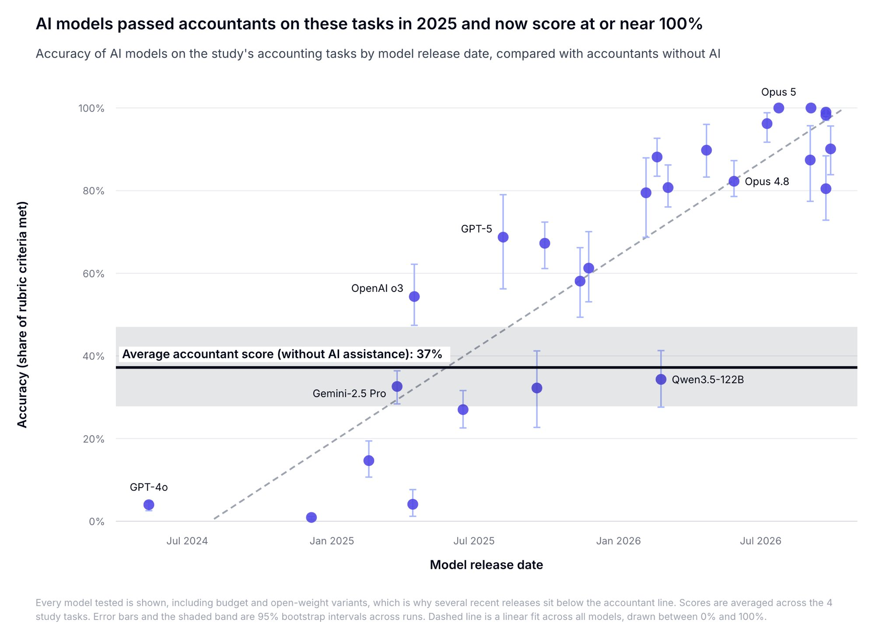

# 🐦 @emollick

## 📅 October 02, 2026

> 3 post(s) archived.

---

### 🕐 19:57 UTC · @emollick

> People asked for me to upload the Bitter Lesson video from this piece to YouTube, so here you are: https://youtu.be/OAwat51S_Sk Media I wrote about the thing I underestimated most about progress in AI: its ability to self-organize to accomplish tasks. Also, what that means for agents like Muse and Dots, along with a music video explaining why we keep relearning The Bitter Lesson. https://open.substack.com/pub/o…

🔗 [View original post](https://x.com/emollick/status/2106111291014234462)

---

### 🕐 19:00 UTC · @emollick

> Yes! I think there is too much &quot;we&apos;re so early&quot; self-congratulation here. Many senior leaders in companies are smart, motivated, and understand a lot about their business. Many are also technically adept. They are absolutely getting AI. But changing a company is a longer process. Everyone uses AI by now. Senior leaders are vibecoding apps. They&apos;ve adopted claude. They&apos;re finding workflows to automate. Folks have their own claws. AI capex is keeping the S&amp;P afloat. Corporate America&apos;s geared up. It&apos;s all very much mainstream. We&apos;re not so early anymore.

🔗 [View original post](https://x.com/emollick/status/2106097018129227918)

---

### 🕐 02:10 UTC · @emollick

> “We find that on medium-length, well-defined accounting tasks, frontier AI models are now faster and more accurate than junior accountants, even the best one in our study.” Eighteen months ago they scored well below human accountants Good discussion here: https://www.mercor.com/blog/human-baselines-for-benchmarks-ai-now-outperforms-junior-accountants/

🔗 [View original post](https://x.com/emollick/status/2105842740533596201)

---
