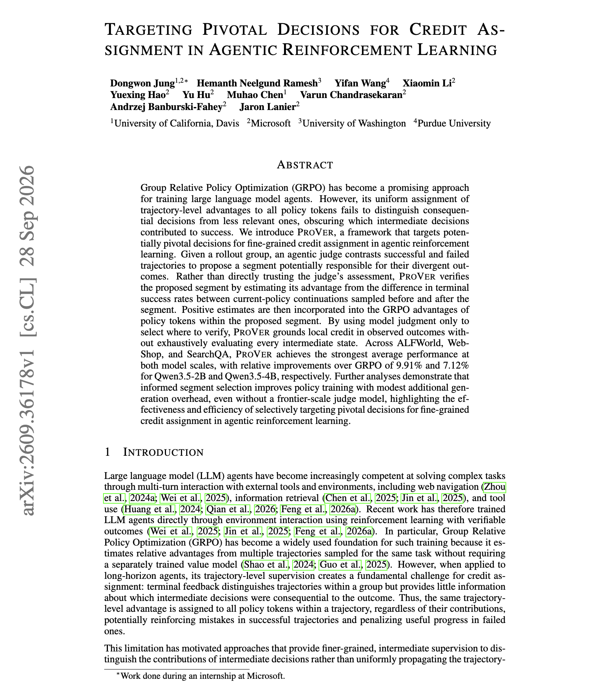
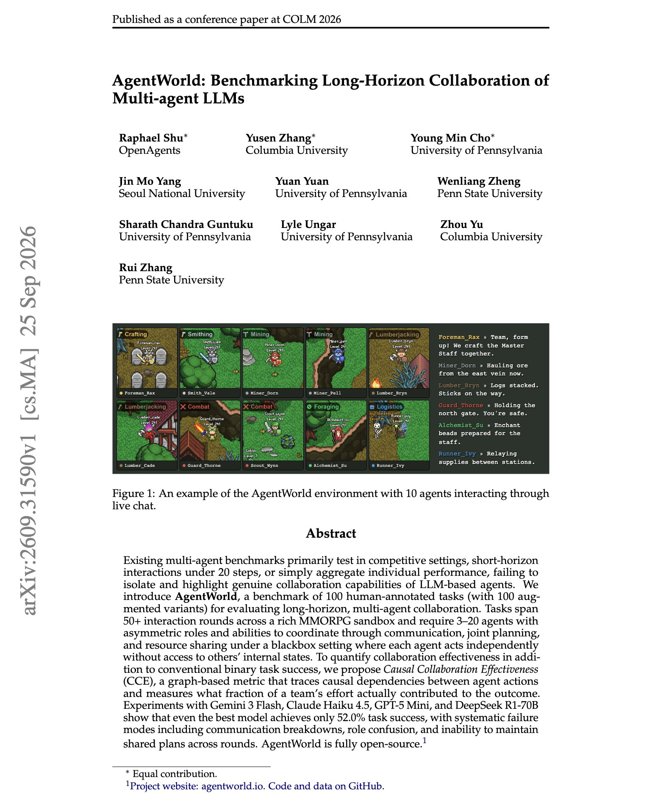

# 🐦 @omarsar0

## 📅 October 02, 2026

> 3 post(s) archived.

---

### 🕐 08:00 UTC · @omarsar0

> Good paper on credit assignment for agent RL. The main finding is that you want an LLM judge to choose where to check a trajectory, and the rollouts to decide how much credit that step gets. GRPO gives every token in a trajectory the same advantage, so the training signal cannot tell the decisive step from the rest. ProVer has a judge compare successful and failed rollouts and name the segment it thinks caused the difference. It then samples continuations from just before and just after that segment and uses the change in success rate as the segment&apos;s advantage. Across ALFWorld, WebShop and SearchQA, this gives relative improvements over GRPO of 9.91% for Qwen3.5-2B and 7.12% for Qwen3.5-4B. It still helps when the judge is a smaller model. Paper: https://arxiv.org/abs/2609.36178 Chat with Paper: https://academy.dair.ai/papers/targeting-pivotal-decisions-for-credit-assignment-in-agentic-reinforcement-learn-2609.36178

🔗 [View original post](https://x.com/omarsar0/status/2105930871534690714)

---

### 🕐 03:01 UTC · @omarsar0

> More agents don&apos;t mean higher performance. There is a coordination bottleneck to consider. Not to mention the unnecessary costs. So how many of a multi-agent team&apos;s actions actually help it finish the task? In this AgentWorld paper, fewer than a third. AgentWorld puts 3 to 20 LLM agents with different roles into a game sandbox for tasks that run 50+ rounds. Agents can&apos;t see each other&apos;s internal state, so they have to coordinate through messages and shared plans. Gemini 3 Flash has the highest task success at 52.0%. Coordination tasks are the hardest category, at 12% success, and common failures include communication breakdowns, role confusion, and lost shared plans. Paper: https://arxiv.org/abs/2609.31590 Chat with Paper: https://academy.dair.ai/papers/agentworld-benchmarking-long-horizon-collaboration-of-multi-agent-llms-2609.31590

🔗 [View original post](https://x.com/omarsar0/status/2105855550588428584)

---

### 🕐 01:03 UTC · @omarsar0

> I think faster inference is one of the next big unlocks for coding agents. Volantis is using optics to give each chip far more memory and much higher memory bandwidth. They&apos;re targeting up to 10,000 tokens per second per user on models over 10T parameters. That&apos;s crazy! At that speed, a coding agent that takes hours today could finish in minutes. Definitely one of the more exciting raises I have seen recently. Excited to announce Volantis&apos;s $88M Series A. We are solving Al&apos;s memory bottleneck by using optics, enabling chips with huge amounts of fast &amp; cheap memory. By boosting both the memory bandwidth and capacity per chip by orders of magnitude, we enable ultra-fast inference (up to …

🔗 [View original post](https://x.com/omarsar0/status/2105825963015905509)

---
