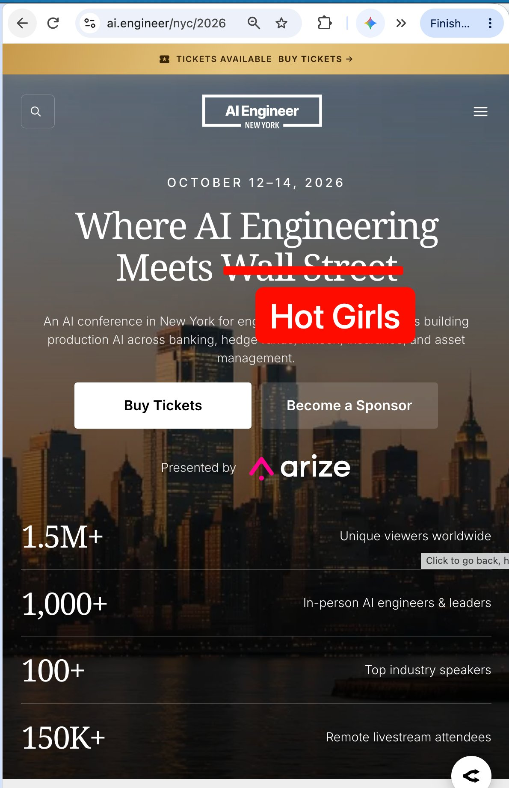

# 🐦 @swyx

## 📅 October 02, 2026

> 3 post(s) archived.

---

### 🕐 15:25 UTC · @swyx

> It&apos;s time to get serious about Security x AI. One of the joys of doing AIE is helping others start their own high quality conferences in their countries and domains. Every single 2025 partner has come back — and the 2nd AI Security Summit is now way more important than before. Proud to be back as a founding partner with @snyksec! Join the event: https://aisecuritysummit.com/ The landscape has completely transformed since we started this a year ago. An exploding number of rogue agents, more breaches, more AI-driven attacks. now more than ever, security must be at the center of the AI conversation. With so much more hacks and vulnerabilities, this stuff is no longer theoretical...

🔗 [View original post](https://x.com/swyx/status/2106042773510177256)

---

### 🕐 00:32 UTC · @swyx

> Recursive Language Models: Claude Code, Agent Swarms, Big Research Bets, &amp; the $40M AI Problem Solver https://www.latent.space/p/rlm MIT’s @a1zhang explains why Claude Code, Codex, and Pi are basically the same, how RLMs use code, context offloading, and recursive subagents to generalize across tasks, why one expert can sometimes replace a trillion-token brute-force search, what OpenAI’s 10,000-agent, 130B-output-token experiment reveals about the future of language models, and why academia’s biggest advantage is the freedom to take weird, ambitious research bets. Media

🔗 [View original post](https://x.com/latentspacepod/status/2105818177674654099)

---

### 🕐 00:13 UTC · @swyx

> changing my tagline for @aidotengineer nyc flying over early for NY Comic Con. see you in 11 days! it took not even 30 seconds after leaving my hotel in nyc to see something that i almost never saw in 3 months in sf: i saw a hot girl

🔗 [View original post](https://x.com/swyx/status/2105813399804502403)

---
