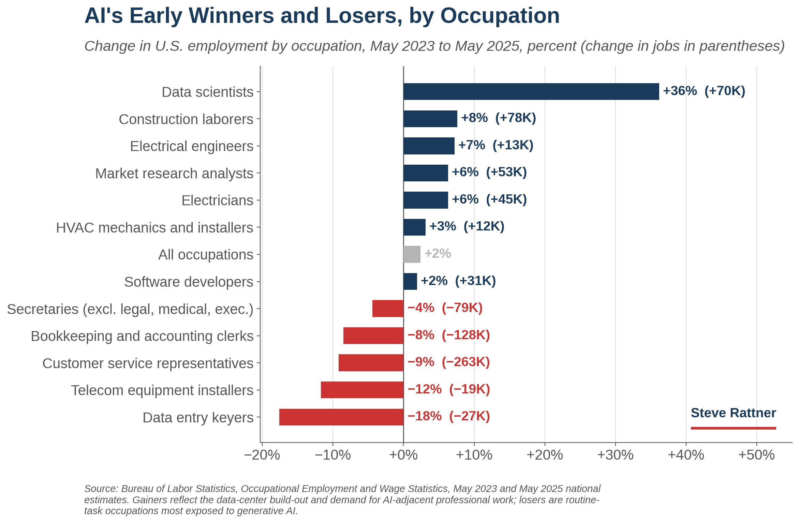
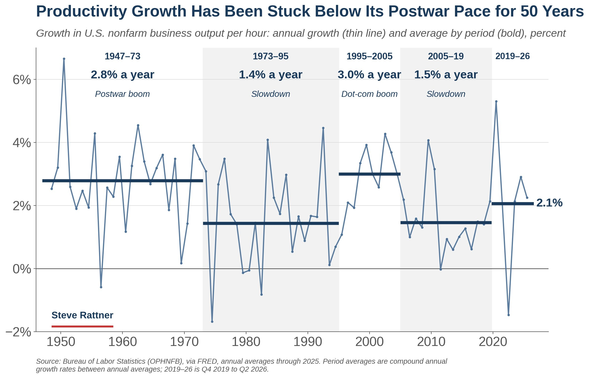
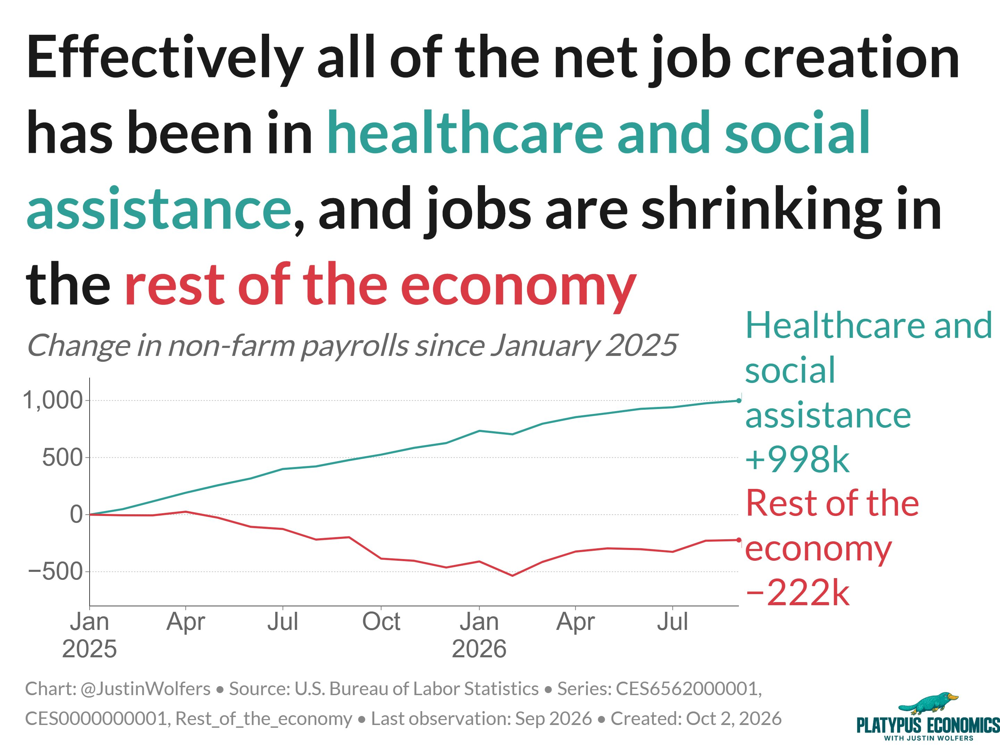

# 🐦 @ylecun

## 📅 October 02, 2026

> 4 post(s) archived.

---

### 🕐 19:24 UTC · @ylecun

> So far, A.I.&apos;s losers are routine office jobs like data entry keyers and customer service reps. Its winners are data scientists and the trades building the data centers like construction laborers and electricians. My @nytopinion Chart: https://www.nytimes.com/2026/10/02/opinion/ai-tech-innovation.html

🔗 [View original post](https://x.com/SteveRattner/status/2106103006668161328)

---

### 🕐 15:59 UTC · @ylecun

> Productivity growth raises per-capita incomes, but outside the dot-com boom, it&apos;s been sluggish for 50 years. A.I. is our best chance in a generation to change that. My @nytopinion Chart: https://www.nytimes.com/2026/10/02/opinion/ai-tech-innovation.html

🔗 [View original post](https://x.com/SteveRattner/status/2106051562942664727)

---

### 🕐 13:27 UTC · @ylecun

> And so it continues... Our economic debates seem utterly disconnected from the reality. That reality: This is an economy mostly creating healthcare jobs, and it does so month after month, and everything else is just noise.

🔗 [View original post](https://x.com/JustinWolfers/status/2106013311737209002)

---

### 🕐 03:20 UTC · @ylecun

> &quot;The world is predictable in the right coordinates. The open question is whether a model can learn those coordinates on its own.&quot; World model for Physics conference in Aspen coming winter 2027! Application deadline October 5 ! organized by @randall_balestr @KempeLab @ylecun and me 😀 Media

🔗 [View original post](https://x.com/cosmo_shirley/status/2105860476752330811)

---
