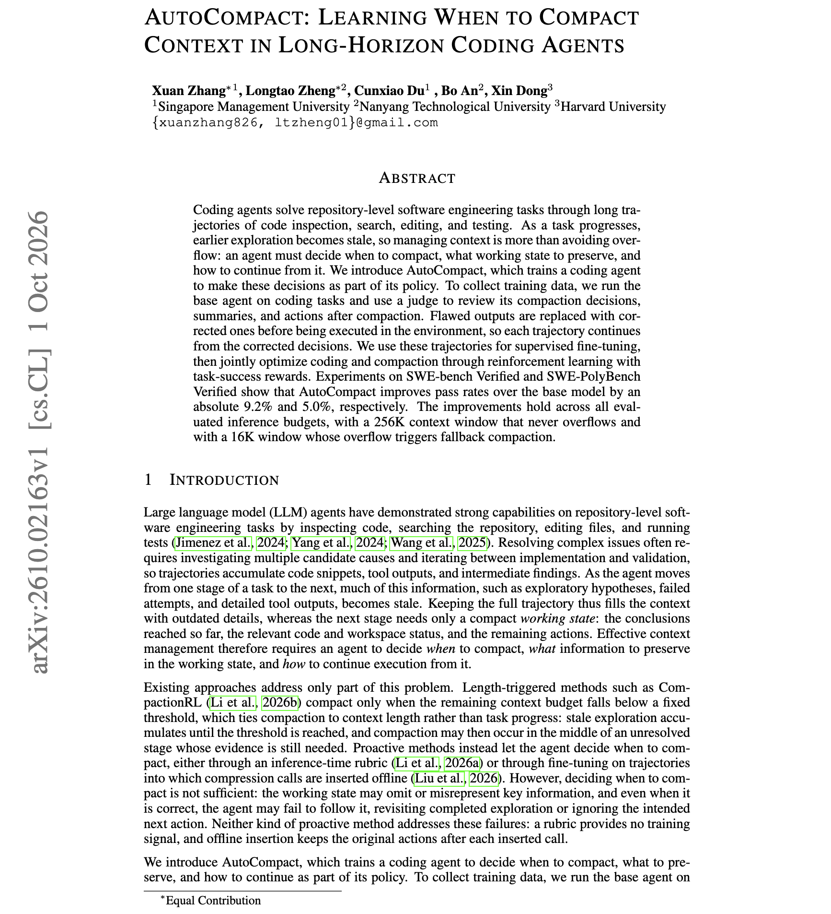

# 🐦 @dair_ai

## 📅 October 03, 2026

> 2 post(s) archived.

---

### 🕐 16:11 UTC · @dair_ai

> First AutoHarness, then AutoContext, now AutoCompact. I am seeing a rising trend of work that trains models to natively support more of what the harness does. This work specifically trains agents to decide for themselves when to compact. Reminds me of the new paper from Meta that trains models to manage context natively. But how good is this approach? AutoCompact trains the agent to decide when to compact, what working state to keep, and how to resume. A judge first reviews the base agent&apos;s compaction decisions and replaces flawed ones before they execute. The corrected trajectories are used for SFT, then RL with task-success rewards trains coding and compaction together. Pass rates improve by 9.2 points on SWE-bench Verified and 5.0 points on SWE-PolyBench Verified. The gain holds even with a 256K window that never overflows, so learned compaction helps when context space is not the limit. It remains to be seen how this works at scale and how robust it is across harnesses. One interesting note from the authors is that this type of proactive compaction is a form of model-harness co-design: the harness provides the compaction mechanism, while the model learns when to invoke it, what to preserve, and how to continue afterward. Even more interesting is how to combine the rule-based compaction techniques already packaged in harnesses with more model-invoked proactive ones. Paper: https://arxiv.org/abs/2610.02163 Chat with Paper: https://academy.dair.ai/papers/autocompact-learning-when-to-compact-context-in-long-horizon-coding-agents-2610.02163

🔗 [View original post](https://x.com/omarsar0/status/2106416745686995025)

---

### 🕐 14:33 UTC · @dair_ai

> This is impressive! I cloned my voice in the @cartesia playground from a ~15-second clip. The clone was ready in a couple of seconds. Then I had it speak Japanese, a language I don&apos;t speak. My clone now says in Japanese that I can find good papers by combining AI with my experience reviewing papers. I am impressed by how good this sounds. This runs on Sonic 3.6, their latest voice model, which supports 44 languages. You can do the same with any of them. This tech is getting really good, and I think it&apos;s worth exploring to make your content more accessible to more people in different languages. Try it here: http://play.cartesia.ai More info about their model here: https://www.cartesia.ai/blog/sonic-3.6 Media

🔗 [View original post](https://x.com/omarsar0/status/2106392210023309338)

---
