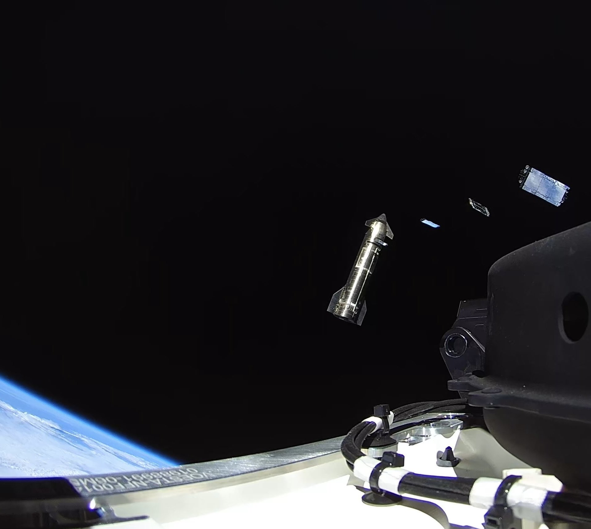
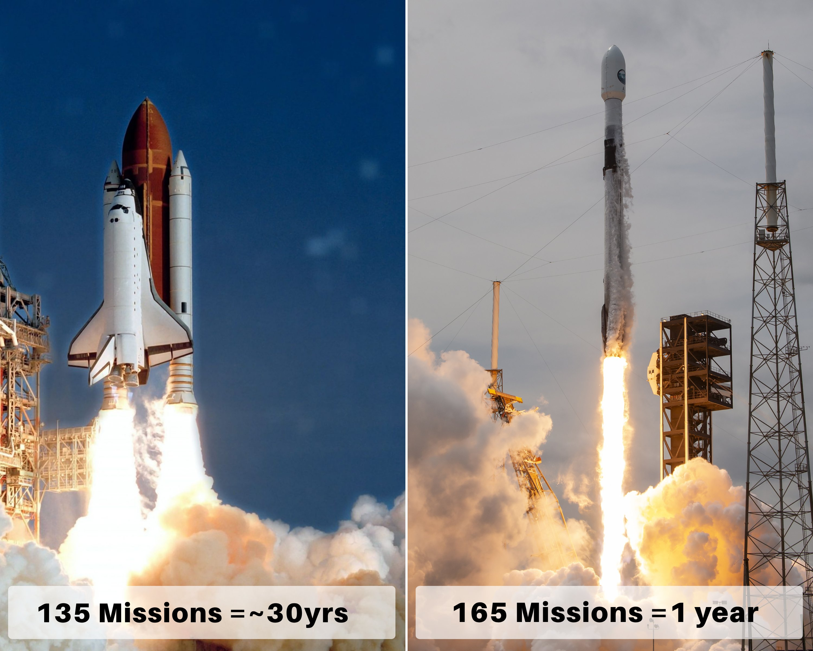

# 🐦 @elonmusk

## 📅 October 03, 2026

> 13 post(s) archived.

---

### 🕐 20:59 UTC · @elonmusk

> @SawyerMerritt We are being extremely careful with autonomous safety, just as we are with making Teslas the safest cars in the world for human driving

🔗 [View original post](https://x.com/elonmusk/status/2106489424569668089)

---

### 🕐 18:42 UTC · @elonmusk

> Starship deploying Starlink V3 satellites

🔗 [View original post](https://x.com/elonmusk/status/2106454808676716916)

---

### 🕐 17:41 UTC · @elonmusk

> Falcon 9 flew more missions in ONE YEAR than the entire Space Shuttle program flew in 30 years • The entire Shuttle fleet: 135 missions from 1981–2011 • Falcon 9 in 2025 alone: 165 launches SpaceX exceeded the Shuttle program’s entire lifetime mission count by 30 launches in just 12 months And Falcon 9 also launched more times than every other orbital launch vehicle combined that year At the Shuttle program’s historical average cadence, reaching 165 missions would have taken roughly 37 years Falcon 9 did it in ONE And the hardware reuse comparison is just as insane: • Space Shuttle Discovery — 39 flights across roughly 27 years • Falcon 9 booster B1067 — 37 flights in just over 5 years B1067 first flew on June 3, 2021 By August 25, 2026, the same booster had launched and landed successfully 37 times A single Falcon 9 first stage came within TWO flights of the most-flown Shuttle orbiter’s lifetime flight count in about one-fifth of the time What once took decades of launch operations now happens within a single year of Falcon 9 cadence SpaceX turned reusability into an industrial-scale operation

🔗 [View original post](https://x.com/XFreeze/status/2106439595860857017)

---

### 🕐 16:26 UTC · @elonmusk

> Grok is making the impossible possible. Have always been a work horse, yet never capable of multi-tasking. So I worked long hours, disciplined and focused. Now, multiple agents and bots are working simultaneously on different things, and the jobs get done. Amazing times.

🔗 [View original post](https://x.com/TeslaBoomerMama/status/2106420598985703877)

---

### 🕐 16:24 UTC · @elonmusk

> First @united flight with @Starlink today (ATX to LAX) Such a game changer… can&apos;t wait for it to show up on the Japan and MENA routes

🔗 [View original post](https://x.com/Jason/status/2106420067709882574)

---

### 🕐 15:13 UTC · @elonmusk

> What happened at Cornell is disgusting But if you think it’s bad, go look into what the migrant rape gangs in Europe have been doing

🔗 [View original post](https://x.com/shaunmmaguire/status/2106402390903803932)

---

### 🕐 15:09 UTC · @elonmusk

> Treasury Secretary Scott Bessent just made his support for Elon Musk very clear: “I am a huge Elon fan” He compared their relationship to a sports team...you can argue in the locker room, but once you step onto the field, you’re all working toward the same goal Bessent also said he’s been in regular contact with Elon and added: “He’s amazing” “He’s taking us to Mars. Look at what he’s done with SpaceX” Pretty strong words from the U.S. Treasury Secretary https://x.com/clashreport/status/2106350319462416796/video/1 Media

🔗 [View original post](https://x.com/XFreeze/status/2106401202984632617)

---

### 🕐 14:48 UTC · @elonmusk

> Republicans must WIN the 2026 Midterm Elections, and we must use every appropriate tool – whether you vote early, absentee, by mail, or in-person, we must swamp the Radical Left Dumocrats with massive turnout! SO IMPORTANT – PLEASE GET OUT AND VOTE. MAKE AMERICA GREAT AGAIN! Media

🔗 [View original post](https://x.com/realDonaldTrump/status/2106396002005737498)

---

### 🕐 08:00 UTC · @elonmusk

> A sufficiently large quantity is a quality all its own. Big difference between bacteria with one cell and a human with 35 trillion cells, even though both are made of cells. Anything TSMC contributes to Terafab would basically be supplemental Terafab itself is going to be absurdly massive The goal is 1 TW of compute production every year.....around 50× the current global output of AI compute This isn’t just another fab. It’s being built for a scale t…

🔗 [View original post](https://x.com/elonmusk/status/2106293251233738928)

---

### 🕐 07:32 UTC · @elonmusk

> How would you like your FSD? People want FSD, so they go to https://tesla.com and pick what shape they want it in

🔗 [View original post](https://x.com/elonmusk/status/2106286369018716581)

---

### 🕐 07:13 UTC · @elonmusk

> how can we make @bot better for you in next two weeks? any confusion, frustration, criticism, wishes. just dump them to me plz. 🫶

🔗 [View original post](https://x.com/lingxi/status/2106281453386633593)

---

### 🕐 04:27 UTC · @elonmusk

> Robotaxi operating hours moved from 10pm to 11pm. The main thing we’re trying to solve is making sure that we don’t run over pets when they’re hard to see at night. Literally trying to avoid grey kittens on grey tarmac in the dark. Robotaxi in Austin now available until 11pm

🔗 [View original post](https://x.com/elonmusk/status/2106239692866019479)

---

### 🕐 00:17 UTC · @elonmusk

> This is uncomfortable viewing for me. Takes me back to when I was attacked by a mob of some 200 men in Tahrir Square in Cairo, when I was reporting for 60 Minutes and I was gang-raped, sodomized &amp; beaten. Mob violence is a call to the worst of humanity because it is cover for cowards. 🚨BREAKING: Students rioting in France are now ASSAULTING teachers This is what years of leftism has led to. Where is Emmanuel Macron?

🔗 [View original post](https://x.com/laralogan/status/2106176701231243408)

---
