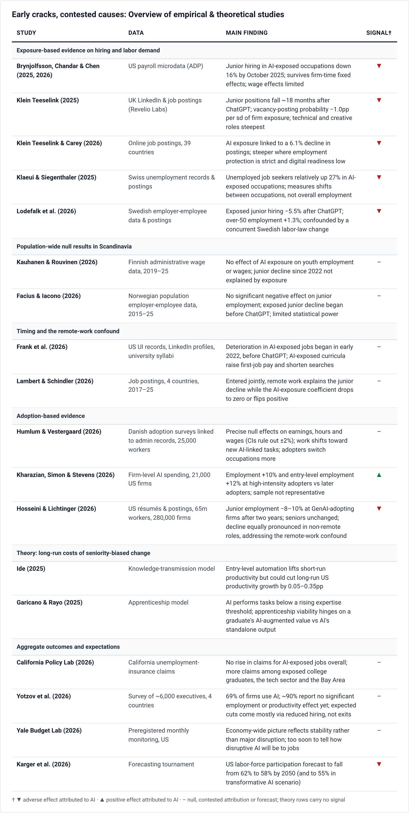

# 🐦 @emollick

## 📅 October 03, 2026

> 1 post(s) archived.

---

### 🕐 00:59 UTC · @emollick

> &quot;The best current evidence supports a narrow claim: AI may already be affecting the hiring margin for junior white-collar roles most exposed to AI, but this attribution is contested, and aggregate labor-market disruption has yet to appear in the data.&quot; https://aleximas.substack.com/p/has-ai-impacted-the-labor-market

🔗 [View original post](https://x.com/emollick/status/2106187293501411755)

---
