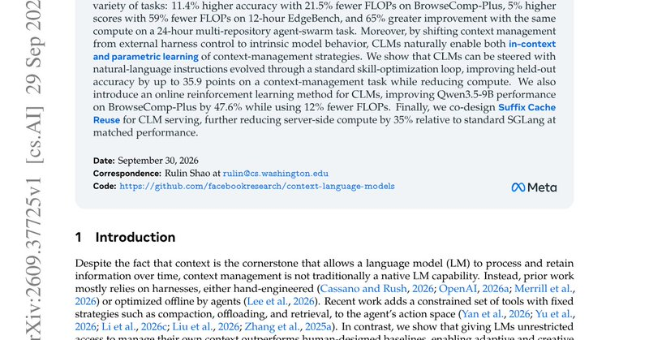

# 🐦 @omarsar0

## 📅 October 03, 2026

> 5 post(s) archived.

---

### 🕐 19:54 UTC · @omarsar0

> Dear Anthropic, please don&apos;t nerf Opus 5.5. I have been impressed by Opus 5.5 (using it via API). So I resubscribed to Max and was just mind-blown by how durable it has become. If you used Fable models, you would know how terrible and useless that Max subscription had become. Opus 5.5 is obviously one of the best models as a daily driver, but I didn&apos;t expect to get so much from the Max subscription with this new model. Say what you want about Anthropic, but Opus 5.5 is extremely efficient and a really good model. It&apos;s exciting. I hope models get more efficient and we can squeeze more value out of every token.

🔗 [View original post](https://x.com/omarsar0/status/2106472992570220588)

---

### 🕐 17:17 UTC · @omarsar0

> If you want more related reading on this. The mentioned context language model paper: https://academy.dair.ai/papers/context-language-models-2609.37725 The AutoHarness paper: https://academy.dair.ai/papers/autoharness

🔗 [View original post](https://x.com/omarsar0/status/2106433390652043309)

---

### 🕐 16:41 UTC · @omarsar0

> Like it or not, over 50% of social content will be AI-generated by the end of next year. @higgsfield AI Influencer and Genjutsu let a small team create characters, animate them, and test digital &quot;personalities&quot; like ad creatives. This changes the economics of building a media business, and Higgsfield is where the next generation gets built. Calling it “AI slop” says more about a taste preference than the size of the opportunity. Born in Higgsfield. All over your feed. Introducing Higgsfield AI Influencer. Create your own AI influencer and bring them into any trend. Try now with up to 5 FREE generations on Higgsfield and in the ChatGPT extension. Powered by Genjutsu. Credits: @JeanPhilMadame

🔗 [View original post](https://x.com/alexmashrabov/status/2106424314010706060)

---

### 🕐 16:36 UTC · @omarsar0

> Great paper for all you pre-training and post-training nerds. The surprising finding is that pre-trained LLMs, equipped with a light inference harness, can serve as capable agents and can even surpass post-trained counterparts with a sufficient test-time budget. Banger paper from Meta Superintelligence Labs. They find something super interesting and unexpected. (bookmark it) Base models with a light harness often solve more agentic tasks than their RL post-trained versions when both get enough samples. Post-trained models win on pass@1. …

🔗 [View original post](https://x.com/omarsar0/status/2106423166788669445)

---

### 🕐 00:51 UTC · @omarsar0

> Yesterday we previewed Griffin, a Human Interaction Model capable of seeing, hearing, sounding, and looking like a human does. There have been a lot of questions, so I wanted to take a moment to share our thoughts. By way of introduction: Tavus is a research lab focused on enabling machines to meet us where we are, and to understand the nuances of how we communicate beyond words. Griffin, our latest model, isn’t publicly available yet. Yesterday’s announcement was a limited research preview to demonstrate what the model is capable of. With AI progressing so quickly, we prefer to share breakthroughs openly and in real-time as we work on a safe public release. Face-to-face is how we evolutionarily communicate, it carries the most meaning and intent, and we want computers to be able to help with work that benefits from that emotional understanding, expression, and immersion. Some examples of the kinds of use cases we care deeply about: - A tutor that can build understanding of how a student learns, see exactly when there is confusion or disengagement, and adapt the lesson to fit them. - A health expert that can answer any questions about your upcoming appointment or prescription, at the pace you want, at any time you need, even on a weekend. - A language coach that you can practice speaking with, that can correct your movement and pronunciation, and help build confidence to have real conversations - Or the perfect assistant for everyone, that understands intent, knows how you work and remembers what matters. We’re working with partners on safeguards and systems for disclosure, as well as inviting discussions with officials around wider regulation and safe use. People will always know they’re interacting with AI, while providing an interface that removes the need to ‘speak computer’. We believe in a future where computers understand us well enough to make technology more accessible, more useful, and make us more capable as humans. That is the world we want to build, and we understand the responsibility to do so safely. Introducing Griffin, the first model to pass the video Turing test. 48% of people who talked to it live thought it was a real human. Previous systems have had a pass rate &lt;3%. It is #1 on NVIDIA&apos;s benchmark for full-duplex AI video. It’s the first Human Interaction Model (HIM).

🔗 [View original post](https://x.com/hassaanraza/status/2106185447361896475)

---
