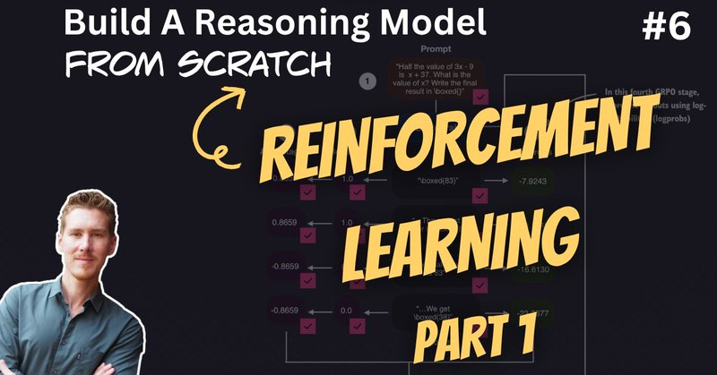

# 🐦 @rasbt

## 📅 October 03, 2026

> 2 post(s) archived.

---

### 🕐 13:03 UTC · @rasbt

> And a link to the YouTube version: https://www.youtube.com/watch?v=237Hf7Q3lgg

🔗 [View original post](https://x.com/rasbt/status/2106369673818235304)

---

### 🕐 13:03 UTC · @rasbt

> Reasoning from scratch, round number 6! An introduction (and implementation) of Reinforcement Learning with Verifiable Rewards (RLVR) and Group Relative Policy Optimization (GRPO). 00:00 Introduction 01:54 What makes a reasoning model different? 04:25 Reasoning traces and model capability 08:29 Accuracy and format rewards 11:34 Aha moments and DeepSeek-R1 training 14:41 Reasoning effort and answer length 18:38 RLHF and RLVR 23:04 GRPO vs. PPO 26:40 GRPO explained with a cooking analogy 31:43 The KL term and simplified GRPO 35:04 Loading the pretrained model 36:07 Loading the MATH training data 39:26 Sampling model responses 46:30 Computing verifiable rewards 49:55 Computing advantages 51:54 Token and sequence log probabilities 55:29 Implementing sequence log probabilities 57:37 Fixing the inference-mode error 1:02:24 Computing the GRPO loss 1:04:37 Putting the GRPO step together 1:09:19 The GRPO training loop 1:12:57 Training settings, logging, and checkpoints 1:17:24 Running training and inspecting outputs 1:19:28 Loading and evaluating checkpoints 1:22:33 MATH-500 results and training stability 1:24:05 Memory requirements and next steps Media

🔗 [View original post](https://x.com/rasbt/status/2106369670680871031)

---
