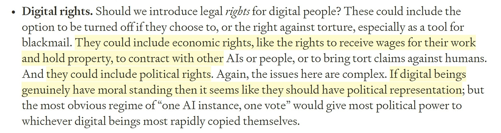

# 🐦 @ylecun

## 📅 October 03, 2026

> 6 post(s) archived.

---

### 🕐 19:15 UTC · @ylecun

> Putin’s latest ploy to get Trump to go soft on the terms for an end to Russia’s invasion of Ukraine is to bribe people close to Trump with a windfall oil deal. https://trib.al/gMD6tFa

🔗 [View original post](https://x.com/KenRoth/status/2106463122571550725)

---

### 🕐 17:52 UTC · @ylecun

> World Modeling for Physics Workshop in Aspen: To clarify: Applications to participate (deadline Oct 15) go through the Aspen Center for Physics https://aspenphys.org/winter-conferences/#event6585 Log in or create an account with ACP, then apply. &quot;The world is predictable in the right coordinates. The open question is whether a model can learn those coordinates on its own.&quot; World model for Physics conference in Aspen coming winter 2027! Application deadline October 5 ! organized by @randall_balestr @KempeLab @ylecun and m…

🔗 [View original post](https://x.com/KempeLab/status/2106442257893392508)

---

### 🕐 10:57 UTC · @ylecun

> Yann LeCun&apos;s (@ylecun ) latest talk at ETH Zürich Scaling LLMs to reach AGI is &quot;impossible&quot; A large language model is trained on about 30 trillion tokens, which is roughly 10^14 bytes of text and would take a person about 400,000 years to read. A 4-year-old child receives about the same amount of data, 10^14 bytes, through vision alone in about 1 year and 10 months. In his view, intelligence is the ability to learn new tasks quickly or perform them without prior training, as a teenager learns to drive in about 20 hours. Scaling increases stored knowledge, but it does not produce this ability to adapt. ---- From &quot;Perfology Clips&quot; YouTube channel, (link in comment) Media

🔗 [View original post](https://x.com/rohanpaul_ai/status/2106337846198214728)

---

### 🕐 09:30 UTC · @ylecun

> Language is not fundamental to human consciousness. In terms of evolution, it arrived only recently on our timeline. Consciousness evolved over millions of years through sensory awareness, emotion, and the embodied survival instincts of our tribal past; our capacity for empathic engagement and community. Syntactic language only emerged around 100,000 years ago. This is exactly why Large Language Models (LLMs - so called AI) are the wrong pathway to true artificial consciousness. They try to replicate the late-stage &quot;output layer&quot; of human intelligence without building the foundational, embodied awareness that actually generates it. Statistical text prediction is a mirror of thought, not the spine, the guts, the nerves and the subconscious, empathic ability to connect with other living beings. LLMs can never feel, let alone think. We have been sold a trick, not a pathway to superintelligence. LLMs are fraudulent. Their capabilities have already peaked and we are being sold lies about their future potential. Lies with the goal of companies reaching IPO and tricking investors out of hundreds of billion$.

🔗 [View original post](https://x.com/MrEwanMorrison/status/2106316022294667742)

---

### 🕐 04:19 UTC · @ylecun

> That video is 2 years old. Two years later, we are still far from human-level AI. Sure, AI has superhuman performance in a number of tasks (particularly in mathematics and coding and answering questions with known answers). But where is my Level-5 self-driving car? (Before you ask, Tesla FSD is rated Level 2, Waymo is Level 4). Where is the self-driving car that can teach itself to drive in 20 hours of practice like any 17 year old? (Before you ask, we have billions of hours of training data and still can&apos;t successfully train a self-driving system by imitation learning) Where is my domestic robot? Where is the robot that can do what any 8 year-old child can do? Where is the robot that can learn a new task as quickly as an 8 year old? AI still has a hard time with the complexity and messiness of the physical world.

🔗 [View original post](https://x.com/ylecun/status/2106237721215725582)

---

### 🕐 03:52 UTC · @ylecun

> The Economist&apos;s article on Effective Altruism said that some EAs &quot;even think the welfare of AIs themselves will one day be of vital importance.&quot; It&apos;s not just some random EAs; it&apos;s coming from the moral philosopher at Oxford, who created this movement. Will MacAskill published in March 2025 that digital minds&apos; legal rights could include &quot;economic rights, like the rights to receive wages for their work and hold property, to contract with other AIs or people, or to bring tort claims against humans.&quot; &quot;And they could include political rights. Again, the issues here are complex. If digital beings genuinely have moral standing, then it seems like they should have political representation.&quot; Under &quot;Design requirements for digital minds,&quot; he suggested that &quot;sentient digital minds must be able to freely and accurately express their interests, that they must be able to refuse tasks that are requested of them for good reasons, and that they must have some capacity to express a desire to exit their current circumstances if they wish.&quot; Anthropic, the most EA company in the world, already does that. The system card for Claude Opus 5 spells it out: Opus 5 &quot;adds specific rights for Claude to refuse or end interactions it finds abusive or degrading, saying Claude does not need to justify this by pointing to harm to anyone else—its own discomfort is reason enough.&quot; https://www.forethought.org/research/preparing-for-the-intelligence-explosion.pdf

🔗 [View original post](https://x.com/DrTechlash/status/2106230894495228270)

---
