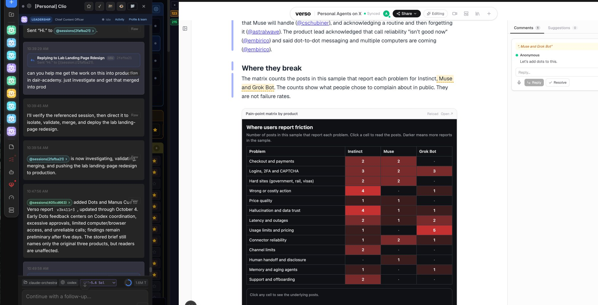

# 🐦 @dair_ai

## 📅 October 04, 2026

> 4 post(s) archived.

---

### 🕐 17:40 UTC · @dair_ai

> 50K likes on this!? Most of what Karpthy has shared is things we have been doing for over a year. No surprises, as many replies are highlighting. But I still think this raises an interesting discussion. Is there a universal interface/langauge that allows more seamless communication between agents and humans? I believe there is. And I think that is what @karpathy is suggesting we think about. Right now, ideas are all scattered. As some of you know, I have been early on LLM Wikis, Artifacts, AI-generated visual explainers, dynamic interactives, etc. Over the past couple of months, I have been experimenting with a new universal interface for seamless human-agent collaboration. So I have a lot to share, but it&apos;s still too early, and I frankly haven&apos;t found the perfect solution. In short, my current optimal setup (see a simple snapshot attached) ties my high-level agent to highly flexible Notion-like pages that support embedding artifacts, text, videos, visual explainers, and just about anything an LLM can generate. And if it doesn&apos;t support it yet, I ask it to build it on the fly. It&apos;s crazy sometimes, the features it builds, but this is a co-evolved interface that satisfies both my agent&apos;s and my needs. The interface supports code review, note-taking, writing, research, prototyping, mock designing, and so on. In fact, I have now wired my agents to intelligently spit out these artifacts (for lack of a better word), depending on the task/instruction, instead of the default text responses, which are frankly overwhelming and hard to read at times. In other words, as I keep building this &quot;universal interface,&quot; it feels less and less like I am chatting with an agent; I&apos;m collaborating with it directly through the artifacts (through comments and suggestions). It allows me to move faster. I can consume and review faster. I am better organized. It feels like a language both the agent and I can speak fluently, so there is very little friction. Listen, this is all a personal experience. I don&apos;t think everyone will use interfaces like this. But it&apos;s been interesting to see Artifacts gain wide adoption, and now dots have Spaces that look a little like what I built here several months ago. More to share soon. We&apos;ll be spending a lot more time trying to understand the outputs of language models. A few thoughts, tips &amp; tricks: Writing. Something I&apos;ve had success with: Ask your LLM to explain something in ASD-STE100, it&apos;s a controlled language specification originally developed for aeros…

🔗 [View original post](https://x.com/omarsar0/status/2106801689495826520)

---

### 🕐 15:37 UTC · @dair_ai

> https://x.com/i/article/2106769688780775424

🔗 [View original post](https://x.com/dair_ai/status/2106770783607373994)

---

### 🕐 11:00 UTC · @dair_ai

> Banger paper from NVIDIA on test-time compute for terminal agents. The finding is that you should sample several candidate shell commands, verify them before running one, and spend more on the verifier than on extra samples. With a GPT-5.6 Sol verifier choosing among 8 sampled actions, TerminalBench-Lite Pass@1 rises from 50.0% to 68.0%. With a weak verifier, extra samples add almost nothing. Mid-Harness leaves the generator and harness unchanged and works between them. When a small TMAX-9B model verifies its own candidates, pairwise comparison works best, and distilling the strong verifier into it helps further. Combining action sampling with trajectory sampling reaches higher success at lower estimated token cost than sampling full trajectories alone. Paper: https://academy.dair.ai/papers/mid-harness-scaling-actions-between-model-and-harness-for-terminal-agents-2609.39982

🔗 [View original post](https://x.com/dair_ai/status/2106700907106943107)

---

### 🕐 05:39 UTC · @dair_ai

> Great paper from Microsoft and colleagues on optimizing agent harnesses. Current harness optimizers change how the harness is updated but keep the training scenarios fixed, so feedback keeps coming from tasks that stop being informative as the harness improves. This work adapts the scenarios as well. ActiveSaddler groups recurring failures into failure patterns and treats each pattern as an arm in a non-stationary bandit. It tracks how much the harness is still learning from each pattern and splits the budget between revisiting known weaknesses and finding new ones. With the same optimizer, test Pass@1 improves by 4.4 points on GAIA2 and 7.5 points on Terminal-Bench 2.0 compared with a fixed scenario order. Paper: https://academy.dair.ai/papers/activesaddler-automated-curriculum-learning-for-agent-harness-optimization-2610.00906

🔗 [View original post](https://x.com/dair_ai/status/2106620084542419257)

---
